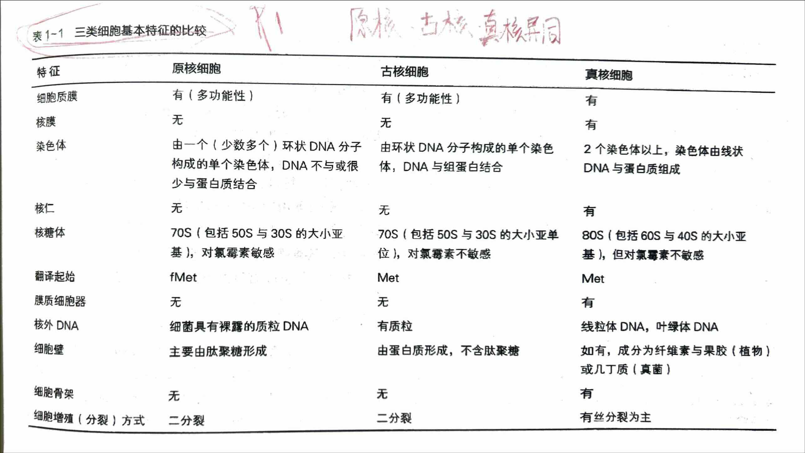
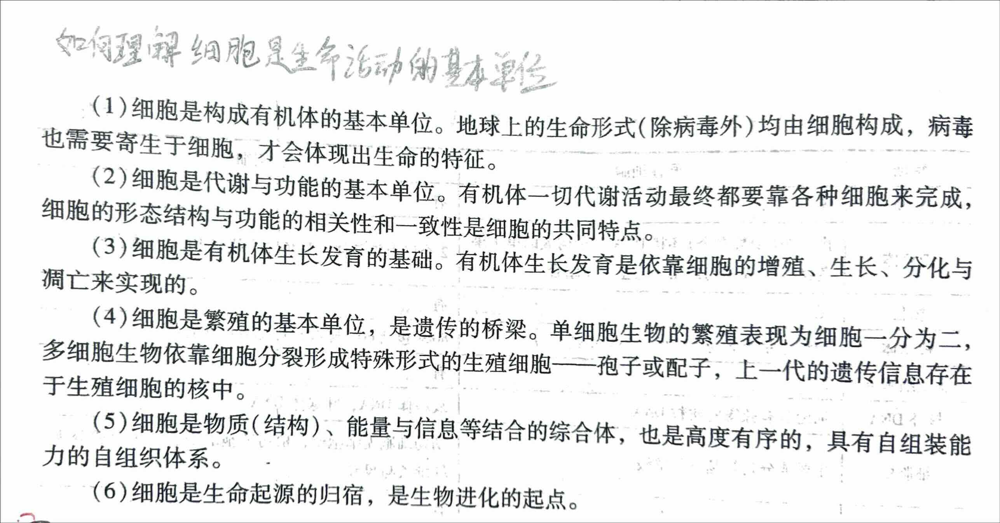
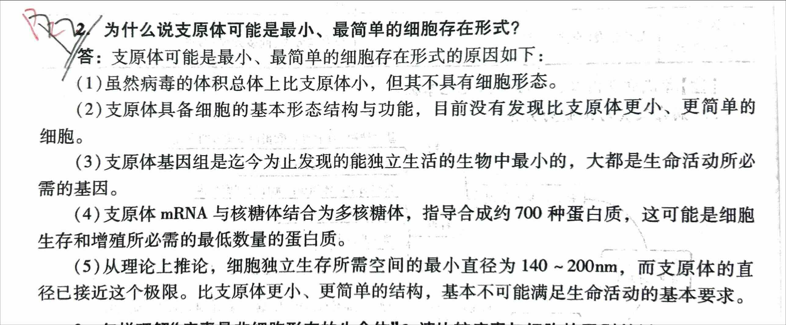

<!-- anki-id: cell-biology-jsonl-000001 -->
### Front
表 1-1 三类细胞基本特征的比较 (原核、古核、真核异同)

### Back
| 特征 | 原核细胞 | 古核细胞 | 真核细胞 |
| :--- | :--- | :--- | :--- |
| **细胞质膜** | 有（多功能性） | 有（多功能性） | 有 |
| **核膜** | 无 | 无 | 有 |
| **染色体** | 由一个（少数多个）环状 DNA 分子构成的单个染色体，DNA 不与或很少与蛋白质结合 | 由环状 DNA 分子构成的单个染色体，DNA 与组蛋白结合 | 2 个染色体以上，染色体由线状 DNA 与蛋白质组成 |
| **核仁** | 无 | 无 | 有 |
| **核糖体** | 70S（包括 50S 与 30S 的大小亚基），对氯霉素敏感 | 70S（包括 50S 与 30S 的大小亚单位），对氯霉素不敏感 | 80S（包括 60S 与 40S 的大小亚基），但对氯霉素不敏感 |
| **翻译起始** | fMet | Met | Met |
| **膜质细胞器** | 无 | 无 | 有 |
| **核外 DNA** | 细菌具有裸露的质粒 DNA | 有质粒 | 线粒体 DNA，叶绿体 DNA |
| **细胞壁** | 主要由肽聚糖形成 | 由蛋白质形成，不含肽聚糖 | 如有，成分为纤维素与果胶（植物）或几丁质（真菌） |
| **细胞骨架** | 无 | 无 | 有 |
| **细胞增殖（分裂）方式** | 二分裂 | 二分裂 | 有丝分裂为主 |

### OriginalMaterial

---

<!-- anki-id: cell-biology-jsonl-000002 -->
### Front
如何理解细胞是生命活动的基本单位？

### Back
(1) 细胞是构成有机体的基本单位。地球上的生命形式（除病毒外）均由细胞构成，病毒也需要寄生于细胞，才会体现出生命的特征。

(2) 细胞是代谢与功能的基本单位。有机体一切代谢活动最终都要靠各种细胞来完成，细胞的形态结构与功能的相关性和一致性是细胞的共同特点。

(3) 细胞是有机体生长发育的基础。有机体生长发育是依靠细胞的增殖、生长、分化与凋亡来实现的。

(4) 细胞是繁殖的基本单位，是遗传的桥梁。单细胞生物的繁殖表现为细胞一分为二，多细胞生物依靠细胞分裂形成特殊形式的生殖细胞——孢子或配子，上一代的遗传信息存在于生殖细胞的核中。

(5) 细胞是物质（结构）、能量与信息等结合的综合体，也是高度有序的，具有自组装能力的自组织体系。

(6) 细胞是生命起源的归宿，是生物进化的起点。

### OriginalMaterial

---

### Front
论述：细胞学说的建立过程与意义

### Back
**一、细胞学说的建立过程**
1. **第一阶段（1838～1839年）**：由德国植物学家**施莱登**和德国动物学家**施旺**提出“细胞学说”。其基本内容包括：
   - 细胞是有机体，一切动植物都是由细胞发育而来，并由细胞和细胞产物所构成。
   - 每个细胞为一个相对独立的单位，既有它“自己的”生命，又对与其他细胞共同组成的整体的生命有所助益。
   - 新的细胞可以通过已存在的细胞繁殖产生。
2. **第二阶段（1858年）**：德国医生和病理学家**魏尔肖**提出“**细胞只能来自细胞**”及“有机体的一切病理表现都是基于细胞的损伤”等观点，修正并完善了细胞学说。

**二、细胞学说的意义**
1. **推动科学发展**：极大推动了人类对生命的认识，促进了生物科学的发展。
2. **学科地位**：与1859年的进化论和1866年孟德尔确立的遗传学共称为**生物学三大基石**。
3. **科学成就**：细胞学说与能量守恒定律、达尔文进化论并称为**19世纪自然科学的“三大发现”**。

---

<!-- anki-id: cell-biology-jsonl-000004 -->
### Front
为什么说支原体可能是最小、最简单的细胞存在形式？

### Back
(1)虽然病毒的体积总体上比支原体小，但其不具有细胞形态。
(2)支原体具备细胞的基本形态结构与功能，目前没有发现比支原体更小、更简单的细胞。
(3)支原体基因组是迄今为止发现的能独立生活的生物中最小的，大都是生命活动所必需的基因。
(4)支原体 mRNA 与核糖体结合为多核糖体，指导合成约 700 种蛋白质，这可能是细胞生存和增殖所必需的最低数量的蛋白质。
(5)从理论上推论，细胞独立生存所需空间的最小直径为 140 ~ 200nm，而支原体的直径已接近这个极限。比支原体更小、更简单的结构，基本不可能满足生命活动的基本要求。

### OriginalMaterial

---
### Front
论述：细胞学说的建立过程与意义

### Back
**一、细胞学说的建立过程**
1. **第一阶段（1838～1839年）**：由德国植物学家**施莱登**和德国动物学家**施旺**提出“细胞学说”。其基本内容包括：
   - 细胞是有机体，一切动植物都是由细胞发育而来，并由细胞和细胞产物所构成。
   - 每个细胞为一个相对独立的单位，既有它“自己的”生命，又对与其他细胞共同组成的整体的生命有所助益。
   - 新的细胞可以通过已存在的细胞繁殖产生。
2. **第二阶段（1858年）**：德国医生和病理学家**魏尔肖**提出“**细胞只能来自细胞**”及“有机体的一切病理表现都是基于细胞的损伤”等观点，修正并完善了细胞学说。

**二、细胞学说的意义**
1. **推动科学发展**：极大推动了人类对生命的认识，促进了生物科学的发展。
2. **学科地位**：与1859年的进化论和1866年孟德尔确立的遗传学共称为**生物学三大基石**。
3. **科学成就**：细胞学说与能量守恒定律、达尔文进化论并称为**19世纪自然科学的“三大发现”**。

---
### Front
论述：细胞大小的决定因素与细胞体积不能无限长大的原因

### Back
**一、细胞大小的决定因素**
**细胞的大小取决于核糖体的活性**，因为蛋白质的量由核糖体决定。相关证据是在酵母和果蝇中已经得到几种核糖体蛋白发生变异的突变体，它们的细胞大小都发生了变化。

**二、细胞体积不能无限长大的原因**
1. **核糖体活性限制**：细胞体积的增大需要更多的蛋白质合成，而核糖体活性有限，可能无法满足过大的细胞对蛋白质的需求。
2. **信号网络调控**：多细胞生物可通过 **IGF/PI3K/Akt/mTOR** 等信号途径调控细胞体积。
3. **细胞核与细胞质比例限制**：细胞核的体积通常占细胞总体积的约 10%，这被认为是制约细胞最大体积的主要因素之一；如果细胞体积过大，可能会导致细胞核与细胞质的比例失调，影响细胞的遗传和代谢活动。
4. **其他原因**：如细胞分裂的限制、端粒的影响等。

---

### Front
论述：为什么说细胞是生命活动的基本单位（五个方面）

### Back
**1. 构成有机体的基本单位**
一切有机体都由细胞构成，细胞是构成有机体的基本单位。尽管地球上生命的形态和代谢方式大相径庭，但无一例外均由细胞构成。有些生物仅由一个细胞构成，另一些生物则由数百万至万亿细胞构成。

**2. 代谢与功能的基本单位**
细胞是代谢与功能的基本单位。有机体一切代谢活动最终要靠各种细胞来完成。单细胞生物依靠一个细胞完成运动、呼吸、排泄和生殖等一系列生理活动；多细胞生物则更多依靠细胞之间的相互协同作用，通过不同形态结构的细胞有机地组织起来，形成执行特定功能的器官，完成其复杂的生理功能。

**3. 生长发育的基础**
细胞是有机体生长发育的基础。有机体的发育与生长是依靠细胞的分裂、分化、迁移与凋亡来实现的。

**4. 繁殖与遗传的桥梁**
细胞是繁殖的基本单位，是遗传的桥梁。单细胞生物的繁殖表现为细胞一分为二，多细胞生物依靠细胞分裂形成特殊形式的生殖细胞（孢子或配子），上一代的遗传信息存在于生殖细胞的核中。

**5. 生命起源与演化的起点**
细胞是生命起源的标志，是生物演化的起点。生命是经过长期的化学演化，由非生命的物质形成的。含有遗传物质的原始细胞的形成，标志着生命的出现，此后便进入生物演化阶段。

---
### Front
论述：病毒在细胞内的增殖过程

### Back
**一、病毒增殖的基本过程**
病毒在宿主细胞内以复制和装配的方式进行增殖，基本过程包括：**吸附（识别） → 注入（侵染/脱壳） → 合成 → 组装（成熟） → 释放**。
1. **吸附（识别）**：病毒通过表面的蛋白质识别宿主细胞表面的特异性受体（蛋白质或糖蛋白），吸附在易感细胞表面。
2. **注入（侵染/脱壳）**：病毒通过胞饮、膜融合或直接注入等方式将其遗传物质或核壳体送入宿主细胞内。
3. **合成**：病毒利用宿主细胞的代谢系统、原料和能量，进行病毒基因组的复制与转录，并翻译合成病毒蛋白质。
4. **组装（成熟）**：新合成的病毒核酸与蛋白质组装成完整的子代病毒颗粒。
5. **释放**：装配完成的子代病毒以不同方式从宿主细胞中释放出来，进而侵染其他细胞。

---
### Front
论述：病毒的特征（4点）

### Back
1. **结构极小且简单**：绝大部分病毒的大小只有 20~200 nm，没有核糖体等任何细胞结构，无法独自进行代谢活动，必须在电子显微镜下才能清楚看到。
2. **遗传载体的多样性**：所有细胞都含有 DNA 和 RNA 且以双链 DNA 作为遗传物质，而病毒粒子中只含有 DNA 或 RNA 其中一种，均有双链和单链之分。
3. **彻底的寄生性**：病毒没有独立的代谢与能量转化系统，必须利用宿主细胞结构、原料、能量与酶系统进行繁殖，在细胞内才表现出生命特征。
4. **以复制和装配的方式进行增殖**：病毒在宿主细胞内先合成大量的病毒核酸及各种病毒蛋白，再装配成新的子代病毒；而细胞是以分裂的方式增殖。

---