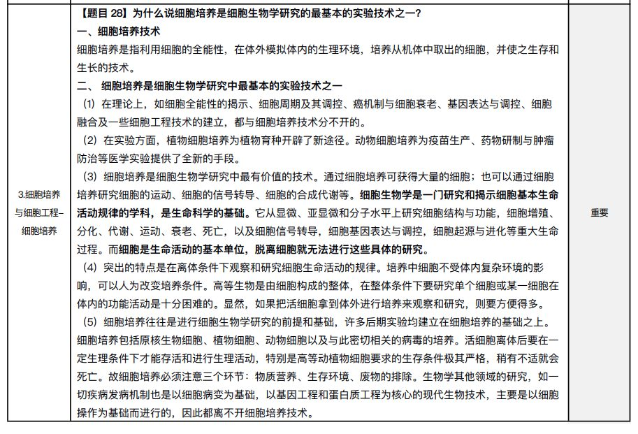
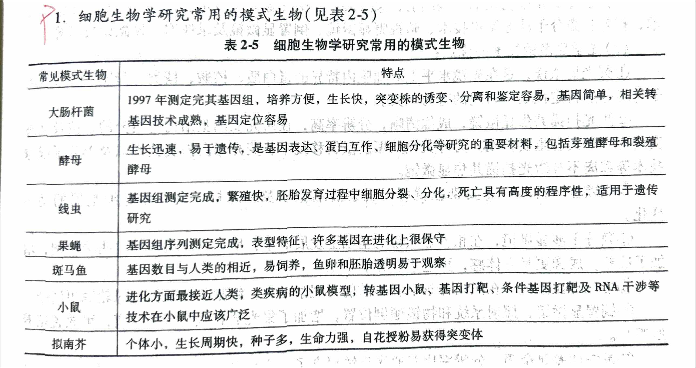

<!-- anki-id: cell-biology-jsonl-000033 -->
### Front
【题目 28】为什么说细胞培养是细胞生物学研究的最基本的实验技术之一？

### Back
**定义**：
细胞培养是指利用**细胞的全能性**，在体外模拟体内的生理环境，培养从机体中取出的细胞，并使之生存和生长的技术。

**理由**：
(1) **理论上**：如**细胞全能性**的揭示、**细胞周期及其调控**、**癌机制与细胞衰老**、**基因表达与调控**、**细胞融合及一些细胞工程技术**的建立，都与**细胞培养技术**分不开的。
(2) **实验方面**：**植物细胞培养**为植物育种开辟了新途径。**动物细胞培养**为**疫苗生产**、**药物研制与肿瘤防治**等医学实验提供了全新的手段。
(3) **最有价值**：通过细胞培养可获得大量的细胞；也可以通过细胞培养研究细胞的运动、细胞的信号转导、细胞的合成代谢等。**细胞生物学是一门研究和揭示细胞基本生命活动规律的学科**，是生命科学的基础。而从显微、亚显微和分子水平上研究细胞结构与功能...**而细胞是生命活动的基本单位**，脱离细胞就无法进行这些具体的研究。
(4) **突出特点**：突出的特点是**在离体条件下观察和研究细胞生命活动的规律**。培养中细胞不受体内复杂环境的影响，可以人为改变培养条件。高等生物是由细胞构成的整体，在整体条件下要研究单个细胞或某一细胞在体内的功能活动是十分困难的。显然，如果把活细胞拿到体外进行培养来观察和研究，则方便得多。
(5) **前提和基础**：细胞培养往往是进行细胞生物学研究的**前提和基础**，许多后期实验均建立在细胞培养的基础之上。细胞培养包括原核生物细胞、植物细胞、动物细胞以及与此密切相关的病毒的培养。活细胞离体后要在一定生理条件下才能存活和进行生理活动，特别是高等动植物细胞要求的生存条件极其严格，稍有不适就会死亡。故细胞培养必须注意三个环节：**物质营养**、**生存环境**、**废物的排除**。生物学其他领域的研究，如一切疾病发病机制也是以细胞病变为基础，以**基因工程和蛋白质工程**为核心的现代生物技术，主要是以细胞操作为基础而进行的，因此都离不开细胞培养技术。

### OriginalMaterial

---

<!-- anki-id: cell-biology-jsonl-000040 -->
### Front
6. 简述细胞器分离的方法及原理。[首都师范大学 2019年研]

### Back
答：细胞器分离的方法有差速离心和密度梯度离心。

(1) <u>差速离心</u>：
①方法：先用低渗匀浆、超声破碎或研磨等方法使细胞质膜破损，形成细胞核、线粒体、叶绿体、内质网、高尔基体、溶酶体等细胞器和细胞组分组成的混合匀浆；起始的离心速度较低，让较大的颗粒沉降到管底，小的颗粒仍悬浮在上清液中。收集沉淀，再用较高的离心速度离心悬浮液，将较小的颗粒沉降，以此类推，达到分离不同大小颗粒组分的目的。
②原理：利用不同的离心速度所产生的<u>不同离心力</u>，将各种质量和密度不同的亚细胞组分和各种颗粒分开。

(2) <u>密度梯度离心</u>：
①方法：用一定的介质在离心管内形成一连续或不连续的密度梯度，将细胞混悬液或匀浆置于介质的最上层，通过重力或离心力场的作用使细胞中不同组分以不同的沉降率沉降，从而得以分层、分离。
②原理：各组分的<u>沉降率与它们的形状和大小有关</u>，通常以<u>沉降系数(S值)</u>表示。在<u>超速离心机巨大离心力</u>的作用下，相当小的 tRNA 和单一的酶都可根据其沉降系数相互分离。
③分类：密度梯度离心又可分为<u>速度沉降</u>和<u>等密度沉降</u>两种。常用的介质有蔗糖和氯化铯等。
a. <u>速度沉降</u>：主要是用于分离密度相近而大小不一的细胞组分。离心前，将要分离的细胞匀浆物放置在蔗糖浓度梯度（通常为 5~40g/100ml）溶液的上层，各种细胞组分根据它们的大小以不同的速度沉降，形成不同的沉降带，然后分别收集不同的沉降带中的组分，用于分析。
b. <u>等密度沉降</u>：用于分离不同密度的细胞组分。细胞组分在连续梯度的高密度介质中经离心力场长时间的作用沉降或漂移到与自身密度相等的位置，形成不同的密度区带。这种方法非常灵敏，甚至可以将掺入重同位素（如$^{14}	ext{C}$ 或 $^{15}	ext{N}$）的生物大分子和未标记分子分开。

### OriginalMaterial

---

<!-- anki-id: cell-biology-jsonl-000041 -->
### Front
【题目 32】试述 B 淋巴细胞杂交瘤（B-lymphocyte hybridomas）技术的基本原理。

### Back
(1) <b>杂交瘤细胞合成</b>：\( \text{B} \) 淋巴细胞能够分泌抗体，但在体外培养时难以增殖。为了获得既能够分泌抗体又能够无限增殖的细胞克隆，将<b>小鼠骨髓瘤细胞</b>与<b>经绵羊红细胞免疫过的小鼠脾细胞</b>（\( \text{B} \) 淋巴细胞）在聚乙二醇或灭活的病毒的导引下发生融合。融合后的杂交瘤细胞具有两种亲本细胞的特性：一方面可分泌抗绵羊红细胞的抗体；另一方面像肿瘤细胞一样，可在体外培养条件下或移植到体内无限增殖。

(2) <b>杂交瘤细胞筛选</b>：尽管没有杂交的 \( \text{B} \) 淋巴细胞随着培养时间的延长将死亡，但要把没有融合的骨髓瘤细胞淘汰掉而在培养体系中只剩下杂交瘤细胞则需要用<b>缺陷型骨髓瘤</b>和<b>选择性培养基</b>。正常细胞在<b>氨基嘌呤</b>的作用下，DNA合成主要通路被阻止，但仍可以利用<b>H次黄嘌呤</b>和<b>T胸腺嘧啶核苷</b>，通过<b>TK</b>和<b>HGPRT酶</b>合成DNA。由于骨髓瘤细胞缺乏 TK 或 HGPRT，因此在含氨基嘌呤的培养液内不能通过旁路合成 DNA 而成活下来。只有<b>融合细胞</b>才能在含 <b>HAT</b>（H次黄嘌呤，氨基嘌呤和胸腺嘧啶核苷）的培养液内通过旁路合成核酸而得以生存。通过 HAT 选择培养和细胞克隆，可获得大量分泌单克隆抗体的杂交瘤细胞株。

### OriginalMaterial

---

<!-- anki-id: cell-biology-jsonl-000128 -->
### Front
1. 细胞生物学研究常用的模式生物（见表2-5）

### Back
表2-5 细胞生物学研究常用的模式生物

| 常见模式生物 | 特点 |
| :--- | :--- |
| 大肠杆菌 | 1997年测定完其基因组，培养方便，生长快，突变株的诱变、分离和鉴定容易，基因简单，相关转基因技术成熟，基因定位容易 |
| 酵母 | 生长迅速，易于遗传，是基因表达、蛋白互作、细胞分化等研究的重要材料，包括芽殖酵母和裂殖酵母 |
| 线虫 | 基因组测定完成，繁殖快，胚胎发育过程中细胞分裂、分化，死亡具有高度的程序性，适用于遗传研究 |
| 果蝇 | 基因组序列测定完成，表型特征，许多基因在进化上很保守 |
| 斑马鱼 | 基因数目与人类的相近，易饲养，鱼卵和胚胎透明易于观察 |
| 小鼠 | 进化方面最接近人类，类疾病的小鼠模型，转基因小鼠、基因打靶、条件基因打靶及 RNA 干涉等技术在小鼠中应该广泛 |
| 拟南芥 | 个体小，生长周期快，种子多，生命力强，自花授粉易获得突变体 |

### OriginalMaterial

---

### Front
解释：相差显微镜与微分干涉显微镜的原理与应用

### Back
**一、相差显微镜（Phase-contrast microscope）**
1. **原理**：在普通光学显微镜的基础上添加**环状光圈**和**相差板**，将光线通过样品产生的光程差（相位差）转换为振幅差（明暗差）。
2. **应用**：
   - 用于观察**未染色活细胞**的显微结构，能分辨出细胞中密度不同的各个区域。
   - 适合观察活细胞的动态变化，以及细胞核、线粒体等细胞器的形态与运动。

**二、微分干涉显微镜（DIC）**
1. **原理**：以**平面偏振光**为光源，光线经棱镜折射后分成两束光，经过样品不同部位后再汇合，将样品厚度与密度上的微小区别转化为明暗区别。
2. **应用**：
   - 显著增加样品的明暗反差，使成像更具**立体感**，比相差显微镜更适合研究活细胞。
   - 专门用于观察和记录活细胞中**颗粒及细胞器的运动**（如直接观察颗粒沿着微管运输的动态过程）。

---
### Front
解释：荧光显微镜的原理与应用

### Back
**一、原理**
采用特制的**滤光片系统**（包含激发滤光片和阻断滤光片）与专用物镜，以紫外光等短波长光作为光源照射样品，激发样品中的荧光分子发射出较长波长的可见荧光。

**二、特点**
1. **强反差与高灵敏度**：背景黑暗，荧光信号对比强烈，检测灵敏度高。
2. **活体实时观察**：可呈现彩色图像，能够对活细胞内分子的动态变化进行实时观察。

**三、应用**
1. **特异性定性与定位**：用于对细胞内特异的蛋白质、核酸、糖类、脂质及某些离子等组分进行定性与定位研究（如免疫荧光技术）。
2. **动态过程跟踪**：结合绿色荧光蛋白（GFP）等荧光标记技术，实时追踪和观察活细胞内蛋白质等大分子的运动、装配及表达动态。

---

### Front
论述：常见显微镜的类型、原理、特点及应用

### Back
| 显微镜类型 | 原理 | 特点 | 应用 |
| :--- | :--- | :--- | :--- |
| **普通光学显微镜** | 由光学放大系统（目镜与物镜）、照明系统（光源和聚光镜）及机械系统组成，利用样品吸收光线形成明暗反差和颜色变化。 | 分辨率约为 \(0.2\,\mu\text{m}\)，操作简便，样品易于制备。 | 观察单细胞生物、体外培养细胞或组织切片（如 H-E 染色切片），研究细胞结构与功能。 |
| **相差显微镜** | 在普通光镜基础上添加环状光圈和相差板，将光程差/相位差转换为振幅差（明暗差）。 | 不需要染色即可观察活细胞，能分辨出细胞中密度不同的各个区域。 | 适合观察活细胞的显微结构及细胞器的动态变化（如线粒体、细胞核等）。 |
| **微分干涉显微镜 (DIC)** | 以平面偏振光为光源，通过棱镜折射分成两束光，经过样品不同部位后汇合。 | 增加样品密度的明暗反差，图像更具立体感，适合观察活细胞。 | 用于观察活细胞中的颗粒及细胞器的运动（如颗粒沿着微管运输）。 |
| **荧光显微镜** | 采用特制滤光片系统和专用物镜，通过激发光照射样品中的荧光分子使其发射特定波长的荧光。 | 荧光信号提供强反差背景，检测灵敏度高，可呈现彩色图像及实时观察活细胞。 | 广泛用于细胞内特异蛋白质、核酸、脂质及离子的定位与定量研究（如免疫荧光）。 |
| **激光扫描共聚焦显微镜 (LSCM)** | 在荧光显微镜基础上安装激光共焦成像系统，以激光为光源，结合孔径遮挡焦点外散射光并进行计算机成像。 | 消除焦平面外散射光，分辨率比普通荧光显微镜提高 1.4～1.7 倍；可进行“光学切片”并重构三维图像。 | 研究亚细胞结构与组分的定位及动态变化（如 FRET、FRAP 实验），观察较厚样品的内部结构。 |
| **超分辨率显微镜** | 包括 TIRFM、PALM/STORM、STED、SIM 等技术，突破传统光学显微镜衍射极限。 | 实现纳米级分辨率（可达 \(10\sim20\,\text{nm}\)），提高时空分辨率。 | 用于研究亚细胞结构与组分的超微定位及动态变化（如神经突触小泡行为）。 |
| **透射电子显微镜 (TEM)** | 利用电子枪发出高速电子束作为光源，由电磁透镜聚焦，根据样品不同部位对电子散射程度不同而成像。 | 分辨率极高（约 \(0.2\,\text{nm}\)），需高真空环境，样品须制成超薄切片（\(<150\,\text{nm}\)）并经重金属染色，只能观察死样品。 | 观察细胞内部精细超微结构（如细胞器、膜结构、细胞骨架）及生物大分子的精细结构。 |
| **扫描电子显微镜 (SEM)** | 高能电子束扫描样品表面激发产生二次电子，根据二次电子数量的多少成像。 | 图像景深长、立体感强，主要观察样品表面形貌，一般不需要超薄切片。 | 用于观察样品表面的立体形貌特征（如核孔复合体表面结构、染色体三维结构）。 |
| **扫描隧道显微镜 (STM)** | 利用量子力学的隧道效应，测定探针针尖与样品表面之间的隧道电流。 | 具有原子尺度分辨率（侧向 \(0.1\sim0.2\,\text{nm}\)，纵向 \(0.001\,\text{nm}\)），非破坏性测量，可在真空、大气、液体中工作。 | 直接观察核酸、蛋白质等生物大分子及生物膜、病毒的结构，可用于观察活的生物样品。 |

---

### Front
论述：超薄切片技术的流程与应用

### Back
**一、超薄切片技术的流程**
超薄切片技术的完整流程为：**取材 → 固定 → 包埋 → 切片 → 染色 → 观察**。
**二、超薄切片技术的应用**
1. **观察细胞超微结构**：用于观察各种细胞的亚显微/超微结构（如细胞核、线粒体、高尔基体、膜结构等）。
2. **生物大分子精细定位与定量**：与放射自显影技术、细胞化学、免疫化学（如免疫电镜）及原位杂交等技术结合，在超微结构水平上完成蛋白质与核酸等成分的定性、定位和半定量研究。

---
### Front
列表简述电镜制样技术

### Back
主要的电子显微镜制样技术及其原理与应用如下：

| 制样技术 | 主要原理与步骤 | 特点与应用 |
| :--- | :--- | :--- |
| **超薄切片技术** | 包含取材、固定（化学固定剂如戊二醛与四氧化锇/锇酸，或物理冷冻）、脱水与包埋（环氧树脂）、超薄切片（厚度为 \(40\sim50\text{ nm}\) 或 \(<0.1\ \mu\text{m}\)，捞在覆有支持膜的载网上）以及重金属盐染色（锇酸染脂质、柠檬酸铅染蛋白质、乙酸双氧铀染核酸）。 | 用于透射电子显微镜观察各种细胞的亚显微/超微结构。 |
| **负染色技术** | 用重金属盐（如磷钨酸或醋酸双氧铀溶液）对铺展在载网上的样品进行染色并自然干燥；高电子密度的重金属盐包埋低电子密度的背景，形成背景黑暗、样品光亮的对比图像，分辨率可达 \(1.5\text{ nm}\) 左右。 | 用于观察游离的细胞组分、生物大分子的精细结构（如线粒体基粒、核糖体、蛋白颗粒及细胞骨架纤维）以及病毒、细菌等超微结构。 |
| **冷冻蚀刻技术** （冷冻断裂-蚀刻复型技术） | 包括冰冻断裂与蚀刻复型两步：样品经液氮/液氦快速冷冻后低温断裂（常沿膜脂双分子层疏水中央部位裂开）；通过冰升华（蚀刻）增强浮雕效果；倾斜喷镀铂形成电子反差，垂直喷镀碳形成连续碳膜，消化生物样品后将复型膜移至载网观察。 | 样品免受化学固定和包埋影响，能更好保持真实结构，图像富有立体感；用于观察膜断裂面上的蛋白质颗粒分布、膜表面形貌以及胞质中的细胞骨架纤维。 |
| **电镜三维重构技术** | 利用透射电镜获取生物样品在不同倾角下的系列二维电镜图像，结合计算机图像处理算法（如傅里叶变换等）计算并构建出样品的三维结构。 | 适用于分析难以形成三维晶体的膜蛋白、核糖体、染色质、病毒及蛋白质-核酸复合物等生物大分子的三维结构。 |
| **低温电镜技术** （冷冻电镜技术） | 样品无需经过化学固定、包埋、染色和干燥，直接在冷冻剂中快速冷冻形成冰膜（\(100\sim300\text{ nm}\)），在电镜内低温（\(-160^\circ\text{C}\) 以下）利用相位衬度成像。 | 能够在接近天然活性的状态下分析生物大分子及其复合物的高分辨率三维结构。 |
| **扫描电镜制样技术** | 采用 \(\text{CO}_2\) 临界点干燥法对样品进行干燥处理，并在观察前于样品表面喷镀一层金膜。 | 一般不需要切片和重金属染色，用于扫描电子显微镜观察样品表面的三维立体形貌特征。 |

---

### Front
简单讲述免疫荧光技术与免疫电镜技术

### Back
#### 1. 免疫荧光技术（Immunofluorescence Technique）
* **定义与原理**：将免疫学方法（抗原-抗体特异结合）与荧光标记技术相结合，利用荧光标记的抗体与细胞内特异抗原结合，在荧光显微镜下观察荧光信号，用于研究特异蛋白抗原在细胞内的分布与定位。
* **基本分类**：
  * **直接免疫荧光技术**：将荧光分子直接与一抗偶联，直接与特异抗原结合进行标记。
  * **间接免疫荧光技术**：先用未标记的一抗与抗原结合，再加入偶联荧光分子的二抗进行标记。
* **特点**：制样简单快捷、灵敏度高、特异性强；但受光学显微镜分辨率限制，分辨率有限。

#### 2. 免疫电镜技术（Immuno-electron Microscopy Technique）
* **定义与原理**：将抗原-抗体特异性反应与电子显微镜技术相结合，把抗体与重金属或电子致密物质偶联，在超微结构水平上研究特异蛋白抗原的精细定位。
* **主要标记类型**：
  * **免疫铁蛋白技术**。
  * **免疫酶标技术**：如利用辣根过氧化物酶标记抗体。
  * **免疫胶体金技术**：利用不同直径的电子致密胶体金颗粒进行标记，在电镜下容易识别，可用于双重或多重标记。
* **特点**：分辨率高，可同时观察细胞超微结构与蛋白质的精细定位；但制样步骤复杂（含固定、脱水、包埋、超薄切片等），抗原易失活。

#### 3. 两种技术对比

| 比较维度 | 免疫荧光技术 | 免疫电镜技术 |
| :--- | :--- | :--- |
| **观察仪器** | 荧光显微镜 | 电子显微镜 |
| **标记物质** | 荧光分子/荧光探针 | 重金属或电子致密物（如胶体金、铁蛋白、酶） |
| **定位层次** | 显微/细胞水平 | 亚显微/超微结构水平 |
| **分辨率** | 有限（受光镜分辨率局限） | 极高（可达超微结构级） |
| **制样难度** | 制样简单快捷 | 制样步骤繁琐复杂，抗原易失活 |

---

### Front
列表展示动物细胞培养的基本类型

### Back
#### 1. 按培养代数及细胞生长特性分类

| 培养类型 | 定义 | 主要特点 | 传代代数/限制 | 细胞状态 |
| :--- | :--- | :--- | :--- | :--- |
| **原代培养** | 从机体取出组织分散后，首次进行的细胞培养。 | 细胞直接来源于组织，保持原有组织特性与形态；多数呈贴壁生长。 | 一般传至 \(10\) 代左右 | 传至 \(10\) 代左右出现生长停滞，大部分细胞衰老死亡。 |
| **传代培养** | 将原代培养增殖的细胞从培养瓶中取出，分散后接种到新培养瓶中继续培养的过程。 | 细胞适应体外环境，可进行连续扩增。 | 一般可顺传 \(40\sim50\) 代 | 保持原来染色体的二倍体倍数及接触抑制行为。 |
| **有限细胞系** | 经原代培养后形成，但可传代次数仍有限的细胞群体。 | 传代至一定次数后仍会遇到衰老“危机”。 | 一般传至 \(50\) 代左右 | 细胞生长停滞，大部分细胞衰老死亡。 |
| **永生细胞系** （连续细胞系） | 在传代过程中发生遗传变异，获得无限传代能力的细胞群体。 | 具有肿瘤细胞特征，染色体明显改变，失去接触抑制。 | 无明确限制（可无限传代） | 失去正常细胞特性，可无限增殖。 |
| **细胞株** | 通过单细胞克隆培养或药物筛选从细胞系中分离出的细胞群体。 | 具有基本相同的遗传性状和特定的遗传标记/特性。 | 视细胞株来源而定 | 性状高度均一的细胞克隆。 |

#### 2. 按细胞生长贴壁特性分类

| 培养类型 | 生长形态与特征 | 代表性细胞 |
| :--- | :--- | :--- |
| **贴壁细胞培养** （单层细胞培养） | 细胞必须附着在支持物（培养容器壁）表面才能生长，铺展并进行有丝分裂；长成密集的单层时会出现**接触抑制**。 | 成纤维样细胞、上皮样细胞。 |
| **悬浮细胞培养** | 细胞生长不依赖固相支持物，在培养液中呈悬浮状态生长与增殖。 | 游走样细胞（如淋巴细胞）。 |

---
### Front
单克隆抗体的定义、原理、基本步骤及应用

### Back
#### 1. 定义
单克隆抗体是由单一的 B 淋巴细胞克隆产生的抗体，具有高度的特异性和均一性。单克隆抗体技术是指将免疫后的 B 淋巴细胞与小鼠骨髓瘤细胞融合，获得既能分泌特异性抗体又能无限增殖的杂交瘤细胞，将得到的杂交瘤细胞在体外培养条件下或移植到体内增殖，从而分泌大量的单克隆抗体。

#### 2. 基本原理
* **亲本细胞互补与细胞融合**：B 淋巴细胞能够分泌抗体但在体外难以增殖；骨髓瘤细胞（TK 或 HGPRT 缺陷型）不分泌抗体，但在体外培养条件下可以无限传代。在聚乙二醇（PEG）或灭活病毒的介导下使两细胞发生融合，得到的杂交瘤细胞兼具两种亲本细胞的特性。
* **HAT 培养基选择性筛选**：骨髓瘤细胞缺乏 TK（胸苷激酶）或 HGPRT（次黄嘌呤-鸟嘌呤磷酸核糖转移酶），在含氨基蝶呤（A）的培养液中 DNA 合成主要途径被阻断，且无法通过旁路途径合成核酸而死亡。只有融合的杂交瘤细胞才能在含 HAT（次黄嘌呤 H、氨基蝶呤 A、胸腺嘧啶核苷 T）的培养基中通过旁路途径合成核酸得以生存。

#### 3. 基本步骤
1. **刺激免疫**：使用特定抗原刺激动物产生免疫反应，获取活化的 B 淋巴细胞。
2. **细胞融合**：将 B 淋巴细胞与骨髓瘤细胞融合形成杂交瘤细胞。
3. **筛选杂交瘤细胞**：利用 HAT 培养基筛选出能产生所需特异性抗体的杂交瘤细胞。
4. **克隆化培养**：对筛选出的杂交瘤细胞进行克隆化培养。
5. **抗体检测与扩大培养**：对克隆化的杂交瘤细胞进行体外培养或体内（如小鼠腹腔）培养，收集培养上清液或腹水，从中纯化并扩大生产单克隆抗体。

#### 4. 应用
* **临床诊断**：广泛用于传染病、肿瘤标志物、自身免疫性疾病及激素/维生素异常的诊断；同位素标记的单克隆抗体还可用于体内的定位显像。
* **疾病治疗**：特异性结合肿瘤细胞表面抗原诱发抗体依赖性细胞毒作用；或与药物、毒素、核素结合形成免疫毒素，用于抗肿瘤和抗感染治疗。
* **基础研究**：用于研究细胞表面分子、信号转导途径及蛋白质分子定位。
* **生物技术与药物生产**：作为靶向药物或生物反应器，用于重组蛋白药物等生物技术产品的分离、纯化与生产。

---
### Front
荧光漂白恢复技术（FRAP）的定义、原理与应用

### Back
#### 1. 定义
荧光漂白恢复技术（FRAP）是指使用亲脂性或亲水性的荧光分子（如荧光素、绿色荧光蛋白等）与蛋白质或脂质偶联，用于检测所标记分子在活体细胞表面或细胞内部的运动及其迁移速率的技术。

#### 2. 原理
利用高能量激光束照射细胞的某一特定区域，使该区域内标记的荧光分子发生不可逆的淬灭变暗，形成光漂白区。随后，由于细胞膜的流动性及脂质或蛋白质分子的运动，周围非漂白区的荧光分子不断向漂白区迁移，使漂白区的荧光强度逐渐恢复到原有水平。荧光恢复的速度在很大程度上反映了荧光标记的脂质或蛋白质在细胞中的运动速率。

#### 3. 应用
1. **研究细胞膜流动性**：用于证明细胞膜具有流动性。
2. **定性与定量分析**：能给出活细胞内脂质或蛋白质运动的定性结果，并可获得膜脂分子的扩散系数与蛋白质的迁移率等定量信息。
3. **探讨动态变化与相互作用**：有助于解决细胞内脂质和蛋白质分子的动态变化及其与其他成分的相互作用等一系列问题。

---

### Front
酵母双杂交技术

### Back
* **定义**：酵母双杂交技术（Yeast Two-Hybrid System）是一种利用单细胞真核生物酵母在体内分析蛋白质-蛋白质相互作用的实验系统。
* **基本原理**：
  1. 基因转录需要转录激活因子的参与，转录激活因子通常包含两个相互独立的结构域：**DNA结合结构域（DB）**与**转录激活域（AD）**。DB用于识别并结合特异的转录调控序列，AD用于与其他成分结合形成转录复合体以启动基因表达。
  2. 将待研究的两种蛋白质分别与DB和AD结合，构建为“诱饵”（bait）融合蛋白与“猎物”（prey）融合蛋白并在酵母细胞内表达。
  3. 若“诱饵”蛋白与“猎物”蛋白在细胞内发生相互作用，会使DB与AD重新靠近并形成有功能的转录激活复合物，进而启动下游报告基因的表达；若无相互作用，报告基因则不表达。
* **优点**：具有高度敏感性、快速、直接的特点，能在活细胞内研究蛋白质之间的相互作用。
* **缺点**：因“猎物”蛋白可能与“诱饵”蛋白存在非特异性结合等因素，实验系统可能产生假阳性结果。
* **应用**：可用于研究哺乳动物及高等植物细胞内蛋白质之间的相互作用，广泛应用于解析细胞信号转导网络中各蛋白质的相互关系。

---
### Front
荧光共振能量转移技术（FRET）

### Back
* **定义**：荧光共振能量转移技术（FRET）是一种利用荧光基团间的能量转移现象，在纳米级距离及其变化水平上检测活细胞内生物大分子（如蛋白质与蛋白质）是否存在直接相互作用的技术。
* **原理**：当供体荧光基团的发射光谱与受体荧光基团的吸收光谱有重叠，且两者空间距离在 \(10\text{ nm}\) 范围以内（一般为 \(5\sim10\text{ nm}\)）时，在供体激发波长的照射下，会发生非放射性的能量转移，使供体发出的荧光强度显著降低，而受体被激发发射出特征荧光。能量转移的效率在很大程度上反映了细胞内两种蛋白质相互作用的可能性与强弱。
* **应用**：用于检测活细胞内两种蛋白质分子（如分别融合 CFP 与 YFP 的目的蛋白）之间是否存在直接的相互作用，广泛应用于解析细胞信号转导网络中蛋白质的相互关系。

---

### Front
放射性自显影技术

### Back
* **定义**：放射性自显影技术是利用放射性同位素的电离射线对乳胶（含 AgBr 或 AgCl）的感光作用，对细胞内生物大分子进行定性、定位与半定量研究的一种细胞化学技术。
* **原理**：将放射性同位素标记的化合物引入生物体或细胞内，经一定时间后制成组织切片或涂片，在暗室中向样品表面均匀敷一层卤化银乳胶膜并进行曝光。射线使乳胶感光，经显影、定影处理后在显微镜下观察生成的黑色银颗粒，从而确定标记分子的准确位置与数量。
* **基本步骤**：
  1. **同位素标记生物大分子前体的掺入**：如利用 \({}^3\text{H}\text{-TdR}\) 标记 DNA、\({}^3\text{H}\text{-U}\) 标记 RNA，或利用 \({}^{35}\text{S}\)、\({}^3\text{H}\)、\({}^{14}\text{C}\) 标记的氨基酸作为前体掺入蛋白质。
  2. **细胞内同位素所在位置的显示**：包括制片、敷乳胶膜、曝光（自显影）、显影与定影以及显微镜观察。
* **应用**：用于在细胞或生物体水平上对生物大分子（如 DNA、RNA、蛋白质及多糖等）的合成、代谢与分泌过程进行动态研究和追踪（如追踪分泌蛋白的合成与分泌途径）。

---