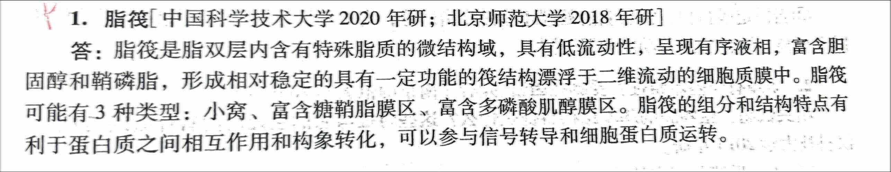
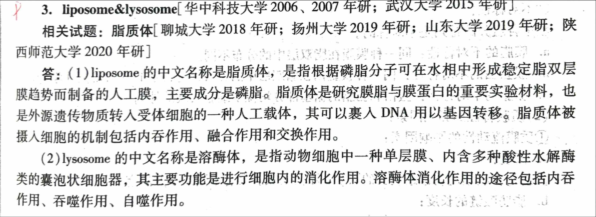
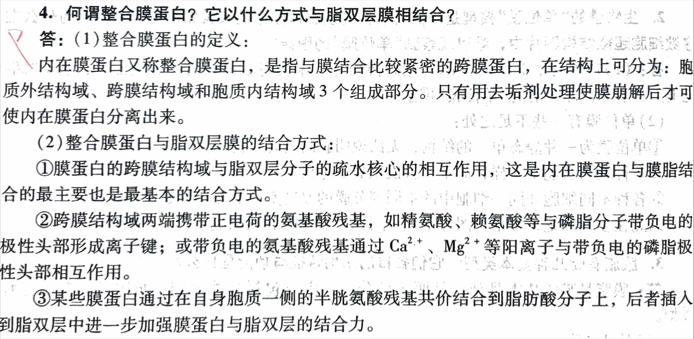
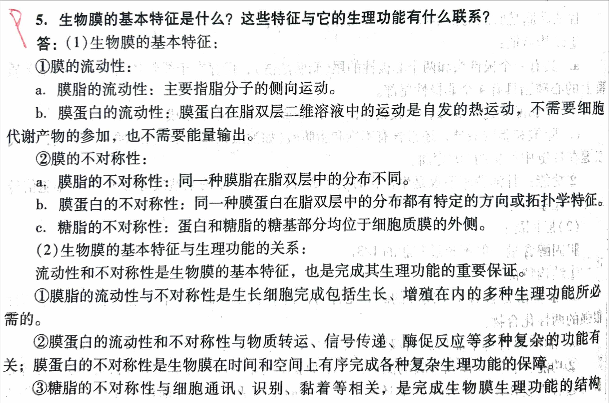

<!-- anki-id: cell-biology-jsonl-000042 -->
### Front
1. 脂筏 简述脂筏的定义、类型及功能。

### Back
答：脂筏是脂双层内含有特殊脂质的微结构域，具有低流动性，呈现有序液相，富含胆固醇和鞘磷脂，形成<u>相对稳定的具有一定功能的筏结构</u>漂浮于二维流动的细胞质膜中。

脂筏可能有3种类型：小窝、富含糖鞘脂膜区、富含多磷酸肌醇膜区。

脂筏的组分和结构特点有利于蛋白质之间相互作用和构象转化，可以参与信号转导和细胞蛋白质运转。

### OriginalMaterial

---

<!-- anki-id: cell-biology-jsonl-000043 -->
### Front
1. liposome&lysosome 脂质体  [聊城大学 2018 年研；扬州大学 2019 年研；山东大学 2019 年研；陕西师范大学 2020 年研]

请回答脂质量体的定义、成分、功能及摄入机制，以及溶酶体的定义、结构和消化途径。

### Back
(1)liposome 的中文名称是脂质体，是指根据磷脂分子可在水相中形成稳定脂双层膜趋势而制备的人工膜，主要成分是磷脂。脂质体是研究膜脂与膜蛋白的重要实验材料，也是外源遗传物质转入受体细胞的一种人工载体，其可以裹入 DNA 用以基因转移。脂质体被摄入细胞的机制包括内吞作用、融合作用和交换作用。

(2)lysosome 的中文名称是溶酶体，是指动物细胞中一种单层膜、内含多种酸性水解酶类的囊泡状细胞器，其主要功能是进行细胞内的消化作用。溶酶体消化作用的途径包括内吞作用、吞噬作用、自噬作用。

### OriginalMaterial

---

<!-- anki-id: cell-biology-jsonl-000044 -->
### Front
【题目】膜脂有哪几种基本类型？它们各自的结构特征与功能是什么？请简述磷脂和鞘脂的作用区别。

### Back
**膜脂是膜的基本结构，是两条性分子，主要包括甘油磷脂、鞘脂、固醇三种类型。它们的结构特征与功能见表格：**

| 膜脂类型 | 结构特征 | 功能 |
| :--- | :--- | :--- |
| **甘油磷脂** | **具有一个与磷酸基团相结合的极性头/亲水头部和两个非极性的尾/疏水尾部（脂肪酸链）**。但存在于线粒体内膜和某些细菌质膜上的心磷脂除外，它具有4个非极性的尾部。（亲水头部由磷酸甘油构成，磷酸基团赋予了亲水性）； (1) 脂肪酸碳链为偶数，多数碳链由16或18个碳原子组成。也有少量14或20个碳链组成的脂肪酸链； (2) 除饱和脂肪酸（如软脂酸、硬脂酸）外，常常还有含1-2个双键的不饱和脂肪酸（如油酸），不饱和脂肪酸多为顺式，顺式双键在烃链中产生约30°角的弯曲。 | 甘油磷脂不仅是生物膜的基本成分，而且其中的某些成分如PI等在细胞信号转导中起重要作用。 常见：PE-磷脂酰乙醇胺/脑磷脂；PS-磷脂酰丝氨酸；PC-磷脂酰胆碱/卵磷脂；SM-鞘磷脂。 |
| **鞘脂** | **鞘脂均为鞘氨醇的衍生物，主要在高尔基体合成，分为鞘磷脂和糖脂（糖鞘脂）。** (1) **鞘磷脂：**它具有一条烃链，另一条链是与鞘氨醇的氨基共价结合的长链脂肪酸。其头部是一个类似于甘油磷脂的基于磷酸基团的极性头部，称为鞘磷脂。鞘磷脂形成的双层的厚度较甘油磷脂的厚度更大；（烃链：CH；脂肪酸链：CH3-CH2n-COOH） (2) **糖脂：**也是两性分子，它的极性头部是直接共价结合到鞘氨醇上的一个单糖分子或寡糖链，因此也称糖鞘脂。 | 鞘脂分布在膜的非胞质面，所有动物的细胞膜都含有糖脂，是膜的重要组成成分，也能构成受体结构，在细胞识别和信号转导中起重要作用。 |
| **胆固醇** | 是一类含有**4个闭环的碳氢化合物**，其亲水的头部为一个羟基，是一种分子刚性很强的两性化合物。 与磷脂不同的是： (1) 亲水头部只有一个OH，亲水性表现不如磷脂和鞘脂； (2) 尾部4个闭环，没那么活泼； (3) 其分子的特殊结构和疏水性太强，自身不能形成脂双层，只能插入磷脂分子之间，参与生物膜的形成/间隔作用； (4) 可以稳定双分层，提高稳定性，降低通透性；也可以调节膜的流动性，是双重性的效果。 | 在调节膜的流动性、增加膜的稳定性以及降低水溶性物质的通透性等方面都起着重要作用，还是甾族的基本结构成分。胆固醇是很多重要的生物活性分子的前体化合物，如固醇类激素、维生素D和胆酸等。 |
 
**磷脂和鞘脂作用区别：**
(1) 胆固醇对厚度的贡献——**<u>对磷脂有用</u>**；对鞘脂无用。
(2) 膜厚度贡献度——**<u>鞘磷脂</u>** > 磷脂。鞘脂对膜厚度贡献大，**一般**在功能筏部位。
(3) 磷脂酰胆碱PC和磷脂酰乙醇胺PE——PC是圆柱形，两种成分在膜当中分布不同。PE极性头比较小，更多分布在脂双层曲率比较大（拐弯的内层）的一侧。

### OriginalMaterial

---

<!-- anki-id: cell-biology-jsonl-000108 -->
### Front
4. 何谓整合膜蛋白？它以什么方式与脂双层膜相结合？

### Back
(1) 整合膜蛋白的定义：
内在膜蛋白又称整合膜蛋白，是指与膜结合比较紧密的跨膜蛋白，在结构上可分为：胞质外结构域、跨膜结构域和胞质内结构域3个组成部分。只有用去垢剂处理使膜崩解后才可使内在膜蛋白分离出来。

(2) 整合膜蛋白与脂双层膜的结合方式：
① 膜蛋白的跨膜结构域与脂双层分子的疏水核心的相互作用，这是内在膜蛋白与膜脂结合的最主要也是最基本的结合方式。
② 跨膜结构域两端携带正电荷的氨基酸残基，如精氨酸、赖氨酸等与磷脂分子带负电的极性头部形成离子键；或带负电的氨基酸残基通过 Ca^{2+}、Mg^{2+} 等阳离子与带负电的磷脂极性头部相互作用。
③ 某些膜蛋白通过在自身胞质一侧的半胱氨酸残基共价结合到脂肪酸分子上，后者插入到脂双层中进一步加强膜蛋白与脂双层的结合力。

### OriginalMaterial

---

<!-- anki-id: cell-biology-jsonl-000129 -->
### Front
5. 生物膜的基本特征是什么？这些特征与它的生理功能有什么联系？

### Back
(1)生物膜的基本特征：
①膜的流动性：
a. 膜脂的流动性：主要指脂分子的侧向运动。
b. 膜蛋白的流动性：膜蛋白在脂双层二维溶液中的运动是自发的热运动，不需要细胞代谢产物的参加，也不需要能量输出。
②膜的不对称性：
a. 膜脂的不对称性：同一种膜脂在脂双层中的分布不同。
b. 膜蛋白的不对称性：同一种膜蛋白在脂双层中的分布都有特定的方向或拓扑学特征。
c. 糖脂的不对称性：蛋白和糖脂的糖基部分均位于细胞质膜的外侧。

(2)生物膜的基本特征与生理功能的关系：
流动性和不对称性是生物膜的基本特征，也是完成其生理功能的重要保证。
①膜脂的流动性与不对称性是生长细胞完成包括生长、增殖在内的多种生理功能所必需的。
②膜蛋白的流动性和不对称性与物质转运、信号传递、酶促反应等多种复杂的功能有关；膜蛋白的不对称性是生物膜在时间和空间上有序完成各种复杂生理功能的保障。
③糖脂的不对称性与细胞通讯、识别、黏着等相关，是完成生物膜生理功能的结构

### OriginalMaterial

---
