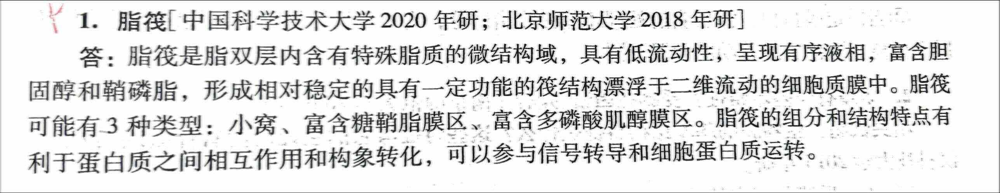
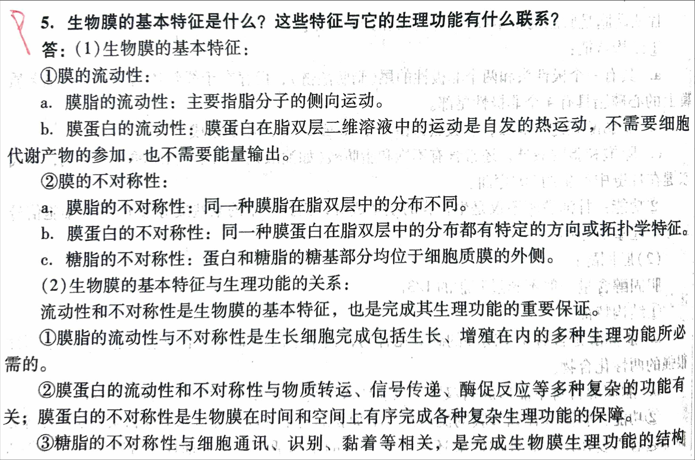

<!-- anki-id: cell-biology-jsonl-000042 -->
### Front
1. 脂筏 简述脂筏的定义、类型及功能。

### Back
答：脂筏是脂双层内含有特殊脂质的微结构域，具有低流动性，呈现有序液相，富含胆固醇和鞘磷脂，形成<u>相对稳定的具有一定功能的筏结构</u>漂浮于二维流动的细胞质膜中。

脂筏可能有3种类型：小窝、富含糖鞘脂膜区、富含多磷酸肌醇膜区。

脂筏的组分和结构特点有利于蛋白质之间相互作用和构象转化，可以参与信号转导和细胞蛋白质运转。

### OriginalMaterial

---

### Front
脂质体的概念、形成机制及其主要应用

### Back
**1. 概念与形成机制**
* **概念**：脂质体（liposome）是指根据磷脂分子可在水相中自发形成封闭脂双层膜的特性而制备的人工膜，是由单层或多层脂双层构成的类似生物膜结构的球形封闭小囊。
* **形成机制**：具有极性头部和非极性尾部的两亲性磷脂分子在水相中具有自我装配成封闭脂双层膜的趋势，极性头部朝向水相，非极性尾部面向内侧。

**2. 主要应用价值**
* **膜生物学研究材料**：可用单一或混合磷脂制备并嵌入不同膜蛋白，是研究膜脂、膜蛋白及其生物学特性的极好实验材料。
* **基因工程载体**：脂质体中包裹 DNA 可有效将其导入细胞中，常用于转基因实验。
* **临床药物载体**：可包裹药物或酶等生物大分子用于疾病治疗；其中水溶性药物包裹在脂质体腔内，脂溶性药物插入脂双层膜中。
* **靶向给药系统**：
  * **主动靶向**：在脂质体双层上装载抗体（如单克隆抗体修饰形成的免疫脂质体）、糖残基、受体配体等归巢装置，特异性结合靶细胞。
  * **特殊性能靶向**：可构建热敏脂质体、pH敏感脂质体、磁性脂质体等新型制剂，使药物更有效地作用于靶细胞并减少对机体的损伤。

---

### Front
简单讲述细胞膜中膜脂的组成成分以及功能

### Back
膜脂是构成细胞膜的基本成分，均为两亲性分子，主要包括甘油磷脂、鞘脂和固醇（胆固醇）三种基本类型。

| 膜脂类型 | 结构特征 | 主要功能 |
| :--- | :--- | :--- |
| **甘油磷脂** | 具有一个极性亲水头部（由磷酸和甘油构成）和两个非极性疏水尾部（脂肪酸链）。常见有磷脂酰胆碱（PC）、磷脂酰乙醇胺（PE）、磷脂酰丝氨酸（PS）等。 | 构成生物膜的基本骨架；某些成分（如磷脂酰肌醇 PI）在细胞信号转导中起重要作用。 |
| **鞘脂** | 均为鞘氨醇衍生物，分为**鞘磷脂**（具烃链、长链脂肪酸与磷酸极性头）与**糖脂**（极性头部为单糖或寡糖链）。 | 主要分布在膜的非胞质面/外小叶；构成受体结构，在细胞识别和信号转导中起重要作用。 |
| **胆固醇（固醇）** | 含有4个闭环碳氢化合物，亲水头部仅为一个羟基（\(-\text{OH}\)），分子刚性强，需插入磷脂分子之间。 | 对膜流动性起双重调节作用（高于相变温度限制流动性，低于相变温度提高流动性）；增加膜稳定性；降低水溶性物质通透性；作为脂筏的基本结构成分。 |

**膜脂的基本功能**：
1. **形成膜的基本屏障与骨架**：具有极性头部和非极性尾部的膜脂分子在水相中自发形成封闭的脂双层结构，为细胞提供相对稳定的内环境。
2. **调节膜的流动性与稳定性**：膜脂的脂肪酸链长度、不饱和度以及胆固醇含量共同决定并调节膜的流动性与稳定性。
3. **参与细胞识别与信号转导**：糖脂及特定磷脂（如PI）作为结构成分或信号分子，参与细胞识别、细胞通讯与信号跨膜传递。

---

### Front
膜蛋白的类型（外在膜蛋白、内在膜蛋白、脂锚定膜蛋白）及整合膜蛋白与膜脂的结合方式

### Back
根据膜蛋白分离的难易程度及其与脂分子的结合方式，膜蛋白主要分为以下三种类型：

| 膜蛋白类型 | 结合方式与结构特征 | 分离方法 | 常见举例 |
| :--- | :--- | :--- | :--- |
| **外在膜蛋白** （周边膜蛋白） | 为水溶性蛋白质，不直接与疏水核心接触，靠离子键或较弱的非共价键与膜表面的膜蛋白或膜脂极性头部结合，分布于膜表面。 | 改变溶液离子强度、高盐溶液、改变 pH 或提高温度即可分离，不破坏膜结构。 | 血影蛋白、肌动蛋白 |
| **内在膜蛋白** （整合膜蛋白） | 均为跨膜蛋白（跨膜结构域由 \(\alpha\) 螺旋或 \(\beta\) 折叠组成，含胞质外、跨膜及胞质内结构域），与膜脂结合紧密。 | 必须使用去垢剂/表面活性剂（如 SDS、Triton X-100）使膜崩解后方可分离。 | 带3蛋白、血型糖蛋白、各类载体与通道蛋白 |
| **脂锚定膜蛋白** | 蛋白质水溶性部分位于脂双层外，通过与其共价结合的脂分子（脂肪酸、烃链或糖脂）插入脂双层而锚定在膜上。 ① N端甘氨酸共价结合脂肪酸（位于胞质侧）； ② C端或近C端半胱氨酸结合烃链/脂肪酸（位于胞质侧）； ③ 通过糖脂（如GPI）锚定（位于非胞质侧）。 | 需要先经脂酶处理去除脂质部分，再用表面活性剂破坏膜结构后分离。 | 窖蛋白、GPI锚定蛋白 |

**整合膜蛋白与膜脂的结合方式（简略）：**
1. **疏水相互作用**：跨膜结构域（疏水 \(\alpha\) 螺旋或 \(\beta\) 折叠桶）与脂双层的疏水核心发生疏水相互作用，这是最主要和基本的结合方式。
2. **离子键与静电作用**：跨膜结构域两端带正电荷的氨基酸残基（如精氨酸 Arg、赖氨酸 Lys）与带负电荷的磷脂极性头部形成离子键；或带负电荷的氨基酸残基通过 \(\text{Ca}^{2+}\)、\(\text{Mg}^{2+}\) 等阳离子与带负电荷的磷脂极性头部相互作用。
3. **共价结合脂质**：某些膜蛋白通过自身在胞质一侧的半胱氨酸残基共价结合脂肪酸分子，后者插入脂双层中进一步加强结合力。

---

<!-- anki-id: cell-biology-jsonl-000129 -->
### Front
5. 生物膜的基本特征是什么？这些特征与它的生理功能有什么联系？

### Back
(1)生物膜的基本特征：
①膜的流动性：
a. 膜脂的流动性：主要指脂分子的侧向运动。
b. 膜蛋白的流动性：膜蛋白在脂双层二维溶液中的运动是自发的热运动，不需要细胞代谢产物的参加，也不需要能量输出。
②膜的不对称性：
a. 膜脂的不对称性：同一种膜脂在脂双层中的分布不同。
b. 膜蛋白的不对称性：同一种膜蛋白在脂双层中的分布都有特定的方向或拓扑学特征。
c. 糖脂的不对称性：蛋白和糖脂的糖基部分均位于细胞质膜的外侧。

(2)生物膜的基本特征与生理功能的关系：
流动性和不对称性是生物膜的基本特征，也是完成其生理功能的重要保证。
①膜脂的流动性与不对称性是生长细胞完成包括生长、增殖在内的多种生理功能所必需的。
②膜蛋白的流动性和不对称性与物质转运、信号传递、酶促反应等多种复杂的功能有关；膜蛋白的不对称性是生物膜在时间和空间上有序完成各种复杂生理功能的保障。
③糖脂的不对称性与细胞通讯、识别、黏着等相关，是完成生物膜生理功能的结构

### OriginalMaterial

---
### Front
膜脂的运动方式主要有

### Back
**膜脂分子的主要运动方式包括以下四种：**

1. **沿膜平面的侧向运动（侧向扩散）**：是膜脂分子的基本运动方式，具有重要的生物学意义。
2. **分子围绕轴心的自旋运动（旋转运动）**：膜脂分子围绕其长轴进行旋转分子运动。
3. **脂肪酸尾部的摆动（旋转异构）**：脂肪酸链靠近极性头部的摆动较小，其尾部摆动较大。
4. **双层分子之间的翻转运动（倒翻运动）**：一般情况下极少发生，但在细胞某些膜系统（特别是在内质网膜）中发生的频率较高，该过程需要特殊的膜蛋白（翻转酶）协助完成。*注意：翻转运动不属于热自由运动。*

---

### Front
膜脂的流动性概念及其影响因素

### Back
**1. 膜脂流动性的概念**
膜脂的流动性主要是指脂分子的侧向扩散运动，是生物膜的基本特征之一。膜脂在相变温度以上呈液晶态，具有类似二维液体的流动特征。

**2. 影响膜脂流动性的主要因素**

| 影响因素 | 作用机制与对流动性的影响 |
| :--- | :--- |
| **温度与相变温度** | 温度升高，膜脂流动性增大。在高于相变温度时呈液态（流动性强），低于相变温度时骤然转变为固态（流动性降低）。相变温度越低，流动性越强。 |
| **脂肪酸链长度** | 脂肪酸链越短，分子间疏水相互作用越弱，膜脂流动性越大；脂肪酸链越长，流动性越小。 |
| **脂肪酸链不饱和度** | 不饱和脂肪酸含量越高（顺式双键使烃链弯曲、排列疏松），膜脂流动性越大；饱和脂肪酸含量高则流动性小。 |
| **胆固醇含量** | 起**双重调节作用**：在相变温度以上，限制脂肪酸链运动，降低膜流动性；在相变温度以下，将磷脂隔开防止凝集，提高膜流动性。 |
| **膜脂成分与比例** | 鞘脂相变温度高于磷脂，磷脂/鞘脂比例越高，流动性越大。卵磷脂（PC）和鞘磷脂组成的膜流动性较小，磷脂酰乙醇胺（PE）、PS、PI等组成的膜流动性较大。 |
| **膜蛋白与环境因素** | 膜蛋白及其与细胞骨架的结合会限制脂分子运动；离子强度、pH及金属离子等理化因素也会对流动性产生影响。 |

---
### Front
膜蛋白的流动性及其影响因素与检测技术

### Back
**1. 膜蛋白流动性的概念与运动方式**
* **概念**：膜蛋白在脂双层二维溶液中的运动是自发的热运动，不需要能量和代谢产物的参与。
* **运动方式**：主要包括侧向扩散运动和旋转扩散运动。
* **特点**：膜蛋白的流动性并非完全自由和随机的，其分布具有不对称性、方向性和区域性，部分膜蛋白受限制而不流动。

**2. 影响膜蛋白流动性的主要因素**
* **膜蛋白之间的相互作用**：膜蛋白相互结合形成特定的膜区，或膜蛋白含量较低/较高时，会限制其流动性并阻隔周边脂分子的运动。
* **膜蛋白与膜脂分子的相互作用**：膜蛋白与脂双层的疏水相互作用及静电作用等会影响其在膜中的扩散。
* **细胞骨架系统的限制**：膜蛋白与膜下细胞骨架结构相结合，会显著限制膜蛋白的侧向运动。例如，用阻断微丝形成的药物（细胞松弛素 B）处理细胞后，膜蛋白的流动性会大大增加。
* **膜脂与膜蛋白的不对称分布**：膜脂（如胆固醇）和膜蛋白在脂双层内外小叶的不对称分布也会影响局部流动性。

**3. 膜蛋白流动性的检测技术与方法**
* **荧光抗体免疫标记实验（细胞融合技术）**：
  * **原理与过程**：分别用荧光抗体（如显绿光的抗小鼠膜蛋白抗体和显红光的抗人膜蛋白抗体）标记小鼠和人的细胞表面，再利用灭活的仙台病毒诱导细胞融合。约 40 min 后，红绿荧光在融合细胞表面均匀分布，证明了膜蛋白在质膜上的侧向运动。
  * **成斑与成帽现象**：若延长标记时间，均匀分布的荧光可重新排布聚集成斑点（成斑现象）或聚集于细胞一端（成帽现象），进一步证实了膜蛋白的流动性以及细胞骨架对膜蛋白运动的限制。
* **荧光漂白恢复技术（FRAP / FPR）**：
  * **原理与过程**：用荧光素或 GFP 标记膜蛋白，利用高能量激光束照射细胞表面某一区域，使被照射区的荧光发生不可逆的淬灭变暗（光漂白）。由于膜的流动性，非漂白区的荧光标记蛋白向漂白区迁移，使漂白区荧光强度逐渐恢复。
  * **应用**：不仅能证明膜蛋白的流动性，还可以定量计算出膜蛋白的扩散系数与迁移率。

---

### Front
膜的不对称性（膜脂与膜蛋白的不对称性及其意义）

### Back
**1. 膜面定义（ES面与PS面）**
* **ES面（E-surface，细胞外表面）**：与细胞外环境接触的膜面，指质膜的外小叶。
* **PS面（P-surface，原生质表面）**：与细胞质基质接触的膜面，指质膜的内小叶。

**2. 膜脂的不对称性及其生物学意义**
* **概念与分布规律**：指同一种膜脂分子在脂双层的内外小叶中呈不均匀分布。
  * 鞘磷脂和磷脂酰胆碱（PC）主要分布在质膜外小叶（ES面）；
  * 磷脂酰乙醇胺（PE）、磷脂酰肌醇（PI）和磷脂酰丝氨酸（PS）主要分布在质膜内小叶（PS面）；
  * 糖脂完全分布在质膜的细胞外小叶（ES面）；
  * 胆固醇在内外小叶中的分布相对均匀。
* **生物学意义**：
  * **信号转导**：如磷酸化磷脂酰肌醇（PI）的头部基团面向细胞质一侧，是 G 蛋白偶联信号转导的必要条件。
  * **参与凝血**：血小板受到血浆因子刺激后，PS 迅速翻转到外小叶，活化参与凝血的酶类。
  * **指示细胞凋亡**：细胞濒临凋亡时难以维持不对称状态，PS 翻转至外小叶且含量明显增加，可作为检测细胞凋亡的指标。

**3. 膜蛋白的不对称性及其生物学意义**
* **概念与分布特征**：指每种膜蛋白分子在细胞膜上都具有明确的方向性（拓扑学特征）。无论是内在膜蛋白还是外在膜蛋白在质膜上均呈不对称分布；糖蛋白的糖链完全分布在 ES 面。
* **生物学意义**：
  * **保证膜功能的方向性**：使膜表面受体、载体蛋白等按一定方向传递信号和跨膜转运物质。
  * **酶促反应区域化**：与质膜相关的酶促反应均发生在膜的某一特定侧面（例如 \(\text{Na}^+\text{-K}^+\) 泵的 ATP 结合位点位于 PS 面）。
  * **细胞识别与相互作用**：ES 面的糖蛋白与糖脂糖链与胞外基质、生长因子及抗体等相互作用（如人类 ABO 血型抗原），是完成细胞识别与细胞通讯的结构基础。

---

### Front
红细胞质膜蛋白及膜骨架

### Back
红细胞膜蛋白的组成:红细胞膜蛋白主要包括血影蛋白(或称红膜肽)、锚蛋白、带3蛋白、带4.1 蛋白、带4.2蛋白和肌动蛋白,此外还有一些血型糖蛋白。
红细胞膜骨架蛋白的组成:红细胞膜骨架蛋白主要包括血影蛋白(或称红膜肽)、锚蛋白、带4.1 蛋白、带4.2蛋白和肌动蛋白。
也就是说带3蛋白及血型糖蛋白是膜蛋白,但不是膜骨架蛋白。

---

