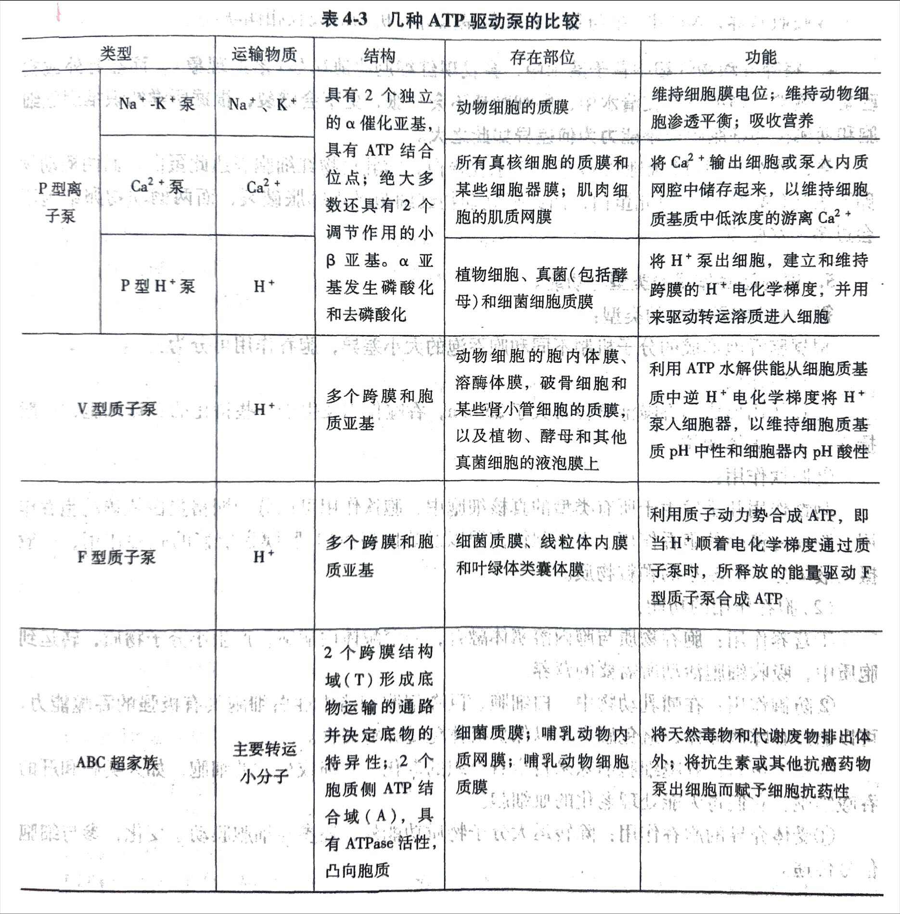

<!-- anki-id: cell-biology-jsonl-000045 -->
### Front
【题目】动物细胞是如何维持细胞内钙离子浓度低于细胞外浓度的?

### Back
(1) 正常情况下，胞膜对Ca2+是高度不透的。
(2) <u>在质膜和内质网膜上有Ca2+泵</u>，能将Ca2+从基质泵出细胞外或泵入内质网腔中。
(3) <u>某些细胞的质膜有Na+-Ca2+交换泵</u>，能将Na+输入到细胞内，而将Ca2+从基质中泵出。
(4) 某些细胞的线粒体也能将Ca2+从基质转运到线粒体基质。
(5) **动物细胞主要是通过膜上的Ca2+泵维持细胞内钙离子浓度低于细胞外浓度的。** Ca2+泵是由1000个氨基酸残基组成的跨膜蛋白，与Na+-K+泵的α亚基同源，含有10个跨膜α螺旋，其中3个螺旋形成了跨越脂双层的中央通道。Ca2+泵工作与ATP的水解相偶联，每消耗1分子ATP从细胞质基质泵出2个Ca2+。Ca2+是细胞内重要的信号分子，细胞质基质中游离的Ca2+浓度始终维持在一个很低水平。细胞质基质中低Ca2+浓度的维持主要得益于质膜或细胞器膜上的钙泵将Ca2+泵到细胞外或细胞器内。Ca2+泵将Ca2+泵入肌质网，对调节肌细胞的收缩运动至关重要。
(6) **Ca2+和蛋白质结合，降低游离Ca2+浓度。**

### OriginalMaterial

---

<!-- anki-id: cell-biology-jsonl-000046 -->
### Front
[题目] 说明 Na-K 泵的工作原理及其生物学意义。

### Back
### 一、概念
**Na-K 泵**是动物细胞中由 ATP 驱动的将 Na+输出到细胞外同时将 K+输入细胞内的运输泵。实际上是一种 Na+/K+-ATPase。
<u>**Na+/K+-ATPase 是由两个大亚基（α亚基）和两个小亚基（β亚基）组成。**</u>
α亚基是跨膜蛋白，在膜内侧有 ATP 结合位点，细胞外侧有乌本苷结合位点；在α亚基上有 Na+ 和 K+结合位点。

### 二、原理
将Na+结合后 ATP水解而使其中天冬氨酸残基磷酸化引起α亚基构象发生变化，从而将 Na+泵出细胞，同时，细胞外的 K+与α亚基的另一位点结合，使其去磷酸化，α亚基构象再度发生变化将 K+泵入细胞。动物细胞要消耗 1/3 的总 ATP 供 Na+-K+泵工作以维持细胞内高 K+低 Na+的离子环境。

### 三、过程
<u>**Na+/K+-ATPase 运输分为六步：**</u>
(1) 静息状态，Na-K 泵的构型使Na+结合位点暴露在膜内侧。当细胞内 Na+浓度升高时，3个 Na+与该位点结合；
(2) Na+的结合，激活了 ATP 酶的活性，使 ATP 分解，释放 ADP，α亚基中天冬氨酸残基被磷酸化；
(3) 由于α亚基磷酸化，引起酶发生构型变化，于是Na+结合的部位转向膜外侧，向胞外释放 3个 Na+；
(4) 膜外的两个 K+同α亚基结合；
(5) K+与磷酸化的 Na+/K+-ATPase 结合后，促使酶去磷酸化；
(6) 去磷酸化后的酶恢复原构型，于是将结合的 K+释放到细胞内。每水解 1个 ATP，运出 3个 Na+，输入 2个 K+。Na+-K+泵工作的结果，使细胞内的 Na+浓度比细胞外低 10~30 倍，而细胞内的 K+浓度比细胞外高 10-30 倍。由于细胞外的Na+浓度高，且Na+是带正电的，所以 Na+-K+泵使细胞外带上正电荷。

### 三、生物学意义（续）
(2) 在建立细胞质膜两侧 Na+浓度梯度的同时，为葡萄糖协同运输泵提供了驱动力；
(3) Na+泵建立的细胞外电位，为神经和肌肉电脉冲传导提供了基础。

#### 四、生理功能
(1) **维持细胞膜电位**：细胞质膜两侧均具有一定的电位差，称为膜电位。膜电位是膜两侧的离子浓度不同形成的，细胞在静息状态时膜电位质膜内侧为负，外侧为正。每一个工作循环下来，Na+-K+将从细胞泵出 3个 Na+并泵入 2个 K+，结果对膜电位的形成起到了一定作用；
(2) **维持动物细胞渗透平衡**：<u>动物细胞靠 Na+-K+泵工作维持渗透平衡，而植物细胞依靠坚韧的细胞壁防止膨胀和破裂</u>；生活在水中的的一些原生动物（如草履虫），通过收缩泡收集和排除过量的水。如果利用 Na+-K+泵的抑制剂乌本苷处理，红细胞将因为胞外 Na+浓度降低而不断吸水膨胀，甚至破裂；
(3) **吸收营养**：动物细胞对葡萄糖或氨基酸等有机物吸收的能量，由 Na+-K+泵工作形成的 Na+电化学梯度中的势能提供，以同向协同转运的方式将葡萄糖等有机物转运至小肠上皮细胞。葡萄糖分子通过Na+驱动的同向协同运输方式进入上皮细胞，再经载体介导的协助扩散方式进入血液；Na+-K+泵消耗 ATP 维持 Na+的电化学梯度，动物细胞利用膜两侧的 Na+电化学梯度以同向转运的方式吸收营养物质。而植物细胞、真菌和细菌细胞通常利用质膜上的 H+-ATPase 形成的 H+电化学梯度来吸收营养物质。

### OriginalMaterial

---

<!-- anki-id: cell-biology-jsonl-000047 -->
### Front
膜转运蛋白（载体蛋白 vs 通道蛋白）的对比表格

### Back
| 比较项目 | 载体蛋白 | 通道蛋白（离子通道为主） | 通道蛋白（孔蛋白） | 通道蛋白（水孔蛋白） |
| :--- | :--- | :--- | :--- | :--- |
| **功能** | 
都是多次跨膜的膜蛋白，在功能上有区别——<u>通道蛋白只能帮助膜实现被动运输</u>；<u>载体蛋白可以帮助膜被动运输+主动运输</u>。  (注：此条为膜转运蛋白共同点及区别描述，横跨所有列) | (同左) | (同左) | (同左) |
| **存在** | 几乎在所有类型的生物膜 | 普遍存在于各类真核细胞的质膜以及细胞内膜上 | (同左) | (同左) |
| **概念** | (1) 载体蛋白具有与溶质特异性结合的位点，所以每种蛋白对溶质具有高度选择性，结合特定溶质，产生构象变化以实现转运； (2) 转运过程具有类似于酶与底物作用的饱和和动力学特征--不能超载； (3) 既可能被底物类似物竞争性抑制，又可被某种抑制剂非竞争性抑制及对PH有依赖性等。 | 对离子选择性取决于通道的直径、形状及通道内带电荷氨基酸残基的分布。 (1) **电压门通道**； (2) **配体/化学门通道** (3) **压力门/机械门通道**。 | 一种跨膜蛋白，其跨膜区域由\beta折叠片层形成柱状亲水性通道。孔蛋白选择性低，且能通过较大的分子 | 四个亚基，每个亚基6次跨膜运输。在细胞膜上组成“孔道”，可控制水在细胞的进出。由于水分子经过水孔蛋白时会形成单一纵列，进入弯曲狭窄的通道内，内部的偶极力与极性会帮助水分子旋转，以适当角度，穿越狭窄的通道 |
| **特点** | (1) **专一性**：一种载体蛋白在细胞内外物质进行运输时只能对应的运送唯一的一种物质； (2) **饱和性**：细胞膜上的载体蛋白有限，在运输过程中当所有蛋白都已承担相应的运输任务时，运输的速度不再因其他条件加快。 | (1) 极高的转运速率； (2) 并非连续性开放，而是**门控**的，通道的开启或关闭受膜电位变化、化学信号或压力刺激的调控； (3) 疏水跨膜蛋白； (4) 与溶质相互作用轻微； (5) 没有动力学特征（没有超载情况） | 选择性低，能通过较大分子 | 只允许水分子通过。帮助水分子快速过膜。调节细胞渗透压以及生理与病理作用。由于通道内有正电荷，因此只能让水分子通过，其他离子无法通过。 |}]

### OriginalMaterial

---

<!-- anki-id: cell-biology-jsonl-000049 -->
### Front
【题目】简述受体介导的胞吞作用过程。

### Back
网格蛋白/笼型蛋白由3个二聚体组成，3个二聚体形成三脚蛋白复合物，是包被的结构单位。最典型的是受体介导的胞吞行为。

需要**接头蛋白**的连接，形成**受体+接头蛋白+网格蛋白**的结构。称为有被小窝。逐渐内陷越来越大，形成有被小泡。

不会自动从膜上掉下来，需要**发动蛋白**的收缩（形成颈部）使有被小泡从膜上分离下来。发动蛋白是一种G蛋白。

(1) 胞外分子通过**衔接蛋白与细胞膜表面受体特异结合被募集，并向胞内凹陷形成有被小窝。**

(2) 有被小窝进一步向内凹陷，**发动蛋白在深陷的小窝颈部组装成环，水解GTP引起颈部缩缠，导致小窝脱离质膜形成有被小泡**。

(3) **有被小泡的外被很快解聚，形成无被小泡，即初级内体。**

(4) **初级内体与溶酶体融合**，吞噬的物质被溶酶体的酶水解。胞吞后，受体或返回质膜区域再利用，或进入溶酶体被消化，或跨膜转运出细胞。

### OriginalMaterial

---

<!-- anki-id: cell-biology-jsonl-000109 -->
### Front
5. 试述胞吞作用的类型与功能。

### Back
答：(1)胞吞作用的类型：
根据胞吞泡形成的分子机制不同和胞吞泡的大小差异，胞吞作用可分为：
①吞噬作用：
吞噬作用形成的吞噬泡直径常大于250nm，吞噬作用发生于一些特化的吞噬细胞，一般摄入较大的固体颗粒。
②胞饮作用：
胞饮作用几乎发生于所有类型的真核细胞中，胞饮作用可以分为网格蛋白依赖的胞吞作用、膜胞窖依赖的胞吞作用、大型胞饮作用以及非网格蛋白/膜胞窖依赖的胞吞作用，一般摄入液体分子和较小的颗粒物质。

(2)胞吞作用的功能：
①营养作用：胞吞物质与胞内溶酶体融合，经溶酶体内酶解，产生小分子物质，转运到胞质中，吸收细胞活动所需要的营养。
②防御作用：在哺乳动物中，白细胞、巨噬细胞和嗜中性白细胞具有极强的吞噬能力，可以通过吞噬病原体，避免感染，以保护机体免受异物侵害。
③组织更新：吞噬细胞消除来自全身组织的老化、受损或死亡的细胞，如人类脾和肝的吞噬细胞，它们每天能处理老化的血细胞。
④受体介导的胞吞作用：除转运大分子物质功能外，还参与细胞膜动态变化，参与细胞信号传递。

### OriginalMaterial

---

<!-- anki-id: cell-biology-jsonl-000130 -->
### Front
表4-3 几种ATP驱动泵的比较

### Back
| 类型 | 运输物质 | 结构 | 存在部位 | 功能 |
|------|----------|------|----------|------|
| **P型离子泵** | **Na⁺-K⁺泵** | Na⁺、K⁺ | 具有2个独立的α催化亚基，具有ATP结合位点；绝大多数还具有2个调节作用的小β亚基。α亚基发生磷酸化和去磷酸化 | 动物细胞的质膜 | 维持细胞膜电位；维持动物细胞渗透平衡；吸收营养 |
| | **Ca²⁺泵** | Ca²⁺ | | 所有真核细胞的质膜和某些细胞器膜；肌肉细胞的肌质网膜 | 将Ca²⁺输出细胞或泵入内质网腔中储存起来，以维持细胞质基质中低浓度的游离Ca²⁺ |
| | **P型H⁺泵** | H⁺ | | 植物细胞、真菌（包括酵母）和细菌细胞质膜 | 将H⁺泵出细胞，建立和维持跨膜的H⁺电化学梯度，并用来驱动转运溶质进入细胞 |
| **V型质子泵** | H⁺ | 多个跨膜和胞质亚基 | 动物细胞的胞内体膜、溶酶体膜，破骨细胞和某些肾小管细胞的质膜，以及植物、酵母和其他真菌细胞的液泡膜上 | 利用ATP水解供能从细胞质基质中逆H⁺电化学梯度将H⁺泵入细胞器，以维持细胞质基质pH中性和细胞器内pH酸性 |
| **F型质子泵** | H⁺ | 多个跨膜和胞质亚基 | 细菌质膜、线粒体内膜和叶绿体类囊体膜 | 利用质子动力势合成ATP，即当H⁺顺着电化学梯度通过质子泵时，所释放的能量驱动F型质子泵合成ATP |
| **ABC超家族** | 主要转运小分子 | 2个跨膜结构域(T)形成底物运输的通路并决定底物的特异性；2个胞质侧ATP结合域(A)，具有ATPase活性，凸向胞质 | 细菌质膜；哺乳动物内质网膜；哺乳动物细胞质膜 | 将天然毒物和代谢废物排出体外；将抗生素或其他抗癌药物泵出细胞而赋予细胞抗药性 |

### OriginalMaterial

---
