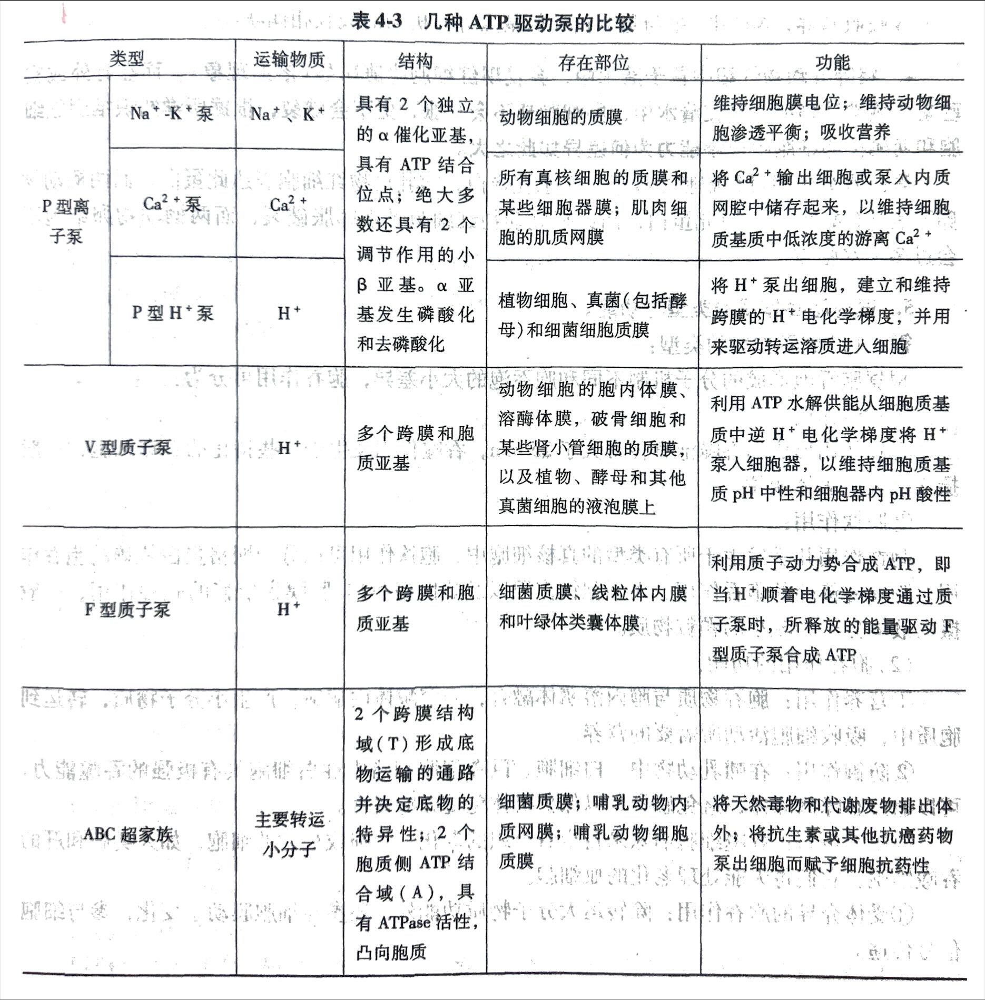

<!-- anki-id: cell-biology-jsonl-000047 -->
### Front
膜转运蛋白（载体蛋白 vs 通道蛋白）的对比表格

### Back
| 比较项目 | 载体蛋白 | 通道蛋白（离子通道为主） | 通道蛋白（孔蛋白） | 通道蛋白（水孔蛋白） |
| :--- | :--- | :--- | :--- | :--- |
| **功能** | 
都是多次跨膜的膜蛋白，在功能上有区别——<u>通道蛋白只能帮助膜实现被动运输</u>；<u>载体蛋白可以帮助膜被动运输+主动运输</u>。  (注：此条为膜转运蛋白共同点及区别描述，横跨所有列) | (同左) | (同左) | (同左) |
| **存在** | 几乎在所有类型的生物膜 | 普遍存在于各类真核细胞的质膜以及细胞内膜上 | (同左) | (同左) |
| **概念** | (1) 载体蛋白具有与溶质特异性结合的位点，所以每种蛋白对溶质具有高度选择性，结合特定溶质，产生构象变化以实现转运； (2) 转运过程具有类似于酶与底物作用的饱和和动力学特征--不能超载； (3) 既可能被底物类似物竞争性抑制，又可被某种抑制剂非竞争性抑制及对PH有依赖性等。 | 对离子选择性取决于通道的直径、形状及通道内带电荷氨基酸残基的分布。 (1) **电压门通道**； (2) **配体/化学门通道** (3) **压力门/机械门通道**。 | 一种跨膜蛋白，其跨膜区域由\beta折叠片层形成柱状亲水性通道。孔蛋白选择性低，且能通过较大的分子 | 四个亚基，每个亚基6次跨膜运输。在细胞膜上组成“孔道”，可控制水在细胞的进出。由于水分子经过水孔蛋白时会形成单一纵列，进入弯曲狭窄的通道内，内部的偶极力与极性会帮助水分子旋转，以适当角度，穿越狭窄的通道 |
| **特点** | (1) **专一性**：一种载体蛋白在细胞内外物质进行运输时只能对应的运送唯一的一种物质； (2) **饱和性**：细胞膜上的载体蛋白有限，在运输过程中当所有蛋白都已承担相应的运输任务时，运输的速度不再因其他条件加快。 | (1) 极高的转运速率； (2) 并非连续性开放，而是**门控**的，通道的开启或关闭受膜电位变化、化学信号或压力刺激的调控； (3) 疏水跨膜蛋白； (4) 与溶质相互作用轻微； (5) 没有动力学特征（没有超载情况） | 选择性低，能通过较大分子 | 只允许水分子通过。帮助水分子快速过膜。调节细胞渗透压以及生理与病理作用。由于通道内有正电荷，因此只能让水分子通过，其他离子无法通过。 |}]

### OriginalMaterial

---

<!-- anki-id: cell-biology-jsonl-000049 -->
### Front
【题目】简述受体介导的胞吞作用过程。

### Back
网格蛋白/笼型蛋白由3个二聚体组成，3个二聚体形成三脚蛋白复合物，是包被的结构单位。最典型的是受体介导的胞吞行为。

需要**接头蛋白**的连接，形成**受体+接头蛋白+网格蛋白**的结构。称为有被小窝。逐渐内陷越来越大，形成有被小泡。

不会自动从膜上掉下来，需要**发动蛋白**的收缩（形成颈部）使有被小泡从膜上分离下来。发动蛋白是一种G蛋白。

(1) 胞外分子通过**衔接蛋白与细胞膜表面受体特异结合被募集，并向胞内凹陷形成有被小窝。**

(2) 有被小窝进一步向内凹陷，**发动蛋白在深陷的小窝颈部组装成环，水解GTP引起颈部缩缠，导致小窝脱离质膜形成有被小泡**。

(3) **有被小泡的外被很快解聚，形成无被小泡，即初级内体。**

(4) **初级内体与溶酶体融合**，吞噬的物质被溶酶体的酶水解。胞吞后，受体或返回质膜区域再利用，或进入溶酶体被消化，或跨膜转运出细胞。

### OriginalMaterial

---

### Front
论述：载体蛋白及其功能

### Back
**一、载体蛋白的概念与定义**  
载体蛋白（carrier protein）是几乎存在于所有类型生物膜上的多次跨膜蛋白。它具有特异性结合位点，能与特定的溶质分子发生暂时性、可逆性的结合，通过自身一系列构象改变（conformational change）来介导溶质分子的跨膜转运。

**二、载体蛋白的转运特点**  
1. **高度特异性**：载体蛋白具有特异性结合位点，对转运的溶质分子具有高度选择性，一种特异性载体蛋白通常只转运一种类型的分子或离子。
2. **构象改变与无共价修饰**：载体蛋白通过自身构象改变来实现物质跨膜转运，且在转运过程中不对溶质分子进行任何共价修饰。
3. **类似于酶的饱和动力学**：载体蛋白对溶质的转运过程具有类似于酶与底物作用的饱和动力学特征，即存在转运饱和点（最大转运速率）；可被底物类似物竞争性抑制，也可被某种抑制剂非竞争性抑制，并具有 pH 依赖性。

**三、载体蛋白的主要生物学功能与运输类型**  
载体蛋白介导特定溶质的跨膜运输，主要分为协助扩散（被动运输）和主动运输两大类：

1. **介导协助扩散（被动运输）**  
   - **特点**：溶质顺着电化学梯度或浓度梯度进行转运，不需要消耗代谢能量（ATP）。  
   - **典型代表**：葡萄糖转运载体（如红细胞及大部分动物细胞质膜上的 GLUT1），通过自身构象改变，顺浓度梯度将葡萄糖协助扩散运入细胞内。

2. **介导主动运输**  
   - **特点**：逆溶质的电化学梯度或浓度梯度进行转运，需要消耗能量，且参与主动运输的转运蛋白仅限于载体蛋白。  
   - **ATP 驱动泵（直接消耗能量）**：直接利用 ATP 水解产生的能量实现离子或小分子的逆浓度梯度跨膜转运。典型类型包括：  
     - **\(\text{Na}^+\)-\(\text{K}^+\) 泵**：每水解 1 分子 ATP，泵出 3 个 \(\text{Na}^+\) 并泵入 2 个 \(\text{K}^+\)，用于维持细胞内高 \(\text{K}^+\) 低 \(\text{Na}^+\) 的离子环境、膜电位及渗透平衡。  
     - **\(\text{Ca}^{2+}\) 泵**：消耗 ATP 将细胞质基质中的 \(\text{Ca}^{2+}\) 输出到细胞外或泵入内质网/肌质网腔中储存，以维持胞质低 \(\text{Ca}^{2+}\) 浓度。  
     - **P 型 \(\text{H}^+\) 泵**：存在于植物、真菌及细菌质膜上，将 \(\text{H}^+\) 泵出细胞建立跨膜 \(\text{H}^+\) 电化学梯度。  
     - **ABC 超家族**：利用 ATP 结合与水解完成糖、氨基酸、脂类及药物等小分子物质的跨膜转运。  
   - **协同运输蛋白（间接消耗能量）**：利用一种溶质顺电化学梯度的势能驱动另一种溶质逆电化学梯度转运。可分为：  
     - **同向协同**：两种物质转运方向相同，如小肠上皮细胞利用 \(\text{Na}^+\) 的电化学梯度同向协同吸收葡萄糖或氨基酸。  
     - **反向协同**：两种物质转运方向相反，如质膜上的 \(\text{Na}^+\)-\(\text{Ca}^{2+}\) 交换器和 \(\text{Na}^+\)-\(\text{H}^+\) 交换器，利用 \(\text{Na}^+\) 梯度驱动 \(\text{Ca}^{2+}\) 或 \(\text{H}^+\) 输出细胞外。

---
### Front
论述：通道蛋白及其特点、功能与分类

### Back
**一、通道蛋白的概念与定义**  
通道蛋白（channel protein）是一类横跨生物膜的跨膜蛋白，通过疏水氨基酸链重排形成水性/亲水性通道，能使适当大小和带电荷的分子或离子以简单自由扩散/协助扩散的方式，顺浓度梯度或电化学梯度从质膜一侧转运到另一侧。

**二、通道蛋白的转运特点**  
1. **只参与被动运输**：介导物质顺电化学梯度或浓度梯度跨膜转运，运输过程中不需要消耗代谢能量（ATP）。
2. **不与溶质结合且不发生构象移动**：在转运过程中不与被转运分子发生特异性结合，蛋白本身也不发生移动或大的构象改变，而是横跨膜形成亲水通道供溶质通过。
3. **极高的转运速率**：具有极高的转运速率，每秒可转运 \(10^7 \sim 10^8\) 个离子，转运速度接近自由扩散。
4. **无饱和效应**：转运速率与溶质浓度成正比，不存在饱和值（无超载现象），不符合类似酶与底物作用的饱和动力学特征。
5. **高度选择性**：对转运的溶质具有选择性。离子通道的选择性取决于通道的直径、形状以及通道内壁带电荷氨基酸残基的分布；水孔蛋白仅允许水分子通过。
6. **门控性（多受调控）**：绝大多数通道蛋白（如离子通道）并非连续性开放，而是门控的（gated）。通道的开启或关闭受膜电位变化、化学信号或压力刺激的调控，可在数毫秒内迅速开放与关闭/失活。

**三、通道蛋白的分类**  
通道蛋白主要分为以下三大类：

| 通道蛋白类型 | 结构特征 | 门控/转运机制 | 典型代表与分布 |
| :--- | :--- | :--- | :--- |
| **离子通道（主）** | 疏水氨基酸形成的亲水通道 | 具有门控性，根据激活信号分为： 1. **电压门控通道**：随跨膜电位梯度改变而开启/关闭 2. **配体/化学门控通道**：与特定小分子配体结合后开启/关闭 3. **压力/机械门控通道**：感受应力或机械刺激而开启/关闭 | 神经与肌肉细胞上的电压门控 \(\text{Na}^+\) 通道、\(\text{K}^+\) 通道；内耳听觉毛细胞的应力门控通道 |
| **孔蛋白（Porins）** | 跨膜区域由 \(\beta\) 折叠片层形成柱状亲水通道 | 选择性较低，允许较大分子（如小分子水溶性物质）自由通透 | 存在于革兰氏阴性细菌外膜、线粒体和叶绿体外膜 |
| **水孔蛋白（AQP）** | 由 4 个亚基组成四聚体，每个亚基独立形成中央孔（含 6 次跨膜 \(\alpha\) 螺旋） | 孔径约 \(0.28\text{ nm}\)，水分子呈单一排列通过；内部带正电荷，阻挡 \(\text{H}^+\) 及其他离子 | 存在于红细胞（AQP1）、肾小管上皮细胞、植物细胞等 |

**四、通道蛋白的生物学功能**  
1. **介导溶质的高速被动跨膜转运**：协助水分子、无机离子等极性/带电小分子快速顺电化学梯度过膜。
2. **构成生物电活动的基础**：离子通道是神经和肌肉等可兴奋细胞电活动的基础。通过调控 \(\text{Na}^+\)、\(\text{K}^+\) 等离子的跨膜流动，产生和维持静息电位与动作电位，完成电信号或化学信号的传导。
3. **调节细胞渗透压与水分平衡**：水孔蛋白在肾小管对原尿水分的重吸收、唾液与泪液的分泌、种子的萌发以及气孔运动中起关键调节作用。
4. **控制细胞生理与内环境稳定**：离子通道参与调节神经递质释放、腺体分泌、肌肉收缩、细胞分裂以及维持细胞体积恒定等重要生理过程。

---
### Front
论述：简单扩散与协助扩散

### Back
**一、定义与概念**  
1. **简单扩散（Simple Diffusion）**：小分子物质或离子以热自由运动的方式顺着电化学梯度或浓度梯度直接通过脂双层进出细胞的方式。  
2. **协助扩散（Facilitated Diffusion）**：溶质顺着电化学梯度或浓度梯度，在膜转运蛋白（载体蛋白或通道蛋白）协助下的跨膜转运方式，又称易化扩散。  

**二、简单扩散与协助扩散的异同对比**  

| 比较项目 | 简单扩散 | 协助扩散 |
| :--- | :--- | :--- |
| **转运方向** | 顺浓度梯度 / 顺电化学梯度 | 顺浓度梯度 / 顺电化学梯度 |
| **代谢能量消耗** | 否（不消耗 ATP） | 否（不消耗 ATP） |
| **膜转运蛋白** | 不需要膜转运蛋白 | 需要（载体蛋白或通道蛋白） |
| **转运动力** | 物质跨膜浓度梯度或电化学梯度 | 物质跨膜浓度梯度或电化学梯度 |
| **选择性与特异性** | 无结合位点，取决于物质理化性质与膜通透性 | 具有高度特异性或选择性 |
| **饱和效应** | 无饱和现象（速率与浓度差成正比） | 载体蛋白介导时具有饱和动力学特征；离子通道介导时无饱和现象 |
| **竞争性抑制** | 无 | 载体蛋白介导时存在竞争性抑制 |
| **转运物质类型** | 脂溶性分子及不带电荷的小分子（如 \(\text{O}_2\)、\(\text{N}_2\)、\(\text{CO}_2\)、甘油、苯等） | 水分子、葡萄糖、氨基酸等极性小分子及各种无机离子 |

**三、生物学意义**  
简单扩散与协助扩散均属于被动运输。两者均顺梯度转运物质，趋向于消除细胞内外浓度差，保证细胞及细胞器摄取必要的营养物质并排出代谢废弃物。协助扩散克服了脂双层对极性分子和离子的屏障作用，使这些物质能够高效、选择性地跨膜流动。

---
### Front
论述：水孔蛋白及其结构与功能

### Back
**一、水孔蛋白的概念与性质**
水孔蛋白（Aquaporin, AQP）属于整合膜蛋白家族，是构成选择性水通道的跨膜通道蛋白，主要介导水分子的快速跨膜被动运输。水分子虽然可以通过简单扩散缓慢穿过脂双层，但许多组织细胞（如肾小管上皮细胞、红细胞等）必须借助质膜上的大量水孔蛋白来实现水分子的快速跨膜转运。

**二、水孔蛋白的结构特征**
1. **四聚体及跨膜结构**：水孔蛋白通常由 4 个相同的亚基组成四聚体。每个亚基均由 6 个跨膜 \(\alpha\) 螺旋构成。
2. **中央通道与孔径**：每个水孔蛋白亚基单独形成一个供水分子通过的中央通道，孔道长约 \(2\text{ nm}\)，孔径稍大于水分子直径（约 \(0.28\text{ nm}\)），水分子在通道内呈单一队列穿过。
3. **选择性通透与阻挡质子机制**：
   - **氢键与分子的旋转**：弯曲狭窄的通道内部存在偶极力与极性，可帮助水分子旋转并以适当角度穿越通道。通道内高度保守的氨基酸残基（如 Asp/His/Cys）通过与水分子形成氢键，特异性介导水分子跨膜运输。
   - **正电荷阻断离子与质子**：通道内部（如 Asn-Pro-Ala 中的 Asn 残基）带有正电荷，能有效阻止质子（\(H^+\)）及其他离子的通过，确保其对水分子的高度特异通透性。

**三、生理功能与应用**
1. **快速转运水分子与调节渗透压**：水孔蛋白能帮助水分子快速过膜，对调节细胞渗透压以及维持体内水盐平衡至关重要。例如帮助人体在炎热夏天浓缩尿液防止脱水，在肾近曲小管对原尿（每天约 \(180\text{ L}\)）进行大部分水分的重吸收。
2. **特定小分子的跨膜转运**：个别水孔蛋白不仅能转运水，还允许小分子非电解质或脂溶性分子通过，如 AQP7 和 Glpf 可转运甘油，AQP8 对尿素具有通透性。
3. **植物与动物生理活动中的作用**：
   - **植物**：参与种子萌发、细胞伸长、气孔运动、受精及抗旱等逆境应答过程。
   - **动物**：参与出汗、排尿、发炎红肿、唾液与眼泪形成、红细胞快速膨胀与收缩，以及维持晶状体透明度（如 AQP0 突变可导致晶状体水肿与白内障）等。

---
### Front
论述：主动运输的特点及类型

### Back
**一、主动运输的概念**
主动运输是指由载体蛋白所介导的物质逆电化学梯度或浓度梯度进行跨膜转运的方式。

**二、主动运输的特点**
1. **逆梯度转运**：物质由低浓度/低电化学势一侧向高浓度/高电化学势一侧转运（逆浓度梯度或逆电化学梯度）。
2. **依赖载体蛋白**：必须依赖膜转运蛋白中的载体蛋白介导，通道蛋白不参与主动运输。
3. **消耗代谢能量**：转运过程需要消耗代谢能量（直接或间接供能），对代谢毒物敏感。
4. **选择性与饱和性**：对被转运物质具有高度的选择性与特异性；转运过程具有类似于酶与底物作用的饱和动力学特征，可被竞争性或非竞争性抑制。

**三、主动运输的类型**
根据能量来源的不同，主动运输主要分为以下三种类型：

| 运输类型 | 能量来源 | 作用机制与主要特点 | 代表实例 |
| :--- | :--- | :--- | :--- |
| **ATP驱动泵** | ATP直接水解供能 | 直接利用ATP水解产生的能量逆电化学梯度转运离子或小分子。 | **P型泵**（如 \(\text{Na}^+-\text{K}^+\) 泵、\(\text{Ca}^{2+}\) 泵，形成磷酸化中间体）；**V型质子泵**（维持胞内体/溶酶体酸性环境）；**F型质子泵**（\(\text{ATP}\) 合酶）；**ABC超家族**（转运多种小分子与药物）。 |
| **协同运输蛋白** | 跨膜电化学梯度（间接消耗ATP） | 将一种溶质逆浓度梯度的转运与另一种溶质（如 \(\text{Na}^+\) 或 \(\text{H}^+\)）顺电化学梯度的转运相偶联。 | **同向协同**（如小肠上皮细胞吸收葡萄糖，与 \(\text{Na}^+\) 同向转运）；**反向协同**（如质膜 \(\text{Na}^+/\text{Ca}^{2+}\) 交换体）。 |
| **光驱动泵** | 光能 | 将对溶质的主动运输与光能的输入直接相偶联，主要存在于细菌。 | 菌紫质（如嗜盐菌质子泵）。 |

---

<!-- anki-id: cell-biology-jsonl-000045 -->
### Front
【题目】动物细胞是如何维持细胞内钙离子浓度低于细胞外浓度的?

### Back
(1) 正常情况下，胞膜对Ca2+是高度不透的。
(2) <u>在质膜和内质网膜上有Ca2+泵</u>，能将Ca2+从基质泵出细胞外或泵入内质网腔中。
(3) <u>某些细胞的质膜有Na+-Ca2+交换泵</u>，能将Na+输入到细胞内，而将Ca2+从基质中泵出。
(4) 某些细胞的线粒体也能将Ca2+从基质转运到线粒体基质。
(5) **动物细胞主要是通过膜上的Ca2+泵维持细胞内钙离子浓度低于细胞外浓度的。** Ca2+泵是由1000个氨基酸残基组成的跨膜蛋白，与Na+-K+泵的α亚基同源，含有10个跨膜α螺旋，其中3个螺旋形成了跨越脂双层的中央通道。Ca2+泵工作与ATP的水解相偶联，每消耗1分子ATP从细胞质基质泵出2个Ca2+。Ca2+是细胞内重要的信号分子，细胞质基质中游离的Ca2+浓度始终维持在一个很低水平。细胞质基质中低Ca2+浓度的维持主要得益于质膜或细胞器膜上的钙泵将Ca2+泵到细胞外或细胞器内。Ca2+泵将Ca2+泵入肌质网，对调节肌细胞的收缩运动至关重要。
(6) **Ca2+和蛋白质结合，降低游离Ca2+浓度。**

### OriginalMaterial

---
### Front
解释：ATP驱动泵的主要类型

### Back

**ATP驱动泵的概念** ATP驱动泵（即转运 ATP 酶）是一类直接利用 ATP 水解产生的能量，实现离子或小分子逆电化学梯度或浓度梯度进行跨膜转运的载体蛋白。在正常情况下，ATP 驱动泵将 ATP 的水解与物质的跨膜转运紧密偶联
**ATP驱动泵**（转运 ATP 酶）主要分为以下 4 种类型：

1. **P型离子泵（P-type pump）**：主要负责离子的跨膜转运与梯度维持，如 \(\text{Na}^+-\text{K}^+\) 泵、\(\text{Ca}^{2+}\) 泵和 P型 \(\text{H}^+\) 泵。
2. **V型质子泵（V-type proton pump）**：专门逆浓度梯度转运 \(\text{H}^+\)，存在于胞内体膜、溶酶体膜及液泡膜等，维持内部酸性环境。
3. **F型质子泵（F-type proton pump / \(\text{F}_0\text{F}_1\text{-ATP}\) 合酶）**：协助 \(\text{H}^+\) 顺电化学梯度运动并利用能量合成 ATP，存在于细菌质膜、线粒体内膜和叶绿体类囊体膜。
4. **ABC超家族（ABC transporter superfamily）**：转运离子及各种小分子（如糖、氨基酸、脂质、药物等）的跨膜转运蛋白超家族。

---

### Front
论述：P型泵（P-type pump）的定义、结构特点与通用转运机制

### Back
**一、 定义**  
P型泵（P-type pump）属于由 ATP 直接供能的 ATP 驱动泵，是主要负责跨膜离子转运的载体蛋白。其在转运离子过程中，催化亚基利用 ATP 水解发生磷酸化和去磷酸化，形成磷酸化的中间体，因而被称为 P型泵。

**二、 结构特点**  
1. **亚基组成**：通常由大、小两个亚基（或 \( \alpha_2\beta_2 \) 多聚体）组成。  
2. **\( \alpha \) 亚基（催化亚基）**：为多次跨膜蛋白，细胞质侧含有 ATP 结合位点和天冬氨酸残基（磷酸化位点），同时具备特异性离子结合位点。  
3. **\( \beta \) 亚基（调节亚基）**：为糖基化的多肽，不直接参与离子转运，但有助于新合成的 \( \alpha \) 亚基在内质网中正确折叠并调节其运输。

**三、 通用转运机制**  
1. 离子在胞质侧与 \( \alpha \) 亚基结合，激活其 ATPase 活性。  
2. ATP 水解生成 ADP，释放的磷酸基团转移至 \( \alpha \) 亚基的天冬氨酸残基上使其**磷酸化**。  
3. 磷酸化诱导 \( \alpha \) 亚基发生构象改变，离子结合位点转向膜另一侧（胞外或细胞器腔），亲和力降低并释放离子。  
4. 膜另一侧的离子结合或去磷酸化信号促使 \( \alpha \) 亚基**去磷酸化**，恢复初始构象，完成一次转运循环。

---

### Front
论述：Na+-K+泵的结构、转运机制、影响因素与生理功能

### Back
**一、 结构**  
\( \text{Na}^+\text{-K}^+ \) 泵（又称 \( \text{Na}^+/\text{K}^+\text{-ATPase} \)）由 2 个 \( \alpha \) 亚基和 2 个 \( \beta \) 亚基组成四聚体。\( \alpha \) 亚基胞内侧具有 ATP 结合位点及 \( \text{Na}^+ \)、\( \text{K}^+ \) 结合位点，胞外侧具有乌本苷（ouabain）结合位点。

**二、 转运机制**  
每消耗 1 分子 ATP，逆浓度梯度向胞外泵出 3 个 \( \text{Na}^+ \)，向胞内泵入 2 个 \( \text{K}^+ \)：  
1. 静息状态下 \( \text{Na}^+ \) 结合位点朝向胞内，胞内 3 个 \( \text{Na}^+ \) 结合激活 ATPase 活性。  
2. ATP 水解，\( \alpha \) 亚基天冬氨酸残基磷酸化，发生构象改变将 3 个 \( \text{Na}^+ \) 释放至胞外。  
3. 胞外 2 个 \( \text{K}^+ \) 与 \( \alpha \) 亚基结合，促使酶去磷酸化。  
4. 去磷酸化使酶恢复原构象，将 2 个 \( \text{K}^+ \) 释放到胞内。

**三、 影响因素**  
1. **乌本苷（ouabain）**：极少量的乌本苷可与胞外结合位点竞争性结合并阻断 \( \text{K}^+ \) 结合，抑制泵活性。  
2. **\( \text{Mg}^{2+} \) 与膜脂**：\( \text{Mg}^{2+} \) 和少量膜脂有助于提高泵活性。  
3. **代谢抑制剂**：如氟化氰化物等抑制代谢中断 ATP 供应，致使泵停止工作。

**四、 生理功能**  
1. **维持膜静息电位**：形成内负外正的跨膜电位差。  
2. **维持渗透平衡与细胞体积**：泵出 \( \text{Na}^+ \) 抵消渗透压，防止细胞吸水膨胀破裂。  
3. **提供协同运输驱动力**：建立 \( \text{Na}^+ \) 跨膜电化学梯度，驱动小肠上皮细胞吸收葡萄糖和氨基酸。  
4. **维持神经与肌肉兴奋性**：为神经和肌肉电脉冲传导提供离子梯度基础。

---

### Front
论述：Ca2+泵的结构、转运机制、调节因素与生理功能及与其他P型泵比较

### Back
**一、 结构**  
\( \text{Ca}^{2+} \) 泵（\( \text{Ca}^{2+}\text{-ATPase} \)）是由 1000 个氨基酸残基组成的跨膜蛋白，与 \( \text{Na}^+\text{-K}^+ \) 泵 \( \alpha \) 亚基同源，包含 10 个跨膜 \( \alpha \) 螺旋（其中 3 个螺旋形成跨膜中央通道）。质膜型 \( \text{Ca}^{2+} \) 泵 C 端含有钙调蛋白（CaM）结合位点。

**二、 转运机制**  
每消耗 1 分子 ATP，从细胞质基质逆浓度梯度泵出 2 个 \( \text{Ca}^{2+} \) 到胞外或泵入内质网/肌质网腔内：  
1. 非磷酸化状态下，胞质侧结合 2 个 \( \text{Ca}^{2+} \)。  
2. ATP 结合并水解，天冬氨酸残基磷酸化引发跨膜螺旋重排，破坏 \( \text{Ca}^{2+} \) 结合位点，将 \( \text{Ca}^{2+} \) 释放至膜另一侧。  
3. 去磷酸化后构象复原。

**三、 调节因素与生理功能**  
1. **调节因素**：胞内 \( \text{Ca}^{2+} \) 浓度升高时与 CaM 结合形成 \( \text{Ca}^{2+}\text{-CaM} \) 复合物，结合质膜 \( \text{Ca}^{2+} \) 泵 C 端以激活其活性；内质网型无 CaM 结合域。  
2. **生理功能**：维持细胞质基质中极低浓度的游离 \( \text{Ca}^{2+} \)；肌质网 \( \text{Ca}^{2+} \) 泵储存 \( \text{Ca}^{2+} \)，对调节肌肉细胞的收缩与舒张至关重要。

**四、 主要 P型泵的特征比较**

| P型泵类型 | 存在部位 | 运送离子及化学计量 | 主要生理功能 |
| :--- | :--- | :--- | :--- |
| **\( \text{Na}^+\text{-K}^+ \) 泵** | 动物细胞质膜 | 水解 1 ATP，泵出 3 \( \text{Na}^+ \)，泵入 2 \( \text{K}^+ \) | 维持渗透平衡、静息电位及 \( \text{Na}^+ \) 驱动协同运输 |
| **\( \text{Ca}^{2+} \) 泵** | 所有真核细胞质膜、内质网/肌质网膜 | 水解 1 ATP，泵出/泵入 2 \( \text{Ca}^{2+} \) | 维持胞质低 \( \text{Ca}^{2+} \) 浓度，调节肌肉收缩与信号转导 |
| **\( \text{H}^+ \) 泵** | 植物、真菌和细菌质膜 | 泵出 \( \text{H}^+ \) | 建立跨膜 \( \text{H}^+ \) 梯度，驱动溶质协同吸收 |

---

### Front
论述：V型质子泵与F型质子泵的分布、功能及异同比较

### Back
**一、 V型质子泵（V-type proton pump）**  
1. **分布（存在位置）**：  
   - 动物细胞的**胞内体膜**与**溶酶体膜**。  
   - 某些分泌酸性物质的动物细胞质膜，如**破骨细胞**和**肾小管细胞**。  
   - 植物、酵母及其他真菌细胞的**液泡膜**。  
2. **功能**：利用 ATP 水解供能，将 \( \text{H}^+ \) 逆电化学梯度/浓度梯度从细胞质基质泵入细胞器腔内（或细胞外），以维持细胞质基质 pH 为中性以及细胞器（如溶酶体、液泡）内部为酸性环境。

**二、 F型质子泵（F-type proton pump）**  
1. **分布（存在位置）**：  
   - **细菌质膜**。  
   - **线粒体内膜**。  
   - **叶绿体类囊体膜**。  
2. **功能**：利用质子动力势（跨膜 \( \text{H}^+ \) 电化学梯度）合成 ATP。当 \( \text{H}^+ \) 顺着电化学梯度穿过质子泵时，释放的能量驱动其催化合成 ATP（参与氧化磷酸化和光合磷酸化过程），故又称 **\( \text{H}^+\text{-ATP} \)合酶** 或 **\( \text{F}_0\text{F}_1\text{-ATP} \)合酶**。

**三、 V型与F型质子泵异同比较**

| 特征项 | V型质子泵 | F型质子泵 |
| :--- | :--- | :--- |
| **分布位置** | 动物胞内体膜、溶酶体膜、破骨/肾小管细胞质膜；植物/真菌液泡膜 | 细菌质膜、线粒体内膜、叶绿体类囊体膜 |
| **主要功能** | 逆电化学梯度泵入 \( \text{H}^+ \)，维持酸性内环境 | 顺电化学梯度转运 \( \text{H}^+ \)，驱动合成 ATP |
| **能量转化** | **消耗/利用** ATP 水解释放的能量 | **利用质子动力势产生/合成** ATP |
| **转运方向** | 从细胞质基质逆梯度泵入细胞器腔或胞外 | 顺梯度流过质子通道 |
| **磷酸化中间体** | 转运过程中**不形成**磷酸化中间体 | 转运过程中**不形成**磷酸化中间体 |
| **别称** | 转运 ATP 酶 | \( \text{H}^+\text{-ATP} \)合酶 / \( \text{F}_0\text{F}_1\text{-ATP} \)合酶 |

---
### Front
论述：ABC超家族（ABC转运蛋白）的分布、结构特点、转运功能及相关病症

### Back
**一、 分布**  
ABC超家族（ABC transporter superfamily）是广泛存在于从细菌到人类的最大一类转运蛋白：  
1. **细菌质膜**：主要用于转运糖、氨基酸、肽类等。  
2. **哺乳动物内质网膜**：负责转运与 MHC 蛋白相关的抗原肽。  
3. **哺乳动物细胞质膜**：广泛分布于肝、小肠和肾等器官，负责转运小分子、磷脂、胆固醇、亲脂性药物及其他小分子。

**二、 结构特点**  
1. **跨膜结构域（T）**：包含 2 个跨膜结构域，每个结构域由 6 个跨膜 \( \alpha \) 螺旋组成，形成底物运输通路并决定底物的特异性。  
2. **ATP 结合结构域（A）**：包含 2 个胞质侧 ATP 结合域，凸向胞质，具有 ATPase 活性。  
3. **亚基组合**：不同的结构域可以位于同一个亚基上，也可以位于不同的亚基上。

**三、 工作机制与功能**  
1. **工作机制**：  
   - ATP 分子与 2 个 ATP 结合域结合并诱导其二聚化，引起转运蛋白发生构象改变，使底物结合位点暴露于膜另一侧；  
   - ATP 水解及 ADP 解离促使 ATP 结合域解离，转运蛋白恢复原有构象，完成物质跨膜转运。  
2. **主要功能**：  
   - 直接消耗 ATP 驱动离子与多种小分子的逆浓度梯度跨膜转运；  
   - 在肝、小肠和肾等器官中将天然毒物和代谢废物排出体外；  
   - 能将抗生素或抗癌药物泵出细胞。

**四、 相关病症**  
1. **囊性纤维化（Cystic Fibrosis, CF）**：  
   - **病因**：由 CFTR 基因突变导致蛋白缺陷。CFTR 是受 cAMP 激活的 ATP 门控上皮氯离子通道蛋白，属于 ABC 转运蛋白超家族。  
   - **机制**：突变导致 \( \text{Cl}^- \) 无法运出细胞外而在胞内积累，同时刺激 \( \text{Na}^+ \) 相关通道吸收 \( \text{Na}^+ \)，使细胞内渗透压增大，水分由呼吸道黏液转移至细胞内。黏液因失水而浓稠，导致肺部和消化道出现严重呼吸与消化障碍。  
2. **肿瘤及细菌的多药耐药性（MDR）**：  
   - 部分 ABC 转运蛋白在细胞表面过度表达时，会将进入胞内的抗生素或抗癌药物强行泵出细胞，从而赋予细菌或肿瘤细胞抗药性。

---
### Front
比较：膜电位（静息电位与动作电位）

### Back
| 特性 | 静息电位 | 动作电位 |
| :--- | :--- | :--- |
| **定义** | 细胞在未受到刺激时质膜两侧的电位差 | 细胞受到刺激时质膜电位的快速变化 |
| **膜电位范围** | -70 ~ -30 mV | 从静息电位开始，去极化至正值，再超极化至比静息电位更负的值 |
| **形成原因** | 质膜对 \( \text{K}^+ \) 的通透性大于 \( \text{Na}^+ \)，导致 \( \text{K}^+ \) 顺电化学梯度外流 | \( \text{Na}^+ \) 通道开放引起 \( \text{Na}^+ \) 内流导致去极化；随后 \( \text{K}^+ \) 通道开放，\( \text{K}^+ \) 外流导致复极化与超极化 |
| **通道状态** | 静息状态下，\( \text{Na}^+ \) 通道关闭，\( \text{K}^+ \) 通道部分开放 | \( \text{Na}^+ \) 通道在去极化阶段打开，\( \text{K}^+ \) 通道在超极化阶段打开 |
| **膜电位变化** | 相对稳定 | 全或无的正反馈信号，产生快速变化的脉冲 |
| **生物学意义** | 维持细胞内外的电化学梯度，为细胞提供稳定的内环境 | 作为神经或肌肉兴奋传导的电信号 |
| **\( \text{Na}^+\text{-K}^+ \) 泵的作用** | 维持静息电位的相对稳定 | 在动作电位后帮助恢复细胞内外离子浓度至静息状态分布 |

---
### Front
论述：胞吞作用的概念、主要特点及生理作用

### Back
**一、 概念**  
胞吞作用（endocytosis）是指细胞通过质膜内陷形成囊泡，将胞外的大分子物质、颗粒性物质或液体等摄取到细胞内，以维持细胞正常代谢活动的膜泡运输过程。

**二、 主要特点**  
1. **膜泡包裹转运**：物质被包裹在脂双层形成的囊泡中转运，不需要直接穿过细胞膜脂双层。  
2. **消耗代谢能量**：属于主动运输范畴，依赖 ATP 供能以及细胞骨架（微丝、微管等）和相关蛋白（网格蛋白、发动蛋白等）的协同作用。  
3. **具有特异性与选择性**：分为特异性胞吞（如受体介导的胞吞作用，能高效选择并浓缩摄入特定配体）与非特异性胞吞（如大饮作用）。  
4. **机制与类型的多样性**：  
   - **胞饮作用**：几乎发生在所有真核细胞中，为连续性摄入液体及可溶性小颗粒的过程，胞吞泡直径一般 \( < 150 \text{ nm} \)。  
   - **吞噬作用**：仅发生于特化的吞噬细胞（如巨噬细胞、中性粒细胞），属于信号触发的非连续过程，胞吞泡（吞噬体）直径一般 \( > 250 \text{ nm} \)。

**三、 生理作用**  
1. **摄取营养**：摄入胞外营养大分子（如低密度脂蛋白 LDL），囊泡与溶酶体融合后被水解为小分子供细胞吸收利用。  
2. **防御保护**：特化吞噬细胞吞噬并消灭入侵的病原体（如细菌、病毒），构成机体非特异性免疫的重要防线。  
3. **清除与组织更新**：吞噬并消除体内衰老、受损或凋亡的细胞（如巨噬细胞每天清除大量衰老的红细胞），维持组织内环境稳态。  
4. **调节信号转导**：通过将受体及其配体复合物内化并降解，实现信号转导活性的下调（受体下行调节）；或介导特定信号通路的激活（如 Notch 信号转导）。

---

<!-- anki-id: cell-biology-jsonl-000130 -->
### Front
表4-3 几种ATP驱动泵的比较

### Back
| 类型 | 运输物质 | 结构 | 存在部位 | 功能 |
|------|----------|------|----------|------|
| **P型离子泵** | **Na⁺-K⁺泵** | Na⁺、K⁺ | 具有2个独立的α催化亚基，具有ATP结合位点；绝大多数还具有2个调节作用的小β亚基。α亚基发生磷酸化和去磷酸化 | 动物细胞的质膜 | 维持细胞膜电位；维持动物细胞渗透平衡；吸收营养 |
| | **Ca²⁺泵** | Ca²⁺ | | 所有真核细胞的质膜和某些细胞器膜；肌肉细胞的肌质网膜 | 将Ca²⁺输出细胞或泵入内质网腔中储存起来，以维持细胞质基质中低浓度的游离Ca²⁺ |
| | **P型H⁺泵** | H⁺ | | 植物细胞、真菌（包括酵母）和细菌细胞质膜 | 将H⁺泵出细胞，建立和维持跨膜的H⁺电化学梯度，并用来驱动转运溶质进入细胞 |
| **V型质子泵** | H⁺ | 多个跨膜和胞质亚基 | 动物细胞的胞内体膜、溶酶体膜，破骨细胞和某些肾小管细胞的质膜，以及植物、酵母和其他真菌细胞的液泡膜上 | 利用ATP水解供能从细胞质基质中逆H⁺电化学梯度将H⁺泵入细胞器，以维持细胞质基质pH中性和细胞器内pH酸性 |
| **F型质子泵** | H⁺ | 多个跨膜和胞质亚基 | 细菌质膜、线粒体内膜和叶绿体类囊体膜 | 利用质子动力势合成ATP，即当H⁺顺着电化学梯度通过质子泵时，所释放的能量驱动F型质子泵合成ATP |
| **ABC超家族** | 主要转运小分子 | 2个跨膜结构域(T)形成底物运输的通路并决定底物的特异性；2个胞质侧ATP结合域(A)，具有ATPase活性，凸向胞质 | 细菌质膜；哺乳动物内质网膜；哺乳动物细胞质膜 | 将天然毒物和代谢废物排出体外；将抗生素或其他抗癌药物泵出细胞而赋予细胞抗药性 |

### OriginalMaterial

---
### Front
论述：胞饮作用的概念、特点与分类

### Back
**一、 概念**  
胞饮作用（pinocytosis）是几乎发生在所有类型真核细胞中的一种胞吞作用，指细胞通过质膜内陷连续摄入溶液、可溶性分子及较小颗粒物质的过程。

**二、 主要特点**  
1. **连续性**：在所有真核细胞中通常是一个连续发生的过程。  
2. **囊泡尺寸较小**：形成的胞饮泡（胞吞泡）直径一般小于 150 nm。  
3. **选择性差异**：分为非特异性胞饮（如大型胞饮作用，无选择性摄入胞外液体）与特异性胞饮（如受体介导的胞吞作用）。

**三、 主要分类**  
1. **网格蛋白依赖的胞吞作用**（clathrin-dependent endocytosis）：通过网格蛋白形成包被膜泡摄入特定大分子。  
2. **胞膜窖依赖的胞吞作用**（caveolae-dependent endocytosis）：在质膜脂筏区域通过窖蛋白（caveolin）形成胞膜窖进行内吞。  
3. **大型胞饮作用**（macropinocytosis）：通过质膜皱褶（片足）包裹胞外液体形成较大的囊泡（需微丝及结合蛋白参与）。  
4. **非网格蛋白/胞膜窖依赖的胞吞作用**：不依赖网格蛋白或窖蛋白介导的胞吞途径。

---

### Front
论述：网格蛋白介导的胞吞作用（有被小泡形成机制）

### Back
**一、 概念**  
网格蛋白介导的胞吞作用是细胞通过网格蛋白包被膜泡从胞外摄取特定大分子和受体的最经典途径。

**二、 参与的核心蛋白**  
1. **网格蛋白（Clathrin）**：由 3 个重链和 3 个轻链组成三脚蛋白复合物（triskelion），作为包被的结构单位，驱动膜内陷。  
2. **衔接蛋白/接头蛋白（Adaptor protein, AP）**：介导跨膜受体与网格蛋白结合，具有选择与结合特定转运物受体的特异性。  
3. **发动蛋白（Dynamin）**：一种 G 蛋白，在内陷小窝颈部组装成环，水解 GTP 促使小泡与质膜断离。

**三、 形成与转运过程**  
1. **受体与配体结合及小窝形成**：胞外分子与质膜表面受体结合，受体在衔接蛋白作用下被募集，网格蛋白在膜下聚集并诱导膜内陷，形成**有被小窝**（coated pit）。  
2. **小泡缢断**：有被小窝深入胞质，发动蛋白在颈部环绕并水解 GTP 引起缢缩，使小泡脱离质膜形成**有被小泡**（coated vesicle）。  
3. **脱包被**：有被小泡进入胞质后迅速脱去网格蛋白和衔接蛋白包被，形成裸露的无被小泡（初级内体），网格蛋白与衔接蛋白返回膜附近重复使用。

---

### Front
论述：受体介导的内吞作用（以LDL为例）及受体的去向/命运

### Back
**一、 概念与生理意义**  
受体介导的内吞作用（receptor-mediated endocytosis）是受体与配体特异性结合引发的胞吞途径。它是一种高选择性的浓缩机制，能高效摄入特定大分子（如 LDL、转铁蛋白等），同时避免吸入大量胞外液体。

**二、 受体介导内吞的详细过程（以低密度脂蛋白 LDL 为例）**  
1. **受体结合与内陷**：血液中的 LDL 颗粒与质膜上的 LDL 受体特异结合，诱导受体向有被小窝移动。有被小窝内陷并在发动蛋白作用下脱离质膜形成有被小泡。  
2. **脱包被与融合**：有被小泡迅速脱去网格蛋白包被，与胞内体（早期内体）融合。  
3. **酸性解离**：胞内体膜上的 V型质子泵将 \( \text{H}^+ \) 泵入腔内使 pH 降低，酸性环境导致 LDL 受体与 LDL 颗粒发生构象改变而解离。  
4. **受体回收与配体降解**：受体通过转移囊泡返回质膜（受体再循环）；LDL 颗粒被运送至溶酶体，被酸性水解酶降解为游离胆固醇和脂肪酸供细胞利用。

**三、 被内吞受体的三种去向/命运**  
1. **返回原质膜区域（再循环）**：绝大多数受体（如 LDL 受体、转铁蛋白受体）解离配体后返回质膜重复使用。  
2. **进入溶酶体降解（受体下行调节）**：受体与配体复合物不解离，直接进入溶酶体消化（如 EGF 受体），导致细胞对信号的敏感性降低。  
3. **跨细胞转运（transcytosis）**：受体携带配体从极性细胞的一侧质膜内吞，跨越细胞后在另一侧质膜通过胞吐释放（如母体抗体 IgG 跨胎盘或肠上皮转移）。

---