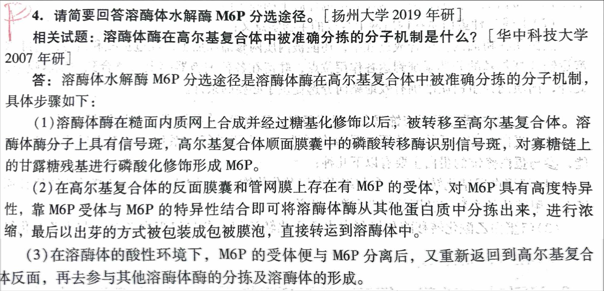
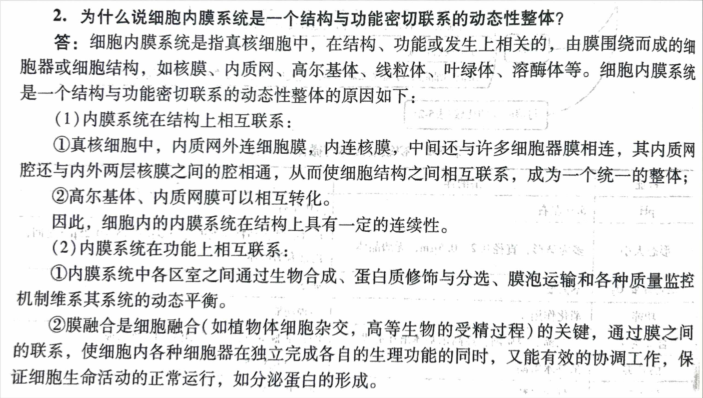

<!-- anki-id: cell-biology-jsonl-000048 -->
### Front
请简要回答溶酶体水解酶 M6P 分选途径。 [扬州大学 2019 年研]

相关试题：溶酶体酶在高尔基复合体中被准确分拣的分子机制是什么？ [华中科技大学 2007 年研]

### Back
溶酶体水解酶 M6P 分选途径是溶酶体酶在高尔基复合体中被准确分拣的分子机制，具体步骤如下：

(1) 溶酶体酶在糙面内质网上合成并经过糖基化修饰以后，被转移至高尔基复合体。溶酶体酶分子上具有信号斑，高尔基复合体顺面膜囊中的磷酸转移酶识别信号斑，对寡糖链上的甘露糖残基进行磷酸化修饰形成 M6P。

(2) 在高尔基复合体的反面膜囊和管网膜上存在有 M6P 的受体，对 M6P 具有高度特异性，靠 M6P 受体与 M6P 的特异性结合即可将溶酶体酶从其他蛋白质中分拣出来，进行浓缩，最后以出芽的方式被包装成包被膜泡，直接转运到溶酶体中。

(3) 在溶酶体的酸性环境下，M6P 的受体便与 M6P 分离后，又重新返回到高尔基复合体反面，再去参与其他溶酶体酶的分拣及溶酶体的形成。

### OriginalMaterial

---

<!-- anki-id: cell-biology-jsonl-000050 -->
### Front
[题目 2] 谈谈你对细胞质基质的结构组成及其在细胞生命活动中作用的理解。

### Back
**一、 细胞质基质的结构组成**

细胞质基质是指真核细胞的细胞质内除细胞器和内含物外的较为均质、半透明的液态物质，结构组成包括水、无机离子、糖类、脂类、核苷酸、氨基酸及其衍生物等中等分子，以及糖原、脂滴、蛋白质、多糖和 RNA 等大分子。

**二、 细胞质基质在生命活动中的作用**

(1) **完成中间代谢**：如糖酵解过程、磷酸戊糖途径、糖醛酸途径、糖原的合成与分解及蛋白质的分选及转运；
(2) **维持细胞形态和运动**、胞内物质运输、能量传递及大分子定位；
(3) **对蛋白质进行修饰**：包括磷酸化与去磷酸化、糖基化、N 端进行甲基化和乙酰基化修饰；
(4) **通过蛋白质的选择性降解来控制蛋白质的寿命**：降解变性和错误折叠的蛋白质，包括依赖于泛素的蛋白质降解。帮助变性或错误折叠的蛋白质重新折叠，形成正确的分子构象，主要靠热休克蛋白(HSP)来完成。

### OriginalMaterial

---

<!-- anki-id: cell-biology-jsonl-000051 -->
### Front
N-连接的糖基化修饰与 O-连接的糖基化修饰的区别？

### Back
(1) **合成部位不同**。N-连接的糖基化发生在粗面内质网和高尔基体中，而 O-连接的糖基化主要发生在高尔基体中。
(2) **连接氨基酸残基不同**。N-连接的糖基化连接到天冬酰胺残基上，而 O-连接的糖基化连接到丝氨酸、苏氨酸、羟赖氨酸或羟脯氨酸的羟基上。
(3) **糖链长度不同**。N-连接的糖基化通常具有较长的糖链，长度在 5 个糖残基以上，而 O-连接的糖基化通常具有较短的糖链，长度在 1 到 4 个糖残基之间，但 ABO 血型抗原较长。
(4) **加工过程不同**。N-连接的糖基化从一条较长的寡糖链开始，这条寡糖链从供体磷酸多萜醇上转移至新生肽链的特定三肽序列的天冬酰胺残基上，O-连接的糖基化则从一个单糖逐个添加开始。
(5) **第一个糖残基不同**。N-连接的糖基化第一个糖残基为 **N-乙酰葡糖胺**，而 O-连接的糖基化第一个糖残基为 **N-乙酰半乳糖胺**。
(6) **成熟的标志不同**。成熟的 N-连接的寡糖链都含有 2 个 N-乙酰葡萄糖胺和 3 个甘露糖残基；O-连接的糖基化最后一步是在高尔基体反面膜囊和 TGN 中加上唾液酸残基。

### OriginalMaterial

---

<!-- anki-id: cell-biology-jsonl-000053 -->
### Front
糖基化的意义有哪些？

### Back
(1) 糖基化的蛋白质其寡糖链具有促进蛋白质折叠和增强蛋白质稳定性的作用。
(2) 蛋白质糖基化修饰给不同蛋白质携带不同的标志，以利于在高尔基体进行分选与包装，同时保证蛋白质从粗面内质网向高尔基体的单向转运。
(3) 细胞表面、细胞外密集集存在的寡糖链可通过与另一细胞表面的凝集素之间发生特异性相互作用，直接介导细胞间的双向通讯，或参与分化、发育等多种过程。
(4) 多糖基侧链还可能影响蛋白质的水溶性及蛋白质所带电荷性质。
(5) 参与细胞间识别，以及宿主细胞与病原微生物之间的识别。典型的例证是 ABO 血型抗原的抗原决定簇是红细胞表面的不同结构的糖链，被抗糖抗体特异性识别，具有重要意义。

### OriginalMaterial

---

<!-- anki-id: cell-biology-jsonl-000054 -->
### Front
溶酶体的类型、消化作用途径及细胞自噬的详细分类

### Back
| 主题 | 初级溶酶体 | 次级溶酶体 | 残质体 |
| :--- | :--- | :--- | :--- |
| **溶酶体的类型** | 【未消化】初级溶酶体是指由高尔基体出芽产生的含有多水解酶的球形囊泡结构。球型，不含颗粒物质，内含多种酸性水解酶。 | 【消化中】又称自噬溶酶体，是初级溶酶体与细胞内自噬或非自噬（胞饮或吞噬）融合形成，用于消化的复合体。即：自噬溶酶体和异噬溶酶体。 | 【消化后】又称后溶酶体、残余小体、残体，是指次级溶酶体内经消化后，很多小分子物质通过膜上载体蛋白转运到细胞质基质中，供细胞代谢利用，剩下的含有未被消化物质的溶酶体结构。残质体可通过类似胞吐方式将内容物排出细胞。 |
| **溶酶体消化作用途径** | （1）内吞作用 【可溶性大分子】通过质膜包被小窝内化和内质网摄入细胞，与初级溶酶体结合形成异噬溶酶体被消化。 | （2）吞噬作用 【破损细胞器或病原体及不溶性颗粒物】通过形成吞噬泡进入细胞，与初级溶酶体结合形成异噬溶酶体被消化。 | （3）自噬作用 【细胞内破损细胞器和批量细胞质】形成自噬泡，与初级溶酶体结合形成自噬溶酶体被消化。 |

**细胞自噬**

细胞自噬包括：

（1）**微自噬**：指溶酶体/液泡膜直接内陷，将细胞质基质中的物质包裹进入溶酶体腔，并降解的过程。

（2）**巨自噬**：巨噬也称大自噬，即通常所说的自噬，是细胞在相关信号的刺激下，底物蛋白或细胞器被一种双层膜的结构包裹，形成直径 400~900nm 大小的自噬小泡，自噬小泡的外膜与溶酶体膜融合，释放所包裹的底物到溶酶体降解的过程。

（3）**分子伴侣介导的自噬（CMA）**：指溶酶体通过 Hsp70 等分子伴侣识别并结合带有“KFERQ”**二肽非人链**氨基酸序列的底物蛋白进行降解的过程，CMA 不仅在持续饥饿状态下为细胞提供能量，还在氧化性损伤保护、维持细胞内环境稳定等方面发挥作用。

**数量与形态差异**
(1) 典型的动物细胞约含数百个溶酶体，但在不同的细胞内溶酶体的数量和形态有很大差异；
(2) 在同一种细胞中溶酶体的大小形态也有很大变化，主要与溶酶体处于不同生理功能阶段相关；

### OriginalMaterial

---

<!-- anki-id: cell-biology-jsonl-000055 -->
### Front
题目、35）试述溶酶体在细胞中的主要功能/作用。

### Back
一、概述
溶酶体是具有一组水解酶并起消化作用的细胞器，有初级和次级之分。初级溶酶体虽含有水解酶，但是它还未进行消化作用的；溶酶体；次级溶酶体又称消化泡，是由初级溶酶体与细胞内的自噬泡或异噬泡相互融合而成的，在次级溶酶体中，对被摄食的物质进行消化。消化后所残留的未消化物（即残存小体）最终以胞吐的方式排出细胞外。

二、溶酶体的主要功能包括
(1) **清除无用的生物大分子、衰老的细胞器及衰老损伤的细胞**
(2) **作为细胞的消化“器官”为细胞提供营养**。如吞饮低密度脂蛋白获得胆固醇；降解内含物的血清脂蛋白，获得胆固醇等营养成分。饥饿状态下，溶酶体可分解细胞内生物大分子即刻自用，保证机体所需的能量；
(3) **将有关体内或外存在的大分子物质降解为小分子物质**。提供给其他的细胞器合成为新的大分子；
(4) <u>防御功能。如巨噬细胞可吞入病原体，在溶酶体中将病原体杀死和降解；防御功能是某些细胞特有的功能，它可以识别并吞进入侵的病毒或细菌在溶酶体作用下将其杀死并进一步降解。当机体被感染后，单核细胞迁移至感染或发炎的部位，分化成巨噬细胞，巨噬细胞中溶酶体非常丰富。</u>溶酶体与吞噬体共同通过过氧化氢、超氧化物等作同作用杀死细菌
(5) **参与清除再生组织或退行性变化的细胞**。无尾两栖类发育过程中蝌蚪尾巴的退化，哺乳动物断奶后乳腺的退行性变化，都涉及某些特定细胞程序性死亡，死后的细胞被周围细胞围绕溶酶体溶酶体清除；
(6) **细胞外的功能。**受精过程中，精子的顶体相当于特化的溶酶体，含有多种水解酶，能溶解卵鞘后卵子包及滤泡细胞，产生孔道，使得精子进入卵细胞，精子和卵细胞的细胞膜相互融合，达到受孕目的；
(7) **在分泌腺细胞中，溶酶体常常插入分泌颗粒。参与分泌过程的调节。**甲状腺球蛋白储存在腺体内腔中，通过吞噬作用进入分泌细胞并与溶酶体融合，甲状腺球蛋白被水解成甲状腺素后分泌到细胞外进入血管中；
(8) 植物种子萌发中的功能等。

### OriginalMaterial

---

<!-- anki-id: cell-biology-jsonl-000057 -->
### Front
过氧化物体与溶酶体的相同点、不同点及异质性细胞器的理解是怎样的？

### Back
**一、相同点**
由一层单位膜包围；都为异质性细胞器。

**二、不同点**
| | 溶酶体 | 过氧化物体 |
| :--- | :--- | :--- |
| **(1) 所含物质不同** | 内含多种水解酶 | 含有40余种氧化酶类 |
| **(2) 作用不同** | 溶酶体主要负责分解进入细胞的物质，也可以消化细胞自身的部分细胞器或细胞 | 过氧化物体的主要功能是催化脂肪酸的$\beta$-氧化，分解极长链脂肪酸为短链脂肪酸 |
| **(3) 形成过程不同** | 在高尔基体中形成 | 有两种途径：一种是成熟的过氧化物体经分裂增殖产生子代细胞器，另一种是细胞内的重新发生 |
| **(4) 有无酶晶体** | 无酶晶体 | <u>有过氧化物酶体</u>（即有酶晶体） |
| **(5) pH值不同** | pH值为5.0左右 | pH值为7.0左右 |
| **(6) 是否需要氧气** | 不需要 | 需要 |
| **(7) 识别的标志酶不同** | 酸性水解酶 | 过氧化氢酶 |

**三、异质性**
异质性细胞器是指 <u>不同生物细胞或酸性细胞的不同个体</u>。这种细胞器的形态大小，甚至内部所含的种类可能有很大不同； <u>同一细胞中的大小不同</u>，细胞内细胞器大小和所含的酶类可随细胞周围营养环境的变化而变化，并同时执行不同的生理功能，因此具有异质性。如细胞中的溶酶体和过氧化物酶体等。

**(二) 过氧化物体**
(1) 过氧化物体的异质性不仅表现为形态、大小的多样性，也体现于不同的过氧化物体所含酶类及其生理功能的不同。
(2) 迄今为止，已经鉴定的过氧化物体酶多达 <u>40余种</u>，但是至今尚未发现一种过氧化物体含有全部40种酶。

### OriginalMaterial

---

<!-- anki-id: cell-biology-jsonl-000110 -->
### Front
2. 为什么说细胞内膜系统是一个结构与功能密切联系的动态性整体？

### Back
细胞内膜系统是指真核细胞中，在结构、功能或发生上相关的，由膜围绕而成的细胞器或细胞结构，如核膜、内质网、高尔基体、线粒体、叶绿体、溶酶体等。细胞内膜系统是一个结构与功能密切联系的动态性整体的原因如下：

(1)内膜系统在结构上相互联系：
    ①真核细胞中，内质网外连细胞膜，内连核膜，中间还与许多细胞器膜相连，其内质网腔还与内外两层核膜之间的腔相通，从而使细胞结构之间相互联系，成为一个统一的整体；
    ②高尔基体、内质网膜可以相互转化。
    因此，细胞内的内膜系统在结构上具有一定的连续性。

(2)内膜系统在功能上相互联系：
    ①内膜系统中各区室之间通过生物合成、蛋白质修饰与分选、膜泡运输和各种质量监控机制维系其系统的动态平衡。
    ②膜融合是细胞融合（如植物体细胞杂交，高等生物的受精过程）的关键，通过膜之间的联系，使细胞内各种细胞器在独立完成各自的生理功能的同时，又能有效的协调工作，保证细胞生命活动的正常运行，如分泌蛋白的形成。

### OriginalMaterial

---

<!-- anki-id: cell-biology-jsonl-000111 -->
### Front
【题目 9】简述蛋白质的泛素化降解过程（包括概念与步骤）。

### Back
**一、概念**

在真核细胞的细胞质中，有一种识别并降解错误折叠或不稳定蛋白质的机制，即泛素化和蛋白酶体所介导的蛋白质降解途径。<u>蛋白酶体</u>是细胞内降解蛋白质的大分子复合体，富含ATP依赖的蛋白酶活性。
<u>泛素</u>是由76个氨基酸残基构成的小分子蛋白质，具热稳定性，普遍存在于真核细胞中，人和酵母细胞的泛素分子共享序列高达96%，由于广泛存在且序列高度保守，故名泛素。蛋白质的泛素化需要<u>泛素载体蛋白(E2)</u>发挥作用，即通过3种酶的先后催化来完成，包括泛素活化酶（E1）泛素结合酶（E2，又称复杂酶系统）和泛素连接酶（E3），三种酶各有分工。

**二、泛素化过程涉及如下步骤**

(1) 泛素活化酶（E1）通过形成酰基—腺苷酸中介物使泛素分子C端被激活，该反应需要ATP；
(2) 转移活化的泛素分子于泛素结合酶（E2）的半胱氨酸残基结合；
(3) 异肽键形成，即与E2结合的泛素羧基和靶蛋白赖氨酸侧链的氨基之间形成异肽键，该反应由泛素连接酶（E3）催化完成；
(4) 重复上述步骤，靶蛋白上被绑上了多个泛素分子，形成具有寡聚泛素链的泛素化靶蛋白；
(5) 泛素化靶蛋白被蛋白酶体的19S调节亚基所识别和去折叠，并利用ATP水解提供的能量驱动泛素分子的切除和靶蛋白降解；去折叠的蛋白质转移至蛋白酶体20S催化核心腔内被降解。
(6) 真核细胞对蛋白质降解的调节，除依赖泛素的蛋白酶体途径外，溶酶体是另一个重要的降解途径，用以清除暂时不需要的酶或某些代谢产物。

### OriginalMaterial

---

<!-- anki-id: cell-biology-jsonl-000112 -->
### Front
【题目 10】由泛素和蛋白酶体所介导的蛋白质降解途径的特异性是如何实现的？

### Back
蛋白酶体包括两部分，<u>催化核心</u>和<u>调节亚基(蛋白酶体帽)</u>。当泛素化标签被蛋白酶体识别，并利用ATP水解提供的能量驱动泛素分子的切除和靶蛋白的去折叠，去折叠的靶蛋白被转移到蛋白酶体的核心内部被降解，其中蛋白酶体帽起着特异性识别携带泛素化标签的底物蛋白的作用。

### OriginalMaterial

---

<!-- anki-id: cell-biology-jsonl-000131 -->
### Front
[题目 23] 什么是内质网应激？

### Back
一、概念

**内质网应激（ERS）指：** 当某些细胞的外因素使细胞内质网生理功能发生紊乱，钙稳态失衡，未折叠及错误折叠的蛋白质在内质网腔内过量积累时，激活一些相关信号通路的反应，影响基因表达，来应对环境的变化并恢复内质网的正常状态；如果不恢复则启动了凋亡。<u>ERS是体内的一种自我保护的机制</u>，也是一套完整的质量监控机制，帮助内质网中蛋白质的折叠与修饰。在功能上，内质网起到细胞间相互传递信号源的作用。

**ERS包括：** 
（1）未折叠蛋白质应激反应；
（2）内质网超负荷反应；
（3）固醇调节升级反应；
（4）肌醇相互相互作用信号源的反应。

发生 ERS→Ca²⁺从内质网腔释放到细胞质中→Ca²⁺水平增高→Ca²与需钙蛋白酶结合→calpain 酶原大亚基被解离而被激活→calpain 裂解多种底物蛋白质→诱导细胞凋亡。

| 反应类型 | 阶段 | 分子/蛋白 | 机制/描述 |
| :--- | :--- | :--- | :--- |
| **UPR 未折叠蛋白应激反应** | 概念 | IRE-1 PERK ATF6 | 错误折叠与未折叠蛋白质不能按照正常途径从内质网中释放，从而在内质网腔内积累，引起一系列分子伴侣和折叠酶表达上调。 |
| | 过程 | | （1）分子伴侣促进<u>蛋白质正确折叠</u>；（2）<u>阻止蛋白质合成</u>防止其继续释放；（3）促进<u>错误蛋白降解</u>。 |
| **SREBP 类固醇调控元件结合蛋白** | 概念 | SREBP-1c | 用来调节内质网膜上<u>胆固醇含量</u>。作为感器感受细胞的应激，结合脂蛋白作为转录的影响因子，转录因子进入细胞核调控相关基因的转录过程。 |
| **EOR 内质网超负荷反应** | 概念 | NF-κB | 即使<u>正常蛋白</u>，在<u>内质网里的浓度过高</u>也是一种应激因素。影响的是<u>核基质</u>的<u>细胞核调控</u>。

### OriginalMaterial

---

<!-- anki-id: cell-biology-jsonl-000133 -->
### Front
高尔基体的结构特征及其生理功能是什么？

### Back
**I、高尔基体的结构特征**

高尔基体是一种有极性的细胞器，由排列较为整齐的扁平膜囊堆叠而成。扁平膜囊多呈弓形或半球形，囊膜周围有许许多多不同类型的囊泡结构。<u>**极性体现在：**</u>
(1) <u>**结构上：**</u>在细胞中有相对固定的位置，靠近细胞核的一面为高尔基体顺面膜囊及顺面高尔基**N**网状结构，面向细胞膜的一面为高尔基体反面膜囊及反面高尔基体网状结构，二者之间为高尔基体中间膜囊。
(2) <u>**功能上：**</u>物质从 **CGN** 输入，从 **TGN** 输出。高尔基体虽然是由膜质不同的膜囊构成的复合体，但是不同的膜囊有不同的功能，执行功能时又是“流水式”操作，上道工序完成了，才能进行下一道工序，这就是高尔基体的极性

**(1) 顺面膜囊以及顺面网状结构（CGN）**
位于高尔基体顺面靠近细胞核的一侧。外侧的顺面膜囊，呈中间多孔且连续分支的管状囊泡结构。从功能上看，CGN 被认为是初级分选站，负责从 ER 转运来的物质进行鉴别分类，决定哪些需要退回，哪些可以进入下一步。结果是大部分转入高尔基体中间膜囊，少部分带有 KDEL/HDEL 内质网驻留蛋白特有信号的蛋白质和脂质，再返回内质网。还有其余功能，如蛋白质氨基酸残基发生 O—连接糖基化等。

**(2) 高尔基体中间膜囊**
由扁平膜囊与管道组成。形成不同间隔。但功能上连续完整的膜囊体系，主要功能是糖基修饰与加工、脂肪形成、高尔基体有关多糖的合成。扁平膜囊的形态大大增加了糖合成与修饰的有效表面积。

**(3) 反面膜囊以及反面网状结构（TGN）**
是高尔基复合体最外面一侧囊状小泡状物质组成的网络结构。是高尔基体蛋白质分选的枢纽区，蛋白质的运输泡有在此被特殊的受体接受，进行分拣，集中，形成不同的分泌小泡，被运送到不同地点。因此，主要功能能参与蛋白质的分类与包装，并输出高尔基体。同时也是蛋白质包装形成网格蛋白/2AP 包被膜泡的重要发源地。某些“晚期”的蛋白质修饰也发生在这里。

**II、高尔基体的生理功能**

(1) 主要功能包括参与**分泌活动**、**蛋白质糖基化修饰**、**蛋白质分选及蛋白酶水解**等；
(2) 在不同膜囊的膜上和腔中分别有不同的酶和蛋白泡，帮助他们分别完成不同的功能；
(3) 在高尔基体的<u>**顺面膜囊**</u>的膜上有 **KDEL 受体**，可将逃逸出来的内质网驻留蛋白捕获并送回内质网，实现蛋白质的初步分选；
(4) 反面膜囊上有不同的蛋白酶和受体蛋白，在对蛋白质进行分类包装和水解等加工过程后，将成熟蛋白质转运到细胞的<u>**不同部位**</u>。
(5) 没有生物活性的蛋白质进入高尔基体后，将<u>**蛋白原 N 端或两端的序列切除**</u>形成成熟的，如胰岛素、胰高血糖素及血清蛋白工。
(6) 有些蛋白质分子在糙面内质网中合成时便是含有多个相同氨基酸序列的前体，然后在高尔基体中<u>水解成同种有活性的多肽</u>，如神经肽等。
(7) 一个蛋白质分子的<u>**前体中含有不同的信号序列**</u>，最后加工成不同的产物。
(8) <u>**硫酸化作用**</u>也在高尔基体中进行。硫酸化反应的核心供体是 3'—磷酸腺苷－5'—磷酸硫酸（PAPS），它从高尔基质膜中转人<u>**高尔基质膜内**</u>，在酶的催化下，将硫酸根转移到肽链中氨基酸残基的羟基上。硫酸化的蛋白质主要是蛋白聚糖。

总之，高尔基体不同膜囊的极性分布产生内部功能的区域化，最终保证了高尔基体得以完成各项复杂的任务。

### OriginalMaterial

---

<!-- anki-id: cell-biology-jsonl-000144 -->
### Front
试述细胞内膜系统的主要结构和功能。

### Back
细胞内膜系统是指在结构、功能乃至发生上相互关联、由单层膜包被的细胞器或细胞结构，主要包括内质网、高尔基体、溶酶体、胞内体和分泌泡等。

一、内质网
是真核细胞中最普通、最多变、适应性最强的细胞器。是**由封闭的膜系统及其围成的腔形成的相互沟通的网状结构**。通常占细胞膜系统的一半左右。内质网的存在，大大增加了细胞内膜的表面积，为各种酶反应提供了充足的结合位点。分为糙面内质网（rER）和光面内质网（sER）。
  （1）光面内质网（sER）：表面没有附着核糖体，常为分支管状，形成较为复杂的立体结构，细胞中几乎不会有纯的内质网区域，只是作为内质网这一连续结构的一部分；是脂质合成的重要场所；所占的区域通常较小，常作为出芽的位点，将内质网上合成的蛋白质或脂类转移到高尔基体内；在某些细胞中，光面内质网非常发达并具有特有的功能，如合成固醇类激素的细胞及肝细胞等。
  （2）糙面内质网（rER）：多层扁囊状，排列较为整齐，膜表面附有大量的核糖体，是内质网与核糖体共同形成的复合机能结构；它是分泌性蛋白和多种膜蛋白合成场所；在分泌旺盛的细胞中（如胰腺泡细胞）和分泌抗体的浆细胞中比较发达，而在一些未分化的细胞和肿瘤细胞中则稀少；其上含有移位子蛋白质复合体，与新合成的多肽转移有关。
**功能：**
  （1）糙面内质网上结合有大量的核糖体，是蛋白质合成和加工修饰的重要场所；
  （2）光面内质网是脂质合成的重要场所；
  （3）对蛋白质进行修饰与加工；
  （4）PDI 和 Bip 促进新多肽的折叠与组装；
  （5）内质网的其他功能：肝细胞的内质网具解毒作用；心肌细胞和骨骼肌细胞中含有发达的促进的肌质网（光面内质网），是储存 Ca2+的细胞器，对Ca2+具有调节作用；在某些合成固醇类激素的细胞及睾丸间质细胞中，光面内质网也非常丰富，其中含有制造胆固醇并进一步产生固醇类激素的一系列酶。

二、高尔基体
是由**排列较为整齐的扁平膜囊堆叠而成，囊堆构成了高尔基体的主体结构**。扁平膜囊多呈弓形或半球形，膜囊周围又有许多大小不等的囊泡结构。高尔基体是一种有极性的细胞器，一般靠近细胞核的一面或物质进入高尔基体的一侧为顺面，面向细胞膜的一侧为反面。
**功能：**
  （1）高尔基体的主要功能是将内质网合成的多种蛋白质进行加工、分类与包装，然后分门别类地运送到细胞特定的部位或分泌到细胞外。因此，高尔基体是细胞内大分子转运的枢纽或“集散地”。是对蛋白进行糖基化修饰的重要场所之一；
  （2）此外高尔基体还是细胞内糖类合成的工厂；
  （3）内质网合成脂类也有部分通过高尔基体转运用细胞其他细胞器或细胞膜；

三、溶酶体
是**单层膜围绕、内含多种酸性水解酶类的囊泡状细胞器**。分为初级溶酶体、次级溶酶体和残质体。
  （1）其主要功能是行使细胞内的消化作用、防御功能等。
  （2）在维持细胞正常代谢方面也起着重要的作用。
  （3）溶酶体内的各种酶在内质网上合成，内质网和高尔基体上进行修饰加工组装，通过高尔基体的反面运输转运至溶酶体。**溶酶体通过与胞内体融合形成次级胞内体，将吞吞的物质消化降解，为细胞的生长发育提供营养。**

四、胞内体
是动植物细胞由内膜包图的细胞器，其作用是运输由胞吞作用摄人新的物质到溶酶体被降解。

五、分泌泡
是**单层膜包裹的球形结构，内含来自内质网或高尔基体的蛋白质等分子**。分泌泡将这些“货物”运输到细胞膜并与细胞膜融合而将“货物”分泌到细胞外，在这种情况下分泌泡和内质网或高尔基体在发生上是连续的。
  （1）是调节型途径中形成的小泡，在一些特化的分泌细胞中，合成一些特殊的产物，如激素，这些产物被贮藏在分泌泡中，这些小泡通过出芽离开反面高尔基体网络并聚集在细胞质膜附近，当细胞受到细胞外信号刺激时，就会与细胞膜融合将内含物释放到细胞外。
  （2）分泌泡也可以以内吞方式形成，这种情况下分泌泡在发生上与细胞膜连续。分泌泡可以与溶酶体融合降解消化内的外来物质起着保护和营养的作用，也可以降解消化自身失去功能蛋白质，作用是保护细胞内环境。通过分泌泡，细胞的各种膜系统联系起来。

### OriginalMaterial

---
