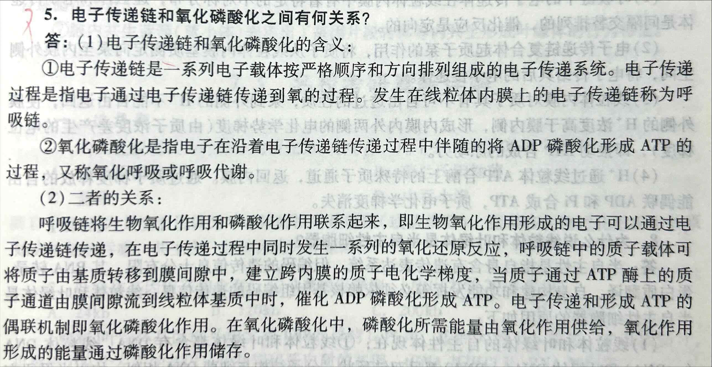
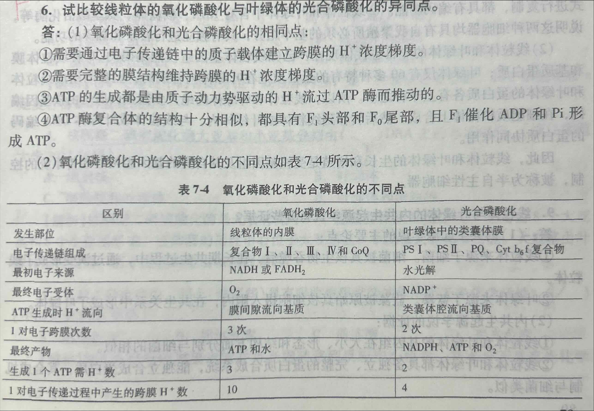
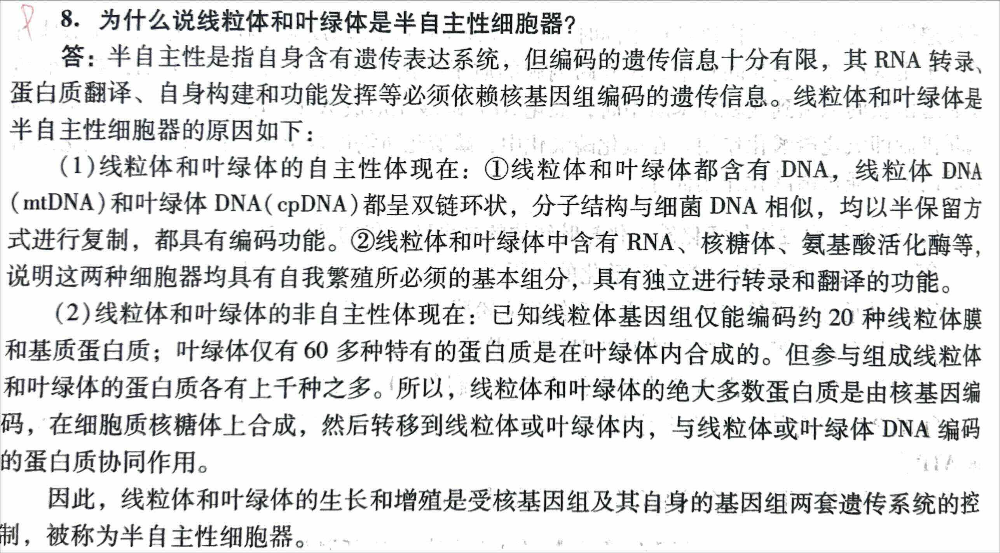

<!-- anki-id: cell-biology-jsonl-000064 -->
### Front
5. 电子传递链和氧化磷酸化之间有何关系？

### Back
一、电子传递链和氧化磷酸化的含义
 **电子传递链：是一系列电子载体/呼吸传递体按严格顺序和方向排列组成的电子传递系统。电子传递过程是指电子通过电子传递链传递到氧的过程。发生在线粒体内膜上的电子传递链称为呼吸链。**
② **氧化磷酸化：是指电子从 NADH 或 FADH2 经电子传递链传递给分子氧生成水，并偶联 ADP 磷酸化生成 ATP 的过程。它是需氧生物合成 ATP 的主要途径。电子沿呼吸链由低电位流向高电位是个逐步释放能量的过程。又称氧化呼吸或呼吸代谢。**

二、二者的关系
内膜上的电子传递链将生物氧化作用和磷酸化作用联系起来，即生物氧化作用形成的电子可以通过电子传递链传递，在电子传递过程中同时发生一系列的氧化还原反应，呼吸链中的质子载体可将质子由基质转移到膜间隙中，建立内膜的质子电化学梯度，当质子通过 ATP 酶上的质子通道由膜间隙流到线粒体基质中时，催化 ADP 磷酸化形成 ATP。**电子传递和形成 ATP 的偶联机制即氧化磷酸化作用。在氧化磷酸化中，磷酸化所需能量由氧化作用供给，氧化作用形成的能量通过磷酸化作用储存。**

### OriginalMaterial

---

<!-- anki-id: cell-biology-jsonl-000065 -->
### Front
6. 试比较线粒体的氧化磷酸化与叶绿体的光合磷酸化的异同点。

### Back
答：(1)氧化磷酸化和光合磷酸化的相同点：
①需要通过电子传递链中的质子载体建立跨膜的 \( H^+ \)浓度梯度。
②需要完整的膜结构维持跨膜的 \( H^+ \)浓度梯度。
③ATP 的生成都是由质子动力势驱动的 \( H^+ \)流过 ATP 酶而推动的。
④ATP 酶复合体的结构十分相似，都具有 \( F_1 \) 头部和 \( F_0 \)尾部，且 \( F_1 \)催化 ADP 和 Pi 形成 ATP。

(2)氧化磷酸化和光合磷酸化的不同点如表 7-4 所示。

| 区别 | 氧化磷酸化 | 光合磷酸化 |
|---|---|---|
| 发生部位 | 线粒体的内膜 | 叶绿体中的类囊体膜 |
| 电子传递链组成 | 复合物 I 、 II 、 III 、 IV 和 CoQ | PS I 、 PS II 、 PQ 、 Cyt b6f 复合物 |
| 最初电子来源 | NADH 或 FADH2 | 水光解 |
| 最终电子受体 | O2 | NADP+ |
| ATP 生成时 H+ 流向 | 膜间隙流向基质 | 类囊体腔流向基质 |
| 1 对电子跨膜次数 | 3 次 | 2 次 |
| 最终产物 | ATP 和水 | NADPH 、 ATP 和 O2 |
| 生成 1 个 ATP 需 H+ 数 | 3 | 2 |
| 1 对电子传递过程中产生的跨膜 H+ 数 | 10 | 4 |

### OriginalMaterial

---

<!-- anki-id: cell-biology-jsonl-000066 -->
### Front
8. 为什么说线粒体和叶绿体是半自主性细胞器？

### Back
半自主性是指自身含有遗传表达系统，但编码的遗传信息十分有限，其 RNA 转录、蛋白质翻译、自身构建和功能发挥等必须依赖核基因组编码的遗传信息。线粒体和叶绿体是半自主性细胞器的原因如下：  (1) 线粒体和叶绿体的自主性体现在： ①线粒体和叶绿体都含有 DNA，线粒体 DNA (mtDNA) 和叶绿体 DNA (cpDNA) 都呈双链环状，分子结构与细菌 DNA 相似，均以半保留方式进行复制，都具有编码功能。 ②线粒体和叶绿体中含有 RNA、核糖体、氨基酸活化酶等，说明这两种细胞器均具有自我繁殖所必须的基本组分，具有独立进行转录和翻译的功能。  (2) 线粒体和叶绿体的非自主性体现在： 已知线粒体基因组仅能编码约 20 种线粒体膜和基质蛋白质；叶绿体仅有 60 多种特有的蛋白质是在叶绿体内合成的。但参与组成线粒体和叶绿体的蛋白质各有上千种之多。所以，线粒体和叶绿体的绝大多数蛋白质是由核基因编码，在细胞质核糖体上合成，然后转移到线粒体或叶绿体内，与线粒体或叶绿体 DNA 编码的蛋白质协同作用。  因此，线粒体和叶绿体的生长和增殖是受核基因组及其自身的基因组两套遗传系统的控制，被称为半自主性细胞器。

### OriginalMaterial

---

<!-- anki-id: cell-biology-jsonl-000067 -->
### Front
【题目8】线粒体的各部分结构分别与哪些代谢反应有关？

### Back
**一、内膜**
① **细胞凋亡**：线粒体作为起始主关，可以开启内膜的非特异性通道–线粒体通透性转变孔(mtPTP);
② **电子传递和氧化磷酸化**：电子传递链和氧化磷酸化的酶存在于内膜中.

**二、基质**
① 参与三羧酸循环、脂肪酸氧化和丙酮酸氧化的酶存在于线粒体基质中；
② **储积钙离子**：基质中的致密颗粒状物质与储积Ca2有关。

**三、膜间隙**
细胞凋亡：在线粒体膜间中鉴定出了多种死亡促进因子，包括细胞色素c死亡诱导因子和被称为切端酶的潜伏蛋白酶。

**四、外膜**
<u>外膜上分布有一些特殊的酶类</u>，如参与肾上腺素氧化、色氨酸降解、脂肪酸链延长的酶，表明外膜不仅参与膜磷脂的合成，还可对将在线粒体基质中彻底氧化的物质进行先行初步分解。

### OriginalMaterial

---

<!-- anki-id: cell-biology-jsonl-000068 -->
### Front
[题目 27] 试比较光合碳同化三条途径的主要异同点。

### Back
**总述：**
C3途径（卡尔文循环）是光合碳代谢最基本、最普遍的途径，同时，也只有这条途径才具备合成淀粉等产物的能力；C4途径和景天酸代谢（CAM）途径则是对C3途径的补充。

**主要区别：**
① **从羧化酶种类和所在位置来看：**
C3植物是由叶肉细胞叶绿体的RuBP羧化酶羧化空气中的CO2，而C4和CAM则由叶肉细胞基质中的PEP羧化酶羧化；

② **从卡尔文循环固定的CO2来源来看：**
C3植物直接固定空气的CO2。而C4植物和CAM植物则利用C4酸脱羧出来的CO2；

③ **从卡尔文循环的叶绿体位置来看：**
C3和CAM植物都是在叶肉细胞进行，而C4植物则在维管束鞘细胞进行；

④ **从同化CO2和进行卡尔文循环来看：**
C3植物是同时同处进行。C4植物在空间分隔进行，即分别在叶肉细胞和维管束鞘细胞进行。CAM是在时间上分隔进行，即分别在夜晚和白天进行。

**C3途径（卡尔文循环）过程图示解析：**
*   **第1阶段（CO2固定）：** 6 CO2 + 6 RuBP (5C) \(\xrightarrow{RuBP羧化/加氧酶}\) 12 甘油酸-3-磷酸 (3C)
*   **第2阶段（还原）：** 12 甘油酸-3-磷酸 + 12 ATP + 12 NADPH \(\rightarrow\) 12 甘油醛-3-磷酸 (3C)
*   **第3阶段（RuBP再生）：** 10 甘油醛-3-磷酸 + 6 ATP \(\rightarrow\) 6 RuBP (5C) + 6 ADP + 6 Pi
*   **产物：** 净剩 2 甘油醛-3-磷酸 \(\rightarrow\) 葡萄糖

### OriginalMaterial

---

<!-- anki-id: cell-biology-jsonl-000070 -->
### Front
[题目 30] 内共生起源依据有哪些？

### Back
(1) <u>**基因组与细菌基因组具有明显的相似性**</u>。线粒体和叶绿体的基因组在大小、形态和结构方面分别与细菌的相似。它们均为单条环状双链 DNA 分子，不含 5-甲基胞嘧啶，无组蛋白结合能进行独立的复制和转录。此外，在碱基比例、核苷酸序列和基因结构特征等方面，线粒体和叶绿体基因组也与细胞核基因组表现出显著差异，而与原核生物极为相似。同时，线粒体和叶绿体具有自身的 DNA 聚合酶及 RNA 聚合酶，能独立复制和转录自己的 RNA。其 mRNA、rRNA 的沉降系数与细菌的类似。
(2) <u>**线粒体和叶绿体具备独立、完整的蛋白质合成系统**</u>，能独立合成蛋白质，其合成机制与细菌类似，而有别于真核生物。与细菌一样，线粒体和叶绿体中的蛋白质合成从 <u>**N—甲酰甲硫氨酸**</u> 开始，而真核细胞中的蛋白质合成从甲硫氨酸开始。线粒体和叶绿体的核糖体较小于真核生物的 80S 核糖体。**线粒体、叶绿体和原核生物的核糖体中只有 <u>5S rRNA</u>，而不少真核细胞的核糖体中存在 <u>5.8S rRNA</u>**。线粒体中的蛋白质合成因子具有原核生物核糖体的识别特异性，其功能可部分地被细菌的蛋白质合成因子取代，但线粒体的蛋白质合成因子不能识别细胞质核糖体。
(3) <u>**都是以分裂的方式进行增殖**</u>，分裂方式与细菌相似。
(4) <u>**膜的特性**</u>：线粒体、叶绿体的内膜和外膜存在明显的性质和成分差异：外膜与真核细胞的内膜系统具有性质上的相似性，可与内质网和高尔基体膜融合沟通，来源于宿主；内膜则与细菌质膜相似，内陷折叠形成细菌的间体、线粒体的嵴和叶绿体的类囊体。
(5) <u>**线粒体和叶绿体能在异源细胞内长期生存**</u>，说明线粒体和叶绿体具有自主性和共生性的特征。
(6) 其他佐证
a.线粒体的磷脂成分、呼吸类型和 Cytc 的初级结构均与反硝化副球菌或紫色非光合光合细菌非常接近。
b.自然界中存在的胞内生蓝藻（蓝小体）表现出了基因片段转移等内共生形成叶绿体的行为特征。
c.遗传信息转移。真核细胞的细胞核中存在大量原本可能属于呼吸细菌或蓝细菌的遗传信息，说明最初的呼吸细菌和蓝细菌的大部分基因组在漫长的共进化的过程中向细胞核发生了转移。

### OriginalMaterial

---

<!-- anki-id: cell-biology-jsonl-000117 -->
### Front
【题目 14】氧化呼吸链电子传递的过程？主呼吸链每传递一对电子会将多少氢质子泵到膜间隙？

### Back
**一、 该学说的主要内容**

① 电子传递从 NADH 开始，复合物 Ⅰ 将还原型的 NADH 氧化，释放出的 2 个电子和 2 个 H+被 NADH 脱氢酶上的黄素单核苷酸（FMN）接受，将 FMN 还原成 FMNH2，NADH 被氧化成 NAD+重新进入 TCA 循环；

② FMNH2 将一对电子经铁硫蛋白（FeS）传递给 Q 池的辅酶 Q；**复合体Ⅰ泵出 4 个 H+质子**；

③ 辅酶 Q 得到电子后从基质中摄取两个 H+被还原成全醌（QH2）；

④ 醌在内膜中通过扩散进行穿梭循环（醌循环），两个 QH2 进行 Q 循环。首先，一个 QH2 带有 2 个电子和 2 个 H+质子，**2 个 H+质子被泵出**，1 个电子传递给复合体 Ⅲ 中的 2Fe-2S，再传递给 Cyt c1，最后给到细胞色素 c，另 1 个电子传递给 Cyt bL 和 Cyt bH，再给到膜间隙的 Q，使之变成 Q–半醒中间体；第二个 QH2 的**2 个 H+质子也被泵出**，1 个电子按照上述路径传递给 Cyt c，另 1 个电子通过 Cyt b 传递给 Q-，再消耗细胞质的 2 个 H+，**重新产生一个 QH2**。

⑤ 细胞色素 c 将 2 个电子通过细胞色素氧化酶传递给氧，CuA–Cyt a–Cyt a3–CuB，从而将氧还原成 H2O；**复合体 Ⅳ 泵出 2 个 H+质子**。

**二、 氢质子传递**

一对电子经呼吸链传递到氧时，共将基质中 10 个 H+泵到膜间隙，从而使膜间隙的 H+浓度高于基质，因而在内膜的两侧形成了电化学梯度/质子梯度。这种电化学梯度可驱动 H+通过 ATP 合酶复合物进入基质，生成 ATP。

### OriginalMaterial

---

<!-- anki-id: cell-biology-jsonl-000118 -->
### Front
**【题目 29】比较循环式电子传递与非循环式电子传递**

### Back
**【题目 29】比较循环式电子传递与非循环式电子传递**

光合作用定义：绿色植物利用色素分子吸收光能，利用水和二氧化碳合成糖类等有机化合物，同时放出氧气的过程称为光合作用。主要分两大反应：光反应和碳同化反应。

**光反应内容：**
1. **包括原初反应、电子传递和光合磷酸化。**
2. **原初反应：** 指叶绿素被光激发而引起一系列化学反应的过程，包括光能的吸收传递、能量转换，这一过程在类囊体膜上进行，通过叶绿素分子的吸收传递光能，光分解，将光能转换为电能。
3. **电子传递和光合磷酸化总述：** 最初电子供体是水，最终电子受体是NADP。通过电子传递和光合磷酸化将光能转换为活跃的化学能，形成 ATP 和 NADPH 并放出氧气的过程。

**两种电子传递方式对比：**
**(1) 非循环光合磷酸化：**
*   **路径：** 由光能驱动的电子从H2O开始，经PSII、Cytb6f复合物和PSI最后传递给NADP。
*   **特点：** 整个过程中，经过两个光系统，电子被单方向传递，并且在电子传递中建立H质子梯度。
*   **产物：** ATP、NADPH（绿色植物）或NADH（光合细菌）、分子氧。

**(2) 循环光合磷酸化：**
*   **路径：** 由光能驱动的电子从PSI开始，经A0、A1、Fe-S和Fd后传给Cytb6f，再经PC回到PSI。光驱动的电子从PSI传递给铁氧化还原蛋白后不是进一步传递给NADP，而是传递给细胞色素bf复合物，再经由质体蓝素（PC）而流回到PSI。
*   **特点：** 由PSI单独完成其过程，电子循环流动过程中释放的能量通过Cytb6f复合物转移质子，建立质子梯度并驱动ATP的形成。**电子的传递是一个闭合的回路**。
*   **产物：** 只有ATP的产生，不伴随NADPH的生成和O2的释放。
*   **意义：** 当植物缺乏 NADP+时启动循环光合磷酸化，以调节 ATP 和NADPH 的比例，适应碳同化反应对 ATP 与 NADPH 的比例需求 3:2。

### OriginalMaterial

---

<!-- anki-id: cell-biology-jsonl-000135 -->
### Front
简述线粒体和叶绿体的结构异同。

### Back
一、线粒体和叶绿体结构的相同点
① 都由双层膜包被，具有外膜、膜间隙、内膜和基质等结构；
② 外膜均具有较高的通透性，而内膜通透性差，内膜上均含有大量的转运载体蛋白，内膜包含的基质中均含有执行各自功能所需要的多种酶蛋白，内外膜之间有膜间隙；
③ 含有的 ATP 酶的基本结构类似；
④ 基质中均含有环状 DNA、RNA 和核糖体，可以自主合成自身某些蛋白质。

二、线粒体和叶绿体结构的不同点
① **外形**：线粒体常见外形以线状和颗粒状为主；叶绿体呈绿色凸透镜或铁饼状；
② **内膜**：线粒体内膜向内折叠成嵴，内膜及嵴上含有电子传递链和 ATP 酶，内膜的标志酶是细胞色素氧化酶；叶绿体内膜并不向内折叠，内膜不含电子传递链，衍生有类囊体，捕光系统、电子传递链和 ATP 合酶都位于类囊体膜上；
③ **外膜**：线粒体外膜厚约 6nm，标志酶是单胺氧化酶；叶绿体外膜厚 68 nm；
④ **基质**：线粒体基质含有与三羧酸循环相关的酶；叶绿体基质含有参与 CO2 固定反应的酶，是光合作用固定 CO2 的场所。叶绿体内部具有由内膜衍生而来的封闭的扁平膜囊，称为类囊体。

### OriginalMaterial

---
