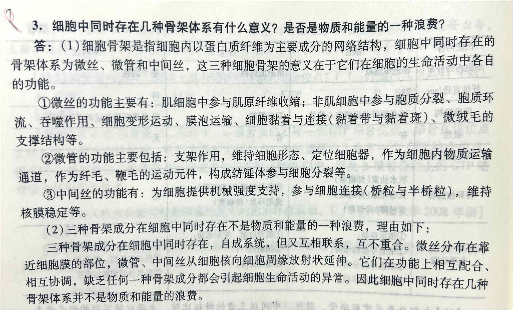

<!-- anki-id: cell-biology-jsonl-000069 -->
### Front
四、微管、微丝、中间丝的比较（见表 8-1）

### Back
表 8-1 微管、微丝、中间丝的比较

| 比较内容 | 微管 | 微丝 | 中间丝 |
| :--- | :--- | :--- | :--- |
| **蛋白质组成** | 微管蛋白二聚体 | 球形肌动蛋白 | 不同来源的组织细胞表达不同类型的中间丝蛋白 |
| **细胞内的分布** | 靠近细胞核 | 细胞质内侧 | 整个细胞 |
| **纤维直径/nm** | 24 | 7 | 10 |
| **纤维结构** | 13条原纤丝组成空心管状 | 双链螺旋 | 32条原纤丝组成的多级螺旋 |
| **极性** | 有 | 有 | 无 |
| **单体蛋白库** | 有 | 有 | 无 |
| **特异性药物** | 秋水仙素（抑组装） 长春花碱（抑组装） 紫杉醇（抑解聚） | 细胞松弛素B（抑组装） 鬼笔环肽（抑解聚） | 无 |
| **主要功能** | ①细胞移动； ②细胞形态的维持； ③染色体的分离； 细胞器的移动 | ①肌肉收缩、变形运动； ②细胞爬行； ③胞质分裂； ④保持细胞形态 | ①支持结构、维持细胞形态； ②形成核纤层、核骨架； ③提高神经细胞的强度 |

### OriginalMaterial

---

<!-- anki-id: cell-biology-jsonl-000071 -->
### Front
3. 细胞中同时存在几种骨架体系有什么意义？是否是物质和能量的一种浪费？

### Back
(1)细胞骨架是指细胞内以蛋白质纤维为主要成分的网络结构，细胞中同时存在的骨架体系为微丝、微管和中间丝，这三种细胞骨架的意义在于它们在细胞的生命活动中各自的功能。
    
  	①微丝的功能主要有：肌细胞中参与肌原纤维收缩；非肌细胞中参与胞质分裂、胞质环流、吞噬作用、细胞变形运动、膜泡运输、细胞黏着与连接（黏着带与黏着斑）、微绒毛的支撑结构等。
  	②微管的功能主要包括：支架作用，维持细胞形态、定位细胞器，作为细胞内物质运输通道，作为纤毛、鞭毛的运动元件，构成纺锤体参与细胞分裂等。
  	③中间丝的功能有：为细胞提供机械强度支持，参与细胞连接（桥粒与半桥粒），维持核膜稳定等。

(2)三种骨架成分在细胞中同时存在不是物质和能量的一种浪费，理由如下：

三种骨架成分在细胞中同时存在，自成系统，但又互相联系，互不重合。微丝分布在靠近细胞膜的部位，微管、中间丝从细胞核向细胞周缘放射状延伸。它们在功能上相互配合、相互协调，缺乏任何一种骨架成分都会引起细胞生命活动的异常。因此细胞中同时存在几种骨架体系并不是物质和能量的浪费。

### OriginalMaterial

---

<!-- anki-id: cell-biology-jsonl-000072 -->
### Front
[题目12] 细胞骨架结构成分的主要装配特点。

### Back
*   **概述**：在细胞生命活动中，<u>细胞骨架是一类高度动态结构，它们通过蛋白亚基的组装与去组装过程来调节细胞内骨架网络的分布和结构</u>。细胞骨架是指真核细胞内由一些特异蛋白质构成的纤维网架结构。细胞骨架包括微丝、微管和中间丝3种结构。

*   **(1) 微丝的组装及动力学特征**
    *   ① 微丝是 G-actin 单体形成的多聚体。装配时头尾相接，故具有极性，即正/负极；
    *   ② 在体外，微丝的组装与溶液中所含肌动蛋白单体的状态（结合 ATP 或 ADP、离子的种类及浓度等参数）相关联。溶液中适当浓度 Ca2+时，F-actin→G-actin；含有 ATP、Mg2+以及较高浓度 Na+、K+时，G-actin→F-actin。
    *   ③ 微丝组装的几个阶段：<u>第一阶段是成核反应，即形成至少有 2-3个肌动蛋白单体组成的寡聚体，第二个阶段是纤维的延长。</u><u>肌动蛋白单体结合 ATP 后才能组装到微丝，组装后单体具有 ATPase 活性，将 ATP 水解成 ADP。在体外，由于微丝在正极端装配延长，负极去装配而缩短，从而表现为踏车现象。</u>

*   **(2) 微管在体外的组装分为成核和延伸两个阶段**
    *   ① <u>α/β微管蛋白二聚体首先先形成原纤维，经过侧面增加而扩展为片层、至 13 根原纤维时，即合拢形成一段微管。</u>新的二聚体不断加到微管的端点使之延长，所有的微管都有确定的极性，是因为微管原纤维是由α/β异二聚体以 a/β→a/β→a/β的形式排列而来的。正极生长速度快，负极生长速度慢。<u>在体外，微管和微丝一样具有踏车行为。</u>细胞中由微管构成的亚细胞结构也是有极性的的。
    *   ② 细胞内微管的组装与去组装在时间和空间上是高度有序的。间期处于平衡状态；有丝分裂前期，胞质内微管网络解体，组装纺锤体微管：分裂末期，发生逆转。纺锤体微管大都起源于中心体，纤毛和鞭毛毛管起源于基体。

*   **(3) 与微丝、微管的组装过程不同，中间丝蛋白在合适的缓冲体系中自我组装成 10nm 的丝状结构，而且不消耗能量**
    *   装配过程：两条中间丝多肽链形成超螺旋二聚体；两个二聚体反向平行以半重叠形式构成四聚体；四聚体首尾相连形成原纤维；8 根原纤维构成圆柱状的 10nm 纤维。与微丝和微管完全不同，<u>中间丝不仅可以从头装配，而且新的中间丝蛋白可通过交换的方式掺入到原有的纤维中去。</u>处有丝分裂的细胞内，胞质中中间丝网格在分裂前解体，分裂结束后又重新组装；在细胞分化中，细胞内中间丝的类型随细胞分化而发生变化。

### OriginalMaterial

---

<!-- anki-id: cell-biology-jsonl-000073 -->
### Front
【题目24】细胞内有哪些三类主要的马达蛋白？简要说明其作用方式。各类马达蛋白（肌球蛋白、驱动蛋白、动力蛋白）的具体结构特点和分类功能是什么？

### Back
一、马达蛋白的类型与作用方式
1. **类型**：主要是指依赖于微管的**驱动蛋白**、**动力蛋白**和依赖于微丝的**肌球蛋白**这三类蛋白超家族的成员。
2. **作用方式**：它们既能与微管/微丝结合，又能与一些细胞器或膜状小泡特异性结合，并利用水解ATP产生的能量，有规则地沿微管或微丝等细胞骨架纤维运输所携带的“货物”。

二、马达蛋白的作用方式（具体分类）
(一) **肌球蛋白**
是与微丝相关的一类分子马达。其共同特征是都含有一个作为<u>**马达结构域的头部**</u>。其马达结构域包含一个<u>微丝结合位点</u>，和一个具有ATP酶活性的ATP结合位点。
1. **(1) II型肌球蛋白**：<yellow>II型肌球蛋白</yellow>存在于多种细胞，包含**<u>2条重链和4条轻链</u>**。**<u>头部即马达结构域</u>**，尾部主要起结构作用。II型肌球蛋白尾尾相接所构成的双极纤维，能介导相邻的微丝相互滑动。
2. **(2) V型肌球蛋白**：头部亦为马达结构域，在ATP存在时可沿微丝运动。其尾部结构域具有多样性，能与多种细胞组分结合，通过头部驱动或细胞膜质作相对于微丝的运动。**<u>V型肌球蛋白是二聚体马达蛋白</u>**，具有两个头部，交替与微丝结合可以确保整个分子以及所运载的“货物”始终不与微丝脱离。

(二) **驱动蛋白**
是一类蛋白质超家族，与微管相关。通常由**<u>2条重链和2条轻链组成</u>**，它们共有保守的“马达”域。内有ATP结合位点和微管结合位点。<u>**马达结构域在重链的N端**</u>，介导物质向微管的正极运动。
*   驱动蛋白的马达结构域具有两个重要的功能位点：①ATP结合位点；②微管结合位点。
*   有关驱动蛋白沿微管运动的分子模型有两种：**<u>步行模型</u>**和**<u>尺蠖爬行模型</u>**。大多数学者承认步行模型，驱动蛋白的两个球状头部交替向前，每水解一分子ATP落在后面的那个马达结构域将移动两倍的距离。即16 nm，并循环该过程。

(三) **动力蛋白**
是马达蛋白中最大、移动速度最快的成员。动力蛋白由2条或3条重链，多条轻链及中间链组成。其马达结构域位于重链C端，轴丝动力蛋白有3个马达结构域，胞质动力蛋白有2个马达结构域。
1. **(1) <yellow>轴丝动力蛋白</yellow>**：在纤毛与鞭毛中发现。与纤毛和鞭毛的运动相关；
2. **(2) <yellow>胞质动力蛋白</yellow>**：在真核细胞胞质内发现，与细胞内介导微管从正极向负极端的膜泡运输以及有丝分裂动粒和纺锤体的共定位有关。

### OriginalMaterial

---

<!-- anki-id: cell-biology-jsonl-000074 -->
### Front
【题目 27】细胞内依赖于微管和微丝的分子马达有哪些？简述其功能。

### Back
一、沿微丝运动的肌球蛋白
(1) **II型肌原纤维的粗肌**在心肌骨骼肌、平滑肌中产生强大收力，也在收缩、张力纤维等能力的细胞结构中发挥作用；
(2) **V型**在细胞内膜泡和其他细胞器的运输发挥作用；
(3) **X型**参与内吞作用以及吞噬泡的运输；
(4) 有些成员在细胞形态和极化细胞结构的建立及维持过程中发挥功能；还有一些参与细胞感知系统及信号转导过程。
二、沿微管运动的驱动蛋白和动力蛋白
(1) **驱动蛋白**能运载膜性细胞器从微管负极移向微管正极。**驱动家族1-3主要与膜性细胞器与大分子复合物的运输相关**。而其他家族的成员主要作用于调节微管的动态不稳定性以及微管网络的结构。
(2) **轴丝动力蛋白可以使纤毛和鞭毛滑动**，只在有纤毛和鞭毛结构的细胞中发现。**（3）细胞质动力蛋白履行细胞生存所必需的功能**，如物质运输和中心体装配。**在所有的动物细胞和绝大部分植物细胞中发现**。细胞质动力蛋白**可以沿着微管反向（正极到负极）移动**。细胞质动力蛋白同样有助于对高尔基体和其他细胞器的定位。它同样可以帮助内质网、溶酶体进行物质运输。动力蛋白也可能参加了染色体的定位与细胞分裂。

### OriginalMaterial

---

<!-- anki-id: cell-biology-jsonl-000075 -->
### Front
【题目 34】简述微丝和微管的组装过程。

### Back
一、微丝的组装过程
(1) **<u>成核反应</u>**：成核反应是指形成至少有 2~3 个肌动蛋白单体组成的寡聚体的过程，是 G-actin 组装的限速步骤。肌动蛋白相关蛋白 Arp2/3 形成的起始复合物与肌动蛋白单体结合，形成一段可供肌动蛋白继续组装的寡聚体。
(2) **<u>纤维的延长</u>**：纤维的延长是指肌动蛋白单体快速结合到成核反应合成的寡聚体上，使之不断延伸形成微丝纤维的过程。

二、微管的组装过程
(1) **<u>成核反应</u>**：一些微管蛋白二聚体首先纵向聚合形成短的丝状结构，即成核反应。然后通过**在两端以及侧面增加二聚体而扩展成片状**，当片状聚合物加宽到大约 13 根原纤丝时，即合拢成为一段微管。
(2) **<u>微管的延长</u>**：新的微管蛋白二聚体不断地组装到微管的两端，使之延长。

### OriginalMaterial

---

<!-- anki-id: cell-biology-jsonl-000076 -->
### Front
【题目29】高等动物的个体运动有赖于骨骼肌的收缩，每根肌原纤维称为肌节，根据肌节的结构，论述肌丝滑动模型的调控。/简述由神经冲动诱发的肌肉收缩基本过程。

### Back
(1) 动作电位的产生
来自脊髓运动神经元的神经冲动经轴突传到运动终板（神经-肌肉接点），使肌细胞膜去极化，并经T小管传至肌质网。

(2) Ca2+的释放
肌质网去极化后释放Ca2+至肌浆中，使Ca2+浓度升高至收缩期的Ca2+阈浓度。

(3) 原肌球蛋白位移
Ca2+与Tn-C结合，引起肌钙蛋白构象变化，Tn-C与Tn-I、Tn-T结合力增强，导致Tn-I与肌动蛋白结合力削弱，使两者脱离；同时，Tn-T使原肌球蛋白移位到肌动蛋白双螺旋沟槽的深处，**暴露出细肌丝肌动蛋白与肌球蛋白头部的结合位点，解除了肌动蛋白与肌球蛋白结合的障碍。**

(4) 细肌丝与粗肌丝之间的相对滑动
① 肌球蛋白的马达结构域没有结合ATP时，与细肌丝结合，并呈僵直状态；
② 肌球蛋白马达结构域结合ATP，与肌动蛋白纤维的结合力下降，与肌动蛋白分开；
③ ATP水解为ADP和Pi，水解产物仍与肌球蛋白结合，获能的肌球蛋白头部发生旋转，向细肌丝的正极端抬升；
④ 在Ca2+存在的条件下，肌球蛋白头部与细肌丝正端的肌动蛋白亚基结合；
⑤ Pi释放，肌球蛋白颈部结构域发生构象变化，头部与细丝的角度发生变化，拉动细肌丝导致细肌丝相对于粗肌丝的滑动；
⑥ ADP释放，肌球蛋白的头部结构域与细肌丝之间又回到僵直状态。
如果体系中仍有高浓度的Ca2+存在，肌球蛋白将继续下一个周期，沿细肌丝滑动。到达肌细胞的冲动一旦停止，肌质网就通过钙泵回收Ca2+，胞质Ca2+浓度降低，收缩周期停止。

### OriginalMaterial

---

<!-- anki-id: cell-biology-jsonl-000077-01 -->
### Front
[题目 44] 中间丝特点

### Back
① <b>中间丝无极性</b>；
② <b>无动态蛋白库</b>；
③ <b>装配和温度与蛋白浓度无关</b>；
④ <b>可以自我组装，不需 ATP、GTP 或结合蛋白的辅助</b>；
⑤ 中间丝的装配与解聚和微丝与微管的动态特征有所不同，并不表现为典型的踏车行为。向细胞内导入荧光标记的中间丝蛋白，然后观察中间丝的组装过程，结果显示带荧光标记的中间丝蛋白可以向已经存在的中间丝的多个位点加入，而不是像微管和微丝那样仅仅在末端加入。随着时间的延长整个中间丝上都显示荧光标记。可见中间丝的组装模式与微管和微丝完全不同，在细胞内新的中间丝蛋白可以通过交换的方式掺入到原有的纤维中去。
⑥ 与微管，微丝不同，中间丝无动力结合蛋白和特异性药物
⑦ 中间丝与其他细胞结构的联系：中间丝在胞质中形成发达的纤维网络，并与细胞质膜上特定的部位连接，并通过一些跨膜蛋白与<u><b>细胞外基质或相邻细胞的中间丝</b></u>间接相连。在细胞的内部，<u><b>许多细胞质中间丝源自细胞核的周围，并且与核膜有联系</b></u>。由 V 型中间丝蛋白组装而成的核纤层结构，在核膜的内侧呈正交网状排列。核纤层与内核膜上的核纤层蛋白受体相连，从而成为核膜的重要支撑结构。此外，核纤层还是染色质的重要锚定位点。
⑧ <b>中间丝比微丝微管稳定得多</b>；
⑨ 中间丝与微丝微管不同，并不是所有真核细胞必需的结构组分，具有组织特异性。

### OriginalMaterial

---

<!-- anki-id: cell-biology-jsonl-000119 -->
### Front
[题目 28] 试比较肌动蛋白与肌球蛋白的异同点

### Back
一、不同点
(1) <u>结构不相同</u>
肌动蛋白由单个肽链折叠而成，并呈球状，在肌动蛋白分子间有一个裂缝将肌动蛋白分成两瓣，裂缝内有 ATP 结合位点。肌球蛋白，具有两个头部和一个尾部，由两条具有马达结构域的重链和四条起调节作用的轻链构成；
(2) <u>存在位置不同</u>
肌球蛋白：存在于平滑肌中。肌动蛋白：存在于横纹肌肌肌原纤维的细丝中，也存在于平滑肌中。
(3) <u>功能不同</u>
肌动蛋白主要作为构成微丝及细胞骨架成分；肌球蛋白主要作为细胞运动收缩，以及物质运输的主要承担者。

二、相同点
(1) 都具有 ATP 的结合位点，并且通过 ATP/ADP 的转换而行使其功能。
(2) 都具有一段保守的氨基酸序列。

### OriginalMaterial

---

<!-- anki-id: cell-biology-jsonl-000136 -->
### Front
试述纤毛和鞭毛的结构与功能。

### Back
**一、纤毛和鞭毛的结构**
是细胞质膜所包被的细小突起，内部由微管构成轴丝结构。<u>由基体和纤毛轴丝两部分组成</u>。纤毛和鞭毛是真核细胞表面的具有运动功能特化结构。纤毛与鞭毛的结构相似，但较鞭毛短。

(1) 纤毛轴丝：为“9+2”排列微管，即外周 9 组二联体微管+中央稍包围的 2 根中央单体微管。外周二联体微管由 A，B 亚纤维组成，A 亚纤维为完全微管，B 亚纤维仅由 10 个亚基构成。中央微管均为完全微管。
(2) 基体的微管组成为“9+0”，无中央微管。

**二、纤毛和鞭毛的功能**
**(一) <u>运动装置</u>**
(1) 鞭毛推动单细胞原生生物如草履虫在液体介质中运动，及动物细胞组织表面的液体做定向流动；精子和原生动物通过鞭毛的波浪摆动使细胞在液体介质中游动。
(2) 在一些高等动物体内，纤毛存在于多种组织（如输卵管、呼吸道上皮组织）的细胞表面。相邻的纤毛可以几乎同步运动，使组织表面的液体定向流动。在人体呼吸道，数目众多的纤毛可以清除进入气管的异物，输卵管中的纤毛使卵细胞向子宫方向移动。
**(二) <u>传输装置和感受装置</u>**
传输某些信号分子（物理化学信号分子），参与信号传导，影响靶细胞的定向分化与发育。鞭毛内转运机制，以及纤毛相关蛋白缺失引起生物体表型变化。

### OriginalMaterial

---
