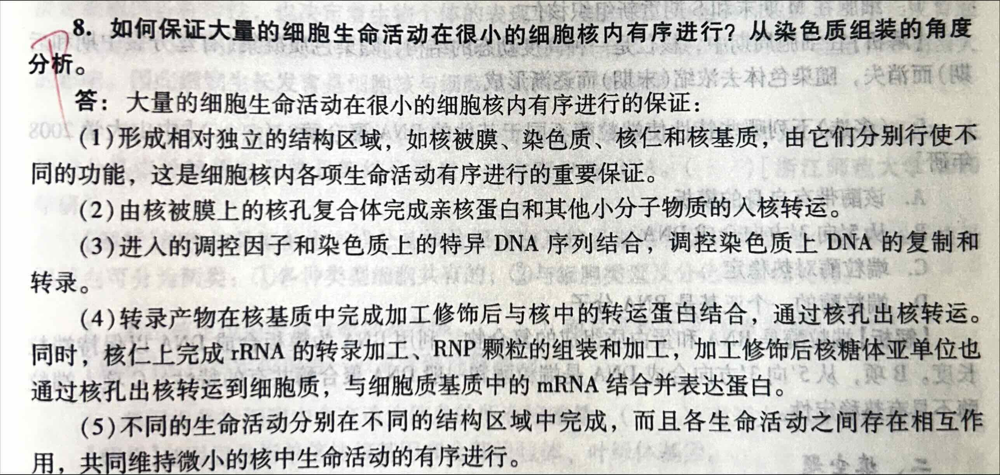
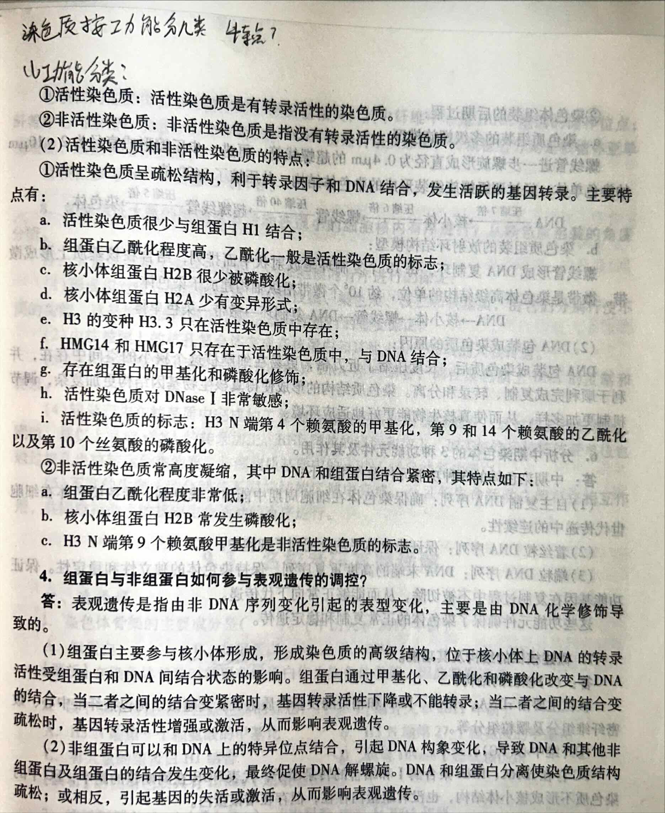

<!-- anki-id: cell-biology-jsonl-000078 -->
### Front
【题目7】核蛋白进入核孔有哪些途径？

### Back
**一、通过核孔复合体的主动运输**

很多核蛋白都具有一段特殊的氨基酸序列，称核定位信号（NLS），核孔复合体上的一些特异受体可识别核定位信号，帮助核蛋白通过核孔复合体，进入细胞核内。入核转运的基本步骤为：
① **亲核蛋白通过NLS识别importin a, 与importin a/importinβ异二聚体结合，形成转运复合物；**
② 在importinβ的介导下，转运复合物与核孔复合体的胞质纤维结合；
③ 转运复合物通过改变构象的核孔复合体从胞质面被转移到核质面；
④ **转运复合物在核质面与Ran-GTP结合，并导致复合物解离，亲核蛋白释放；**
⑤ 受体的亚基与结合的Ran返回胞质，在胞质内Ran-GTP水解形成Ran-GDP并与importin β解离，Ran-GDP返回核内再转换成Ran-GTP状态。

**二、通过核孔复合体的被动扩散**

核孔复合体作为被动扩散的亲水通道，其有效直径为9~10nm，有的可达12.5nm，<u>即离子、小分子以及直径在10nm以下的物质原则上可以自由通过。</u>

### OriginalMaterial

---

<!-- anki-id: cell-biology-jsonl-000079 -->
### Front
【题目 17】简述甲基化在转录水平调控中的作用。

### Back
(1) DNA <u>甲基化</u>是真核细胞基因组重要修饰方式之一。<u>DNA甲基化通过与转录因子相互作用或通过改变染色质结构来影响基因的表达，属于表观遗传水平</u>。<u>DNA甲基化与基因表达的阻遏有关</u>。是<u>使DNA转入持久遏制状态的重要条件</u>。在DNA上有<u>富含CG的区域</u>，这种区域称“<u>CG岛</u>”。CG岛常位于转录调控区或其附近，它的<u>甲基化程度直接影响转录的活性</u>。
(2) 一般而言，<u>非活跃转录基因的DNA甲基化程度普遍高于活跃转录的基因</u>。当含有甲基化DNA的非活性基因活化后，通常伴随失去许多甲基集团。在发育过程中，处于活化状态的基因调节区的甲基化水平会显著下降。因此，甲基化是使DNA转入持久阻遇状态的重要条件。许多研究表明，DNA甲基化对维持基因长期处于非活化状态起重要作用。
(3) <u>甲基化作用通过两种方式抑制转录</u>：一是<u>干扰转录因子对DNA结合位点的识别</u>；二是<u>将转录激活因子识别的DNA序列转换为转录抑制因子的结合位点</u>。不过需要指出的是，DNA甲基化和去甲基化关系并不是绝对的，DNA甲基化不是使基因表达失活的一种普遍机制。种属之间DNA甲基化的程度有很大差别。因此，甲基化和去甲基化在基因表达活性调控中的意义依生物不同而有差异。
(4) **基因组印记**：指由不同性别亲代传给子代的同一染色体或基因可以引起不同的表型，是哺乳动物所特有的现象，是说明甲基化作用在基因表达调控中具有重要意义的最好例证。
(5) **抑癌基因启动子区域CG岛的甲基化**，使抑癌基因功能丧失，转录失活。细胞增殖失去控制，导致细胞变成癌细胞。

### OriginalMaterial

---

<!-- anki-id: cell-biology-jsonl-000080 -->
### Front
[题目 11] 简述核纤层的基本组成和功能。

### Back
**一、 基本组成**

核纤层是位于内层核膜内侧的一薄层纤维网架结构，由 \( \text{V} \) 型中间丝蛋白组装而成。哺乳动物体细胞的核纤层主要中 3 种核纤层蛋白构成，它们分别是 \( \text{laminA} \)、\( \text{laminB} \) 以及 \( \text{laminC} \)。其中，\( \text{laminA} \) 和 \( \text{laminC} \) 是同一个基因的不同的拼接体，前 566 个氨基酸完全相同，但是 C 端的序列是不一样的。**laminA/C 的表达具有组织与发育时期的特异性**，但 **laminB** 则在哺乳动物的所有细胞中表达。

**二、 核纤层的功能主要包括以下几个方面**

① **结构支撑功能**。核纤层蛋白形成骨架结构支撑于核被膜的内侧，使得核被膜能起到细胞核与细胞质之间的隔离与信息交换功能。核纤层的骨架功能还得以使细胞核维持正常的形状与大小。

② **调节基因表达**。果蝇细胞中基因组范围的研究结果表明，沉默基因更倾向于分布于核纤层附近，异染色质更易与核纤层结合，而且核纤层附近的染色质的乙酰化水平较低。然而，在酵母细胞中活跃转录的基因也分布于核纤层附近，它们常与核孔复合体结合。很可能在不同物种的细胞中，甚至不同组织的细胞中情况不一样。

③ **调节 DNA 修复**。研究表明，**laminA 核纤层蛋白是双链 DNA 断裂修复必需的**。核纤层蛋白功能异常病人细胞中的基因组变得不稳定，DNA 修复反应后，端粒变短。

④ **与细胞周期的关系**。细胞分裂过程中，核纤层蛋白解聚成可溶的单体或与崩解后的核被膜相结合。新核形成时，核被膜与染色质结合的同时，核纤层也最后重新形成。

### OriginalMaterial

---

<!-- anki-id: cell-biology-jsonl-000081 -->
### Front
【题目14】概述染色质的类型及其特征。

### Back
【答案】

一、染色质的基本概念
① 染色质：指间期细胞核内由DNA、组蛋白、非组蛋白及少量RNA组成的线性复合结构，是间期细胞遗传物质存在的形式。
② 染色体：指细胞在有丝分裂或减数分裂过程中，由染色质聚缩而成的棒状结构。
③ 染色质与染色体是在细胞周期不同的功能阶段可以相互转变的形态结构；染色质与染色体具有基本相同的化学组成，但包程度不同，构象不同。

二、基本类型
(1) 常染色质
① 概念：指间期核内染色质折叠程度低，处于伸展状态，碱性染料染色时着色浅的染色质。
② 特征：DNA包装比约为1000-2000分之一；单一序列DNA和中度重复序列DNA（如组蛋白基因和tRNA基因）；并非所有基因都具有转录活性，常染色质状态只是基因转录的必要条件而非充分条件。

(2) 异染色质
① 概念：碱性染料染色时着色较深的染色质组分。
② 类型：<u>结构异染色质</u>（或<u>组成型异染色质</u>）、<u>兼性异染色质</u>：结构异染色质，除了复制期外，整个细胞周期均处于聚缩状态，形成多个染色中心。
③ 特征：
① <u>结构异染色质特征</u>：在中期染色体上多定位于着丝粒区、端粒、次缢痕及染色体臂的某些节段；由相对简单、高度重复的DNA序列构成，如卫星DNA；具有显著的遗传惰性，不转录也不编码蛋白质；在复制行为上与常染色质相比表现为晚复制、早聚缩；在功能上参与染色质高级结构的形成，导致染色质区间性，作为核DNA的转座元件，引起遗传变异。
② <u>兼性异染色质特征</u>：在某些细胞类型或一定的发育阶段，原来的常染色质聚缩，并丧失失基因转录活性，变为异染色质，如X染色体随机失活；异染色质化可能是关闭基因活性的一种途径。

### OriginalMaterial

---

<!-- anki-id: cell-biology-jsonl-000082 -->
### Front
[题目 27] 试比较染色体着丝粒与着丝点的区别和联系。

### Back
(1) **定义**
<u>① <u>着丝粒</u></u>：<u>连接两个姐妹染色单体，并将染色体分为长臂和短臂，包括动粒结构域、中央结构域和配对结构域三个结构域，它是中期染色单体相互联系在一起的特殊部位；并与纺锤丝相连，在分裂后期时使两条染色单体分开向两极运动。</u>
<u>② <u>着丝点</u></u>：<u><u>又名动粒</u>，在主缢痕处两个染色单体的外侧表面部位的特殊结构，它与染色体微管接触，是微管蛋白的组织中心。动粒包括与着丝粒中央结构域相联系的内膜板、中间间隙、外板和纤冠状。</u>

(2) **区别**
<u>① <u>着丝粒</u></u>是指位于染色体主缢痕部位的**<u>染色质</u>**。
<u>② <u>着丝点</u></u>即动粒，在主缢痕处两个染色单体的外表面位的**<u>特殊结构</u>**。

(3) **联系**
<u>着丝点是附着于着丝粒上的一种特殊结构，着丝粒是位于染色体主缢痕部位的染色质，动粒的外侧主要用于纺锤体微管附着，内侧与着丝粒相互交织。由于<u>动粒和着丝粒联系紧密</u>，结构成分相互穿插，在功能方面联系密切，因此两者常被称为<u>着丝粒-动粒复合体</u>。</u>

### OriginalMaterial

---

<!-- anki-id: cell-biology-jsonl-000083 -->
### Front
【题目 23】组蛋白与非组蛋白如何参与表观遗传的调控？

### Back
【答案】表观遗传是指由非DNA序列变化引起的表型变化，主要是由 DNA 化学修饰导致的。
(1) <u>组蛋白主要参与核小体形成，形成染色质的高级结构</u>，位于核小体上的 DNA 的转录活性受组蛋白和 DNA 间结合状态的影响。组蛋白通过甲基化、乙酰化和磷酸化而<u>导致和 DNA 结合的 改变</u>，当二者之间的结合变紧密时，基因转录活性下降或不能转录；当二者之间的结合变 疏松时，基因转录活性增强或激活，<u>从而影响表观遗传</u>。
(2) <u>非组蛋白可以和 DNA 上的特异位点结合，引起 DNA 构象变化，导致 DNA 和其他非组蛋白及组蛋白的结合发生变化。最终促使 DNA 解螺旋，DNA 和组蛋白分离使染色质结构疏 松</u>；或相反，引起基因的失活或激活，从而影响表观遗传。

### OriginalMaterial

---

<!-- anki-id: cell-biology-jsonl-000084 -->
### Front
(2) 组蛋白的修饰

### Back
基本修饰包括**核心组蛋白的赖氨酸残基乙酰化**激活染色质；组蛋白 H1 的磷酸化，导致染色质<u>疏松</u>。组蛋白修饰可以改变染色质的结构，直接影响转录活性或者是核小体表面发生改变，使调控蛋白容易和染色质结合，间接影响转录活性。

### OriginalMaterial

---

<!-- anki-id: cell-biology-jsonl-000085 -->
### Front
分析中期染色体的三种功能元件及其作用。染色体应具有的关键序列有哪些？它们在染色体的结构和功能中担当着什么样的角色？

### Back
(1) **自主复制DNA序列（ARS）**
保证染色体在细胞周期中能够自我复制，维持染色体在细胞世代传递中的连续性。它们都具有一段 11~14bp 的同源性很高的富含 AT 的共有序列，同时证明这段共有序列及其上、下游各 200bp 左右的区域是维持 ARS 功能所必需的。

(2) **着丝粒DNA序列（CEN）**
保证细胞分裂时已完成复制的染色体平均分配到子细胞中。他们的共同特点是有两个彼此相邻的核心区，一个是 80~90bp 的 AT 区，另一个是 11bp 的保守区。

(3) **端粒DNA序列（TEL）**
染色体的两个末端必须有端粒，保持染色体的独立性和稳定性。端粒（telomere）是以线性染色体形式存在的真核基因组 DNA 的末端的一种特殊结构，是一段 DNA 序列和蛋白质形成的复合体。

构成染色体 DNA 的这三种关键序列称为染色体 DNA 的功能元件。利用分子克隆技术把真核细胞染色体的复制起点、着丝粒、端粒这三种关键序列分别克隆在互相搭配，可以改造形成人造小染色体。

### OriginalMaterial

---

<!-- anki-id: cell-biology-jsonl-000086 -->
### Front
【题目 28】端粒序列是如何发挥作用的？

### Back
端粒序列可以解决“<u>末端复制问题</u>”，即在DNA复制过程中，**新合成的DNA链5'末端RNA引物切除后会导致DNA变短的问题**。真核染色体的重复序列不是染色体DNA复制时连续合成的，而是由端粒酶合成后，添加到染色体末端。端粒酶是一种**核糖核蛋白复合物**，**具有逆转录酶的性质**。**由物种特异的内在RNA作模板**，能把合成的端粒重复序列再加到染色体的3'端，从而解决末端复制问题。目前只发现在**生殖系细胞和部分干细胞里有端粒活性**，在所有体细胞里则尚未发现端粒酶的活性。端粒起到细胞分裂计时器的作用。

重复单位：
- TTGGGGTTT GGGGTT T GGGGTT T GG GTT TG
- AACCCCAAC

### OriginalMaterial

---

<!-- anki-id: cell-biology-jsonl-000087 -->
### Front
【题目 35】结合核仁结构特点描述哺乳动物核糖体大、小亚基的形成过程。

### Back
【答案】
（1）结构
① 纤维中心是 rRNA 基因的储存位点；
② 致密纤维组分转录主要发生在 FC 与 DFC 的交界处，并加工初始转录；
③ 颗粒组分负责装配核糖体亚单位，是核糖体亚单位成熟和储存的位点。
（2）核糖体的组装主要发生在核仁中
<u>首先要合成组装有关的蛋白质，运输到核仁区参与装配。其中亚基 18SrRNA，5.8SrRNA，28SrRNA 是在核仁中边转录边装配的。5SrRNA 在细胞核质中转录再转移到核仁中装配。</u>
其装配过程为：
① RNA 酶沿着 DNA 分子排列，<u>新合成的 45SrRNA 与蛋白质形成 RNP 复合体，45SrRNA 甲基化后经 RNA 酶裂解开 18SrRNA 和 32SrRNA。</u>
② 其中 32SrRNA 再裂解成 28SrRNA 和 5.8SrRNA，并与从细胞核质转移到核仁中的 5SrRNA 组装成大亚基，若有 mRNA 的存在，则可与 18SrRNA 形成完整的核糖体。

### OriginalMaterial

---

<!-- anki-id: cell-biology-jsonl-000120 -->
### Front
8. 如何保证大量的细胞生命活动在很小的细胞核内有序进行？从染色质组装的角度分析。

### Back
大量的细胞生命活动在很小的细胞核内有序进行的保证：
(1) 形成相对独立的结构区域，如核被膜、染色质、核仁和核基质，由它们分别行使不同的功能，这是细胞核内各项生命活动有序进行的重要保证。
(2) 由核被膜上的核孔复合体完成亲核蛋白和其他小分子物质的入核转运。
(3) 进入的调控因子和染色质上的特异 DNA 序列结合，调控染色质上 DNA 的复制和转录。
(4) 转录产物在核基质中完成加工修饰后与核中的转运蛋白结合，通过核孔出核转运。同时，核仁上完成 rRNA 的转录加工、RNP 颗粒的组装和加工，加工修饰后核糖体亚单位也通过核孔出核转运到细胞质，与细胞质基质中的 mRNA 结合并表达蛋白。
(5) 不同的生命活动分别在不同的结构区域中完成，而且各生命活动之间存在相互作用，共同维持微小的核中生命活动的有序进行。

### OriginalMaterial

---

<!-- anki-id: cell-biology-jsonl-000121 -->
### Front
染色质按功能分为哪几类？活性染色质和非活性染色质各有什么特点？

### Back
(1) **功能分类**：
① **活性染色质**：活性染色质是有转录活性的染色质。
② **非活性染色质**：非活性染色质是指没有转录活性的染色质。

(2) **活性染色质和非活性染色质的特点**：
① **活性染色质**呈疏松结构，利于转录因子和 DNA 结合，发生活跃的基因转录。主要特点有：
a. 活性染色质很少与组蛋白 H1 结合；
b. **组蛋白乙酰化程度高**，乙酰化一般是活性染色质的标志；
c. 核小体组蛋白 H2B 很少被磷酸化；
d. 核小体组蛋白 H2A 少有变异形式；
e. **H3** 的变种 **H3.3** 只在活性染色质中存在；
f. **HMG14** 和 **HMG17** 只存在于活性染色质中，与 DNA 结合；
g. 存在组蛋白的甲基化和磷酸化修饰；
h. 活性染色质对 **DNase I** 非常敏感；
i. 活性染色质的标志：**H3 N端第4个赖氨酸的甲基化**，**第9和14个赖氨酸的乙酰化**以及**第10个丝氨酸的磷酸化**。

② **非活性染色质**常高度凝缩，其中 DNA 和组蛋白结合紧密，其特点如下：
a. **组蛋白乙酰化程度非常低**；
b. 核小体组蛋白 H2B 常发生磷酸化；
c. **H3 N端第9个赖氨酸甲基化**是非活性染色质的标志。

### OriginalMaterial

---

<!-- anki-id: cell-biology-jsonl-000122 -->
### Front
5. 试述从 DNA 到染色体的包装过程。DNA 为什么要包装成染色质？

### Back
答：(1) DNA 到染色体的包装过程：
①染色体组装的前期过程：
a. H3·H4 四聚体结合，由 CAF-1 介导与新合成的裸露的 DNA 结合。
b. 由 NAP-1 和 NAP-2 介导，两个 H2A·H2B 异二聚体加入，形成一个核心颗粒，H4 上 Lys5 和 Lys12 被乙酰化。
c. ATP 创建一个规则的间距，组蛋白去乙酰化，ISWI 和 SWI/SNF 家族的蛋白参与此过程的调节。H1 结合 DNA 伴随核小体折叠。
d. 6 个核小体组成一个螺旋或由其他的组装方式形成一个直径 25 ~ 30nm 的螺线管结构（二级结构）。

②染色体组装的后期过程：
a. 染色质组装的多级螺旋模型：
螺线管进一步螺旋形成直径为 0.4μm 的超螺线管，再进一步压缩形成直径为 2 ~ 10μm 的染色单体。经过四级螺旋组装形成的染色体结构，共压缩了 8400 倍。
\[ \text{DNA} \xrightarrow{\text{压缩7倍}} \text{核小体} \xrightarrow{\text{压缩6倍}} \text{螺线管} \xrightarrow{\text{压缩40倍}} \text{超螺线管} \xrightarrow{\text{压缩5倍}} \text{染色体} \]
b. 染色质组装的放射环结构模型：
螺线管形成 DNA 复制环，每 18 个复制环呈放射状平面排列，结合在核基质上形成微带。微带是染色体高级结构的单位，约 $10^6$ 个微带沿纵轴构建成子染色体。
DNA→核小体→螺线管→DNA 复制环→微带→染色单体

(2) DNA 包装成染色质的原因：
DNA 包装成染色质后，长度压缩了近万倍，更易在细胞核这个狭小的空间中存在，并利于顺利完成复制、转录和分离。染色质结构的形成使得真核生物基因结构更加复杂，调节机制更加多样，从而使真核生物能更好地适应环境。

### OriginalMaterial

---

<!-- anki-id: cell-biology-jsonl-000123 -->
### Front
[题目 5] 试述核孔复合体的结构及其功能。

### Back
**核孔复合体**是指镶嵌在内外核膜融合形成的核孔上的复杂结构，主要由蛋白质构成，核孔复合体在核被膜上的数量、分布密度与分布形式随细胞类型、细胞核的功能不同而有很大的差异。一般来说，转录功能活跃的细胞，其核孔复合体数量较多。

**一、结构成分**
(1) **胞质环**：又称外环，位于核孔边缘胞质面一侧，环上有 8 条短纤维对称分布伸向胞质。
(2) **核质环**：又称内环，位于核孔边缘的核质面一侧，环上对称地连有 8 条细长的纤维，向核内伸入 50~70nm，在纤维的末端形成一直径为 60nm 的小环，小环由 8 颗粒构成。**<u>这些结构共同形成核篮结构</u>**。
(3) **辐**：由核孔边缘伸向中心，呈辐射状八重对称，包括位于核孔边缘的**柱状亚单位**、穿过核膜伸入双层核膜的膜内向的**腔内亚单位**和靠近中心的**环带亚单位**。环带亚单位形成核孔复合体核质交换的通道。
(4) **栓**：又称中央栓，位于核孔的中心，呈颗粒状或棒状。

**二、功能**
核孔复合体可以看作是一种特殊的跨膜运输蛋白复合体，并且是一个双功能、双向性的亲水性核质交换通道。**<u>双功能表现在它有两种运输方式：被动扩散与主动运输。双向性表现在既介导蛋白质的入核转运，又介导 RNA、核糖核蛋白颗粒（RNP）的出核转运。</u>**

(1) **双功能性**
① **<u>核孔复合体的被动扩散</u>**
核孔复合体可以作为离子、小分子以及直径在 10nm 以下的物质被动扩散的亲水通道。核孔复合体的这种被动扩散通道并不意味着所有 10nm 以下的小分子在核被膜两侧就一定均匀分布。
② **<u>核孔复合体的主动运输</u>**
基本功能：亲核蛋白的核输入，RNA 分子及核糖核蛋白颗粒（RNP）的核输出。主动运输的选择性：**第一、<u>对运输颗粒大小有限制</u>**：主动运输的功能直径比被动运输大，为 10~20nm，甚至可达 26nm。像核糖体亚基那样大的 RNP 也可以通过核孔复合体从核内运输到细胞质中，表明核孔复合体的有效直径的大小是可调节的。**第二、<u>是一个信号识别与载体介导的过程，需要消耗 ATP，并表现出饱和动力学特征</u>**；第三、具有双向性。

(2) **双向性：即核输入与核输出**
它既能把复制、转录、染色体构建和核糖体亚基组装等所需要的各种因子如 DNA 聚合酶、RNA 聚合酶、组蛋白、核糖体蛋白等运输到核内；同时又能把翻译所需的 RNA、组装好的核糖体亚单位从核内运输到细胞质。
① **<u>**输入**</u>**：介导蛋白质入核转运。
② **<u>**输出**</u>**：介导 RNA、核糖核蛋白（RNP）出核转运。

### OriginalMaterial

---

<!-- anki-id: cell-biology-jsonl-000137 -->
### Front
【题目 32】试述核仁的结构和功能。

### Back
【答案】
(1) 核仁的结构
**① 纤维中心（FC）**：
纤维中心（FC）是包埋在颗粒组分内部一个或几个浅染的**低电子密度**的圆形结构。是 **rDNA** 所在部位。FC 存在 rDNA、RNA 聚合酶Ⅰ和结合的转录因子。目前认为，纤维中心代表 NOR 在间期核的副本。FC 中的染色质不形成核小体结构，也没有组蛋白存在，但存在嗜银蛋白。

**② 致密纤维组分（DFC）**：
在电镜下观察，致密纤维组分（DFC）是核仁细微结构中**电子密度最高**的部分，呈环形或半月形包围 FC，由致密的纤维构成，通常见不到颗粒。用 3H 标记 RNA 合成前体物质，发现 DFC 区域主要是 rRNA。为 <u>rRNA 转录部位</u>。

**③ 颗粒组分（GC）**：
GC 是核仁的主要结构，由 <u>RNP</u> 构成，为<u>核糖体亚基单元装配、成熟和储存位点</u>。这些颗粒是正在加工成熟的核糖体亚单位的前体颗粒。

**④ 核仁基质（核仁骨架）**：
核仁中除上述结构外的无定形物质。

**⑤ 核仁相随染色质**：
包围核仁的染色质（核仁虽然没有膜包裹，但有染色质包围，一般是异染色质）。

(2) 功能
① rRNA 的合成、加工；
② 核糖体的组装成熟；
③ mRNA 的输出与降解。

### OriginalMaterial

---

<!-- anki-id: cell-biology-jsonl-000138 -->
### Front
概述细胞核的基本结构及其主要功能。

### Back
一、核被膜（包括核孔复合体）
(1) 基本结构
外核膜，附有核糖体颗粒；内核膜，有特有的蛋白成分（如核纤层蛋白B受体）；核纤层：核周间隙、核孔（nuclearpore）。
(2) 主要功能
构成核、质之间的天然选择性屏障：避免生命活动的彼此干扰；保护 DNA 不受细胞骨架运动所产生的机械力的损伤；核质之间的物质交换与信息交流。

二、染色质
(1) 基本结构
指间期细胞核内由 DNA、组蛋白、非组蛋白及少量 RNA 组成的线性复合结构，是间期细胞遗传物质存在的形式；染色体，指细胞在有丝分裂或减数分裂过程中，由染色质聚缩而成的棒状结构。① 染色质与染色体是在细胞周期不同的功能阶段可以相互转变的形态结构。② 染色质与染色体具有基本相同的化学组成，但包装程度不同，构象不同。
(2) 主要功能
携带遗传信息。

三、核仁
(1) 基本结构
纤维中心（FC）、致密纤维组分（DFC）、颗粒组分（GC）、核仁相随染色质、核仁基质。
(2) 主要功能
核糖体的生物发生，包括 rRNA 的合成、加工和核糖体亚单位的装配；rRNA 基因转录：rRNA 前体的加工。

四、核基质或核骨架
(1) 基本结构
**包括核基质、核纤层（或核纤层一核孔复合体结构体系），以及染色体骨架；核骨架是存在于真核细胞核内真实的结构体系；核骨架与核纤层、中间纤维相互连接形成贯穿与核与质的一个独立结构系统；**核骨架的主要成分是由非组蛋白的纤维蛋白构成的，含有多种蛋白成分及少量 RNA；
(2) 主要功能：核骨架与 DNA 复制、基因表达及染色体的包装与构建有密切关系。

五、细胞核的主要功能：细胞核是细胞遗传性和细胞代谢活动的控制中心。
**(1) 细胞核是细胞的控制中心**，在细胞的代谢、生长、分化中起着重要作用，无核的细胞不能长期生存，这是由细胞的功能决定的。如哺乳动物成熟的红细胞无细胞核，其寿命较短。
**(2) 细胞核能够贮存和复制遗传物质**。细胞核是遗传物质的主要存在部位，准确地说细胞中遗传信息库，细胞核中最重要的结构是染色质，染色质的组成成分是蛋白质分子和 DNA 分子，而 DNA 分子又是主要遗传物质。

### OriginalMaterial

---
