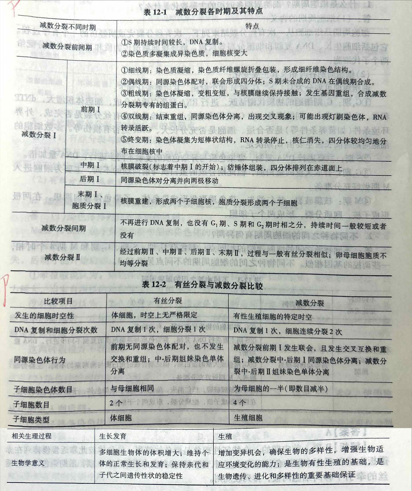

<!-- anki-id: cell-biology-jsonl-000013 -->
### Front
【题目 4）从细胞增殖角度看细胞可分为哪几类？

### Back
【答案】可将细胞群体分为三类：周期中细胞、G0期细胞，也称静止期细胞、终末分化细胞。

### OriginalMaterial

---

<!-- anki-id: cell-biology-jsonl-000014 -->
### Front
【题目 13】纺锤体组装过程的总体描述及关键蛋白（KRP和细胞质动力蛋白）的功能是什么？

### Back
总体描述：纺锤体组装是一个十分复杂的过程，主要涉及一、微管在中心体周围组装和已经完成复制的中心体分离。二、中心体的复制和周围微管的组装需要多种因素的参与。

中心体的分离需要<u>驱动蛋白相关蛋白（KRP）</u>和<u>细胞质动力蛋白</u>的作用。其中：
- KRP主要为一些<b>微管正极运动</b>的蛋白质。
- 细胞质动力蛋白主要是向<b>微管负极运动</b>的蛋白质。

### OriginalMaterial

---

<!-- anki-id: cell-biology-jsonl-000015 -->
### Front
纺锤体组装过程中的三个具体机制（牵拉、拉长、拉近）是如何进行的？

### Back
(1) <b>负向运动马达蛋白牵拉纺锤体</b>：中心体分离时，负向运动的马达蛋白在来自姐妹中心体的纺锤体微管之间搭桥，通过负向运动，将纺锤体微管牵拉在一起，形成早期纺锤体。中心体也自然形成了纺锤体的两极。

(2) <b>正向运动马达蛋白拉长纺锤体</b>：正向运动的马达蛋白在纺锤体微管之间搭桥，借助向微管正极运动，将纺锤体拉长，中心体之间的距离逐渐加大。

(3) <b>负向运动马达蛋白拉近细胞膜</b>：当纺锤体拉长到一定程度后，负极运动的马达蛋白在细胞膜和星体微管之间搭桥，借助负向运动，将星体微管向两极细胞膜拉近，纺锤体也进一步被拉长。

### OriginalMaterial

---

<!-- anki-id: cell-biology-jsonl-000016 -->
### Front
[题目 24] 有丝分裂和减数分裂的区别。

### Back
(1) 有丝分裂与减数分裂的相同点
都是真核生物细胞分裂的方式，都会出现纺锤体与染色体，减数分裂是一种特殊的有丝分裂，DNA 都复制一次，都会将遗传物质均等的分配给子细胞。

(2) 不同点
① **细胞类型**: 有丝分裂发生在体细胞增殖的过程中；减数分裂发生于生殖细胞产生配子的过程中，
② **复制/分裂/细胞数**: 有丝分裂时，DNA 复制1次，细胞分裂1次，两个子细胞与亲代染色体数目相同，DNA数目减半：减数分裂时，DNA 复制1次，细胞连续分裂两次，结果形成4个子细胞，染色体数、DNA 数都减半。
③ **间期**: 有丝分裂只有一个间期，间期 DNA完全复制；减数分裂有两个间期，第一个时间较长，完成大多数 DNA 的复制，并延续到前期；第二个间期时间较短甚至没有，不进行 DNA 复制。
④ **联会/同源重组**: 有丝分裂中无联会现象，无遗传物质的交换；减数分裂前期发生联会，同源染色体的非姐妹染色单体间可交叉互换，进行同源重组。
⑤ **同源染色体分离**: 有丝分裂无同源染色体分离；减数分裂同源染色体要分离。
⑥ **姐妹染色单体分离**: 有丝分裂后期染色体的姐妹染色单体分离；减数分裂后期Ⅰ同源染色体分离，姐妹染色单体不分离；后期Ⅱ姐妹染色单体分离。
⑦ **划分时期**: 有丝分裂分为间期和有丝分裂期；减数分裂前间期、减数分裂期Ⅰ、减数分裂间期、减数分裂期Ⅱ
⑧ **分裂是否等**: 有丝分裂为均等分裂：减数分裂存在不均等分裂。

### OriginalMaterial

---

<!-- anki-id: cell-biology-jsonl-000017 -->
### Front
【题目 22】论述细胞骨架成分在细胞分裂期事件中发挥了哪些重要作用。

### Back
**一、微管参与前期纺锤体的装配，中期染色体的整齐列，后期染色体的分离。**
(1) **前期**：**<u>复制并分离后的两个子中心体作为微管组织中心开始射状微管装配，中心体及其周围微管形成两个星体。随着核膜解体，星体微管进入核内，正极端捕获染色体并分别与染色体两侧的动粒结合，形成动粒微管，至此，由微管及其结合蛋白组成的纺锤体基本完成组装；</u>**
(2) **中期**：根据“牵拉假说”，动粒微管将染色体拉向赤道面并使之为稳定，使染色体排列在赤道面上；
(3) **后期**：当染色体在赤道上成整列后，在各种调节因素的共同作用下，细胞有丝分裂由中期向后期转换，如姐妹染色单体分离，并逐渐向两极移动。大致可以分为连续的两个阶段，即后期 A 和后期 B。
① **在后期 A**，**<u>动粒微管变短将染色体逐渐拉向两极，动粒微管变短是由于动粒端解聚造成的，这种解聚又是由动力蛋白沿动粒微管向极部运动的结果。</u>** 微管马达蛋白首先结合在动粒上，在 ATP 协助下，沿动粒微管向极部运动，并带动动粒和染色体向极部运动。动粒微管的末端随之解聚成微管蛋白二聚体，动粒微管变短，动粒和染色单体与两极之间的距离逐渐拉近。当染色单体接近两极，后期 A 结束，转向后期 B；
② **在后期 B**，**<u>极微管游离端在 ATP 提供能量的情况下与微管蛋白聚合，使极微管加长，形成较宽的极微管重叠区。KRP 与极微管重叠区的微管结合，并在来自两级的极微管之间搭桥。KRP 向微管正极行走，促使来自两极的极微管在重叠区相互滑动，使重叠区逐渐变窄，两极之间的距离逐渐拉长。同时，保持动力蛋白在星体微管和细胞膜之间搭桥，并向星体微管负极端运动，进一步将两极之间的距离拉长。</u>**

**二、微丝参与胞质分裂**
**<u>末末期胞质分裂时，大量平行排列但极性相反的微丝在质膜内侧形成一个具有收缩作用的收缩环</u>**，收缩环收缩，分裂沟加深，两个子细胞被缩分开。中央纺锤体和星体微管共同决定了分裂沟形成的位置，星体微管参与了分裂沟的形成。

**三、核纤层蛋白与核膜解体与重建**
**<u>核纤层结构由 V 型中间丝组成，在细胞分裂过程中，核纤层结构发生解聚和重组。</u>**
(1) **前期**，核纤层解聚，核膜崩解，核纤层蛋白 A 以可溶性单体形式弥散在细胞中，而核纤层蛋白 B 则与核膜解体后形成的核膜小泡保持结合状态；
(2) **末期**，结合有核纤层蛋白 B 的核膜小泡在染色体周围聚集，并逐渐融合形成新的核膜。而核纤层蛋白则在核膜内侧组装成子细胞的核纤层。

### OriginalMaterial

---

<!-- anki-id: cell-biology-jsonl-000018 -->
### Front
【题目 26】简述减数I前期分为哪几个阶段及重要事件？ （试述发生在减数分裂前期Ⅰ的细胞学事件）

### Back
【答案】根据细胞染色体形态变化，可将减数分裂期Ⅰ前期，人为地划分为**细线期**、**偶线期**、**粗线期**、**双线期**和**终变期**5个阶段。

一、细线期
(1) **首先发生染色质凝集染色质纤维，逐渐螺旋化折叠包装**，在显微镜下可以看到的纤细样染色体结构，因此，有人将细线期也称为凝聚期。
(2) 在细线期染色质在凝集前已复制，**但仍呈单条细线状，看不到成对的染色体**。
(3) 在纤细样纤维上出现一系列大小不同的颗粒状结构，称为**染色粒**。
(4) **染色体端粒通过接触斑与核膜相连，使染色体装配成花束状**，所以细线期又称花束期。

二、偶线期
(1) 同源染色体配对，因而偶线期又称**配对期**。配对以后**两条同源染色体紧密结合在一起称为二价体又称四分体**。在联会的部位形成一种特殊的复合结构，称为**联会复合体**。
(2) 在偶线期合成 S 期末合成的约 0.3% 的 **DNA** (zygDNA) 。

三、粗线期
(1) **染色体进一步凝缩变粗变短与核膜继续保持接触**，**同源染色体紧密结合并发生等位基因的交换和重组**，产生新的等位基因组合。
(2) 此时在联会复合体部位的中间出现一个**新的结构即重组节**。
(3) 合成一小部分尚未合成的 DNA，称为 **P-DNA** 
(4) **合成减数分裂期专有的组蛋白**，并将体细胞类型的组蛋白部分或全部的置换下来。

四、双线期
(1) 重组阶段结束，同源染色体相互分离，仅保留几处联系。同源染色体的四分体结构变得清晰可见，同源性仍然相联系的部位称为**交叉**。
(2) **同源染色体或多或少的发生去凝集**，**RNA** 转录活跃。

五、终变期
(1) **染色体重新开始凝集形成短棒状结构**，如果有灯刷染色体存在，其侧环回缩，RNA 转录停止，核仁消失，**四分体较均匀的分布在细胞核中**；
(2) 同时，**交叉向染色体臂的端部移行**，到终变期末，同源染色体之间仅在其端部和着丝粒处相互连接

### OriginalMaterial

---

<!-- anki-id: cell-biology-jsonl-000101 -->
### Front
[题目 6] 阐述细胞周期中几个检验点及其作用。

### Back
【答案】
(1) G1-S 期检验点
**这是 G1 期后期的一个重要事件，主要检查细胞大小、营养物质含量和种类、必备的细胞生长因子表达情况、DNA 损伤的修复情况，如果都达到进入 S 期的要求细胞将继续进行下一步——DNA 的复制活动。**否则，细胞进入休眠期（G0），细胞运转暂停。因此，这个时期的检验点主要检查细胞 G1 期的工作状况，是不是按期完成所有的工作。

(2) G2-M 期检验点
**这是 G2 与 M 期交界处的事件，主要检查细胞大小，DNA 的复制完成没有，如果都达到进入 M 期要求，细胞将开始分裂（增殖）。**否则，细胞进入 G0 期，停止分裂。因此，这个时期的检验点主要检查细胞 S 期和 G1 期工作状况，细胞大小是否适合以及 DNA 含量是否加倍。

(3) M 期中期－后期的检验点
**检查纺锤体组装情况，主要检查染色体是否都附着到纺锤体上**，只有染色体全部都附着到纺锤体上才能将遗传物质平均分配给两个子细胞。

(4) 这反映了细胞周期调控的严格性与精确性，任何一个地方出问题就将导致细胞周期运转失调。

### OriginalMaterial

---

<!-- anki-id: cell-biology-jsonl-000102 -->
### Front
【题目 2】从细胞周期各时期细胞内的生化活动特征分析它们的差异和联系。

### Back
【答案】一、细胞周期是细胞物质准备与细胞分裂的循环过程
<u>细胞从第一次分裂结束开始，经过物质准备过程，直到下一次细胞分裂结束为止，为一个细胞周期。</u>这是一个高度受控、周而复始的过程。它包括细胞生长、DNA复制和细胞分裂，最终将细胞遗传物质和其他内含物分配给两个子细胞等阶段。细胞周期可以划分为分裂间期和分裂期，分裂间期又划分为G1、S、G2三个时期。

二、细胞周期各时相及其主要变化
① G1期。是从分裂期结束到DNA合成开始前的细胞生长发育时期，这一阶段细胞主要活动是为DNA的复制和蛋白质的合成做准备，还有细胞体积的增大以及dNTP积累。合成细胞生长所需要的各种蛋白质、糖类、脂质等，但不合成细胞核DNA，为DNA复制的起始做好了各方面的准备。<b>(G1期的初期-G0期：mRNA、tRNA、rRNA、cAMP、cGMP合成，氨基酸及糖的转运都在迅速进行，并合成糖类、蛋白质和脂质；G1期的后期：合成与DNA合成有关的酶，如DNA聚合酶等)</b>不同类型细胞的周期时间的差别主要在于G1期的差别。
② S期是DNA合成期。进入S期后，细胞立即开始合成DNA和组蛋白，DNA复制以半保留复制的方式进行。真核细胞新合成的DNA立即与组蛋白结合，构成核小体念珠结构。通过DNA复制，亲代细胞将遗传物质精确地传递给子细胞，保持遗传性状的稳定性，所以S期是细胞周期的关键时刻。与此同时，还进行中心粒复制。
③ G2期。加速合成RNA和蛋白质，其中最主要的是合成有丝分裂因子和微管蛋白等有丝分裂器的组分。另外磷脂的合成增加，并进行ATP的积累，为进入M期做好物质和能量的准备。
④ M期。细胞分裂期。细胞进一步将染色质组装成染色体，并将其均等分配，进行胞质分裂，形成子细胞。可进一步划分为前、中、后、末期，这是一个连续变化过程。
(1) 前期。染色质凝缩，开始形成染色体。确立细胞分裂极，中心体分裂并向两极移动，逐渐形成纺锤体。核仁解体，核膜消失。
(2) 前中期。核膜崩解，核纤层蛋白被磷酸化降解。完成纺锤体装配，形成有丝分裂器。染色体整列。
(3) 中期。染色体整列完成，移到细胞的赤道板，从纺锤体两极发出的微管附着于每一个染色体的动粒上。
(4) 后期。由于纺锤体微管的活动，着丝粒断裂，每一染色体的两个染色单体分开并向相反方向移动，接近各自的中心体，染色单体遂分为两组。
(5) 末期。染色单体到达两极，逐渐解螺旋，重新出现染色质丝，核仁核膜也重新组装。先形成两个子代细胞核，再完全分为两个子细胞。

三、差异与联系
① 在G1、S、G2和M期：都存在作用于细胞周期转换时序的调控信号通路的检验点。G1期为S期做准备，细胞只有在内在和外在因素的共同作用下，通过了G1期的检验点，才能顺利进入S期并合成DNA；S期后期也存在S期检验点，细胞只有顺利地完成了DNA的复制才能通过S期检验点，进入G2期。细胞能否顺利地进入M期，要受到G2期检验点的控制。G2期检验点要检查DNA是否完成复制，细胞是否已生长到合适大小，环境因素是否利于细胞分裂等。只有当所有利于细胞分裂的因素得到满足以后，细胞才能顺利实现从G2期向M期的转化。
② 间期主要是细胞积累物质的生长过程，只有缓慢的体积增加，形态看不到明显的变化；分裂期细胞变化较明显。
③ 分裂期主要是将经过复制的亲代染色体精确地平均分配到两个子细胞中。

### OriginalMaterial

---

<!-- anki-id: cell-biology-jsonl-000103 -->
### Front
【题目 11】不同物种之间的细胞周期有何异同？

### Back
**【答案】**
一、相同点：都含有 G1期、S 期、G2期和 M 期四个时期，而且细胞周期的基本调控因子和监控机制与一般体细胞标准的细胞周期基本是一致的。

二、不同点：
① <u><mark>早期胚胎细胞的细胞周期</mark></u>：当受精以后受精卵便开始迅速卵裂、卵裂球数量增加，但其总体积并不增加，因而卵裂球体积越分越小。每次卵裂所持续的时间比体细胞周期时间大大缩短，主要是由于 G2期 和 G1期 非常短。

② <u><mark>酵母细胞的细胞周期</mark></u>：酵母细胞周期持续时间较短，大约为 90min。<u>细胞分裂过程属于封闭式</u>，即在细胞分裂时细胞核核膜不解聚。与细胞核分裂直接相关的纺锤体不是在细胞质中，而是位于<u>细胞核内</u>。酵母的纺锤体组装与 S 期DNA 复制同时进行，而不是在 DNA 复制之后。芽殖酵母分裂为<u>不等分裂</u>，<u>裂殖酵母分裂为均等分裂</u>。

③ <u><mark>植物细胞的细胞周期</mark></u>：高等植物细胞<u>不含中心体（微管组织中心）</u>，但在细胞分裂时可以正常组装纺锤体。植物细胞分裂是在成膜体指导下以形成<u>细胞板（中间板）</u>的形式完成胞质分裂的。

④ <u><mark>细菌的分裂周期</mark></u>：细菌的生长分为快生长和慢生长，<u>慢生长时期与正常的细胞周期相似</u>。但细菌在快生长的情况下，<u>细胞周期过程发生较大的变化</u>。一个 DNA 的复制还没结束，就开始了第二个 DNA 分子的复制，解决了快速分裂与最基础 DNA 复制速度之间的矛盾。

### OriginalMaterial

---

<!-- anki-id: cell-biology-jsonl-000139 -->
### Front
【题目 9】如何用最简单的方法分离静止培养中细胞群体中的 M 期细胞？其原理是什么？

### Back
**【答案】**
每间隔一段时间，轻摇培养瓶，悬浮在培养液中的细胞主要是 M 期细胞。M 期细胞呈球形，与培养基质接触面积小，易脱落。

<u>补充：</u>处于有丝分裂期的细胞形状变圆，单层贴壁生长的细胞的附着性降低，摇动或拍打培养瓶很容易使这些细胞脱落。用这种方法获得的细胞，60~90%处于 M 期。此法的缺点是收获细胞的数量较少，一般只达到细胞总数的 2%左右，在应用中需要与化学诱导法相结合。

### OriginalMaterial

---

<!-- anki-id: cell-biology-jsonl-000140 -->
### Front
【题目 10】DNA 合成阻断法和分裂中期阻断法的原理及过程。

### Back
**【答案】**

**一、DNA 合成阻断法**
(1) **原理：**DNA 合成阻断法是一种采用低毒或无毒的 DNA 合成抑制剂特异的<u>抑制 DNA 合成</u>，而不影响处于其他时期的细胞进行细胞周期运转，从而将被抑制的细胞抑制在 DNA 合成期的实验方法，目前采用最多的 DNA 合成抑制剂为<u>胸腺嘧啶脱氧核苷（TdR）或羟基胺</u>。
(2) **过程：**将过量的 TdR 加入细胞培养液，仅处于 S 期的细胞立刻被抑制，而其他各期的细胞则照常运转，培养一定时间（G2+M+G1）后，所有这些细胞则被抑制在 G1 期和 S 期的交界处，将 TdR 洗脱，更换新鲜培养液后，阻断于 S 期的细胞开始复制 DNA 并沿着细胞周期运转，再向培养液中第二次加入 TdR 经过一定时间的培养，所有的细胞则会被抑制在 G1/S 期交界处，将 TdR 洗脱，更换新鲜培养液，继续培养一定时间即可获得 S 期和 G2 期不同时间点的同步化细胞。

**二、分裂中期阻断法**
(1) **原理：**<u>某些药物如秋水仙碱、秋水仙酰胺和谱考达唑等</u>，可以抑制微管聚合，因而能有效地抑制细胞纺锤体的形成，将细胞阻断在细胞分裂中期。
(2) **过程：**处于间期的细胞受药物的影响相对较弱，常可以继续运转到 M 期，因而在药物持续存在的情况下，处于 M 期的细胞数量会逐渐增加，通过轻微震荡，将变圆的 M 期细胞摇脱，经过离心可以得到大量的分裂中期细胞，将分裂中期细胞悬浮于新鲜培养液中继续培养，它们可以继续分裂并沿着细胞周期同步运转，从而获得 G1 期不同阶段的细胞。

### OriginalMaterial

---

<!-- anki-id: cell-biology-jsonl-000141 -->
### Front
请根据表 12-1 描述减数分裂各时期及其特点。

### Back
**表 12-1 减数分裂各时期及其特点**

| 减数分裂不同时期 | 特点 |
| :--- | :--- |
| **减数分裂前间期** | ①S 期持续时间较长，DNA 复制。
②染色质多凝集成异染色质，细胞核变大 |
| **减数分裂 I** | **前期 I**
① **细线期**：染色质凝缩，染色质纤维螺旋折叠包装，形成细纤维染色结构。
② **偶线期**：同源染色体配对，联会形成四分体；S 期未合成的 DNA 在偶线期合成。
③ **粗线期**：染色体凝缩，变粗变短，与核膜继续保持接触；发生基因重组，合成减数分裂期专有的组蛋白。
④ **双线期**：结束重组，同源染色体分离，出现交叉现象；可能出现灯刷染色体，RNA 转录活跃。
⑤ **终变期**：染色体凝集为短棒状结构，RNA 转录停止，核仁消失，四分体较均匀地分布在细胞核中 |
| | **中期 I**
核膜破裂 (标志着中期 I 的开始)；纺锤体组装，四分体排列在赤道面上 |
| | **后期 I**
同源染色体对分离并向两极移动 |
| | **末期 I、胞质分裂 I**
核膜重建，形成两个子细胞核，胞质分裂形成两个子细胞 |
| **减数分裂间期** | 不再进行 DNA 复制，也没有 G1 期、S 期和 G2 期时相之分，持续时间一般较短或者没有 |
| **减数分裂 II** | 经过前期 II、中期 II、后期 II、末期 II，过程与一般有丝分裂相似；卵母细胞胞质不均等分裂 |

### OriginalMaterial

---

<!-- anki-id: cell-biology-jsonl-000142 -->
### Front
请根据表 12-2 比较有丝分裂与减数分裂在细胞时空性、分裂次数、染色体行为、子细胞特征及生物学意义等方面的区别。

### Back
**表 12-2 有丝分裂与减数分裂比较**

| 比较项目 | 有丝分裂 | 减数分裂 |
| :--- | :--- | :--- |
| **发生的细胞时空性** | 体细胞，时空上无严格限定 | 有性生殖细胞的特定时空 |
| **DNA 复制和细胞分裂次数** | DNA 复制 1 次，细胞分裂 1 次 | DNA 复制 1 次，细胞连续分裂 2 次 |
| **同源染色体行为** | 前期无同源染色体配对，也不发生交换和重组；中-后期姐妹染色单体分离 | 减数分裂前期 I 发生联会，且发生交叉互换和重组；减数分裂中-后期 I 同源染色体分离；减数分裂中-后期 II 姐妹染色单体分离 |
| **子细胞染色体数目** | 与母细胞相同 | 为母细胞的一半（即数目减半） |
| **子细胞数目** | 2 个 | 4 个 |
| **子细胞类型** | 体细胞 | 生殖细胞 |
| **相关生理过程** | 生长发育 | 生殖 |
| **生物学意义** | 多细胞生物体的体积增大；维持个体的正常生长和发育；保持亲代和子代之间遗传性状的稳定性 | 增加变异机会，确保生物的多样性，增强生物适应环境变化的能力；是生物有性生殖的基础，是生物遗传、进化和多样性的重要基础保证 |

### OriginalMaterial

---
