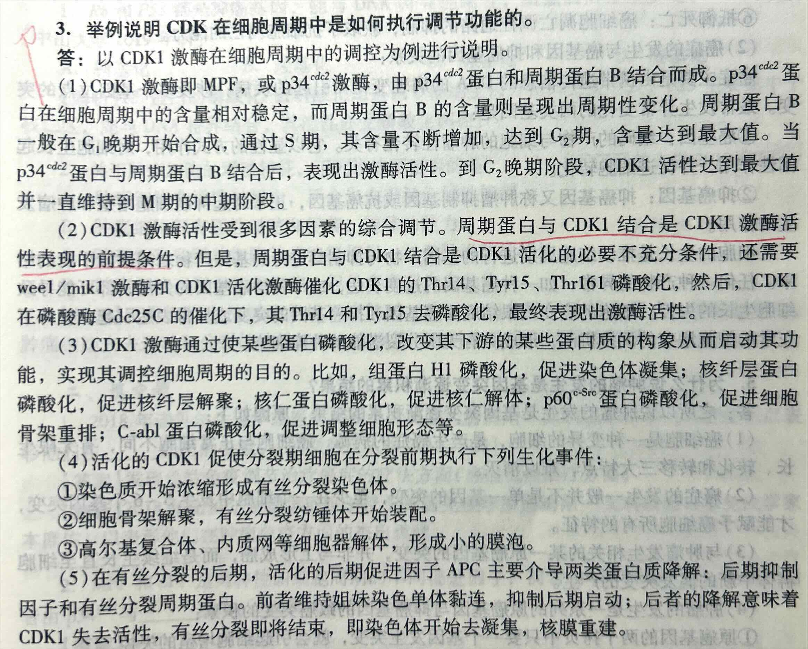

<!-- anki-id: cell-biology-jsonl-000019 -->
### Front
[题目 11] 请给出 Cdk 失活的三种可能的机制。

### Back
(1) 当其与对应的周期蛋白/Cyclin 解离时，其就失去 CDK 活性。因为其不能单独起作用。
(2) **CDK 的活性位点中有一抑制型的磷酸化位点，其被磷酸化会失活。**这一调控机制对有丝分裂期 M-CDK 活性的调控特别重要。
(3) CDK 抑制蛋白/CKI 与周期蛋白 – CDK 复合物结合，可抑制 CDK 活性。细胞使用 CKI 主要是协助细胞周期前期 G1/S 和 S-CDK 的活性。

### OriginalMaterial

---

<!-- anki-id: cell-biology-jsonl-000020 -->
### Front
简述 p34Cdc2 蛋白激酶的发现过程？

### Back
(1) 1970年，Johnson 和 Rao 发现将 M 期细胞与其他间期细胞融合，可诱导间期细胞染色体提前凝集成染色体，提示在 M 期细胞内可能存在一种**诱导染色体凝聚的因子**，即细胞有丝分裂促进因子。
    (2) 1971年，Masui 和 Marker 用非洲爪蟾卵做实验，明确提出了 **MPF** 这一概念。
    (3) 1988年，Lohka 等人从非洲爪蟾卵中分离出了微克级纯化的 MPF，证明其含 **p32** 和 **p45** 两种蛋白质，表现出蛋白激酶活性。
    (4) Hartwel 等获得了数十个芽殖酵母温度敏感型突变株，发现在限定温度下失去正常分裂繁殖能力的现象是由于基因发生突变而起的。<u>（温度引起基因突变）</u>
    (5) Paul Nurse 以裂殖酵母为材料发现，<u>cdc2 基因突变 G2/M期的交界处</u>。cdc2 基因的表达产物分子量为 34KDa，与其他蛋白质结合后具有激酶活性，能被 MPF 的 p32 抗体识别，能增强 MPF 活性，表明其为 p32 的同源物。
    (6) 1983年，Tim Hunt 首次发现海胆卵受精后，在其卵裂过程中两种蛋白质的含量随细胞周期剧烈变化，分别命名为 **cyclin A** 和 **cyclinB**。后来证明酵母的 p56 为 cyclin B 的同源物。

    **至此，MPF 蛋白的生化成分被确定了下来，它含有两个亚单位，Cdc2 蛋白为其催化亚单位，周期蛋白为其调节亚单位。但二者结合后，表现出蛋白激酶活性。**

### OriginalMaterial

---

<!-- anki-id: cell-biology-jsonl-000021 -->
### Front
(1) CDK1 激酶活性受到哪些因素的综合调节？(2) CDK1 对 G2/M 期转化的调节机制是什么？

### Back
(1) **① CDK1 活性首先依赖于 cyclinB 含量的积累**。周期蛋白 B 一般在 G1 晚期开始合成，通过 S 期，其含量不断增加，达到 G2 期，含量达到最大值。随着 cyclinB 含量积累到一定程度，CDK1 活性开始出现。到 G2 晚阶段，CDK1 活性达到最大值并一直维持到 M 期的中期阶段。

**② 当周期蛋白 B 与 CDK1 结合成复合物**，weel/mik1 激酶和 CDK1 活化激酶催化 CDK1 的 Thr14、Tyr15、Thr161 磷酸化。但此时的 CDK 仍不表现激酶活性（称为前体 MPF）。

**③ 然后**，CDK1 在蛋白磷酸水解酶 cdc25C 的催化下，Thr14 和 Tyr15 去磷酸化，最终表现出激酶活性。

(2) **CDK1 通过使某些底物蛋白磷酸化**，改变其下游的某些靶蛋白的结构和启动其功能，实现其调控细胞周期的作用，调控细胞从 G2→M 期转变。**CDK1 催化底物磷酸化有一定的位点特异性**，即选择底物中**某个特定序列中的某个丝氨酸或苏氨酸残基**。CDK1 可以使多种底物蛋白磷酸化，例如组蛋白 H1、核纤层蛋白、核仁蛋白等：
① 组蛋白 H1 磷酸化，促进染色质凝缩，形成有丝分裂染色体；
② 核纤层蛋白磷酸化，促使核纤层解聚：
③ 核仁蛋白磷酸化，促使核仁解体；
④ p60 蛋白磷酸化，促使细胞骨架重排，有丝分裂纺锤体开始装配；
⑤ c-Ab1 蛋白磷酸化，促使细胞形态调整等。

### OriginalMaterial

---

<!-- anki-id: cell-biology-jsonl-000022 -->
### Front
【题目26】一、癌细胞的主要特征及二、癌细胞抵御死亡的原因

### Back
**一、癌细胞的主要特征**

(1) **细胞生长与分裂失去控制**：癌细胞失去控制，成为“不死”的永生细胞，核质比例增大，分裂速度加快，结果破坏了正常组织的结构与功能；

(2) **具有浸润性和扩散性**：良性肿瘤与恶性肿瘤细胞的最主要区别是：恶性肿瘤细胞（癌细胞）的细胞间黏着性下降，具有浸润和扩散性。由转移并在身体其他部位增殖产生的次级肿瘤称为转移灶，癌细胞在分化程度上低于正常细胞和良性肿瘤细胞，失去了原组织细胞的某些结构和功能；

(3) **细胞间相互作用改变**：癌细胞冲破了细胞识别作用的束缚，异常表达某些膜蛋白，以便与别处细胞黏着和继续增殖，借此逃避免疫系统的监视，防止天然杀伤细胞等的识别和攻击；

(4) **表达谱改变或蛋白质活性改变**：癌细胞的蛋白质表达谱系中，往往出现一些在胚胎细胞中所表达的蛋白质。如在肝癌细胞中表达胚胎细胞中的多种蛋白质，多数癌细胞中具有较高的端粒酶活性，此外癌细胞还异常表达与其恶性增殖、扩散等过程相关的蛋白质组分，如纤粘连蛋白减少，某些蛋白如蛋白激酶Src、转录因子Myc等过量表达；

(5) **体外培养的恶性转化细胞的特征：**
① 具有无限增殖的潜能，贴壁性下降，有些可进行悬浮式培养；
② 失去运动和分裂的接触抑制，在软琼脂培养基中可形成细胞克隆；
③ 当将恶性转化细胞注入易感染动物体内时，往往会形成肿瘤。

(6) **抵抗死亡**：成为“不死”的永生细胞的内在原因包括细胞自身对死亡的抵御，抵御死亡是癌细胞的另一个基本特征。

**二、癌细胞抵御死亡的原因：**

① **获取了抗细胞凋亡的能力**，既可能是其促凋亡基因突变而失活，也可能是抑制细胞凋亡基因突变而活性加强，最终表现为细胞凋亡调控通路的抑制。
② **逃脱了生物机体对它的监控**，这可能是由于自身基因突变而不能对细胞外来信号产生应答，也可能是外界信号的变化导致不能被有效监控所造成。
③ **促使细胞增殖的细胞外信号过强**，导致细胞增殖超越及时分化或细胞死亡。癌细胞正是这样的一类细胞，由于其逃离了凋亡调控途径或生物机体监控途径，对外界促增殖信号的应答尤显敏感，增殖愈加迅速。

### OriginalMaterial

---

<!-- anki-id: cell-biology-jsonl-000023 -->
### Front
【题目 36】什么是肿瘤干细胞?

### Back
【答案】<u>肿瘤干细胞是一群存在于某些肿瘤组织中的干细胞样细胞，具有自我更新、无限增殖、转移和抗化学毒物损伤的能力</u>。与一般的肿瘤细胞相比，肿瘤干细胞具有以下特性：
1. 生长不受控制，可以自我更新并多向分化
2. 具有迁移至某些特定组织和排除有毒化学因子能力
3. 在肿瘤组织内数量较少的一群细胞
4. 具有高致癌性和强耐药性

### OriginalMaterial

---

<!-- anki-id: cell-biology-jsonl-000024 -->
### Front
【题目 33】 p53蛋白如何获知并参与 DNA 损伤修复？细胞和分子层次上抑制癌症的原理？

### Back
**一、p53 是一种抑癌基因**

(1) **发现背景**：p53 基因是第一个发现的抑癌基因，开始时被认为是一种癌基因，因为能加快细胞分裂的周期。之后研究发现只有在 p53 的失活或突变时才会导致细胞癌变，才认识到它是一个抑癌基因。

(2) **突变激活转录**：该基因编码分子量为 53kDa 的蛋白质，命名为 p53。**<u>p53蛋白具有特异的转录激活作用。由这种基因编码的蛋白质是一种转录因子，其控制细胞周期的启动。</u>** **<u>抑癌基因实际上是正常细胞增殖过程中的负调控因子，它编码的蛋白质往往在细胞周期检验点上起阻止周期进程作用。</u>** **<u>p53蛋白是一种转录因子，</u>** DNA 的损伤导致 p53 的水平上升，激活 DNA 修复系统，启动修复酶转录，同时启动很多下游基因的转录。**<u>在所有恶性肿瘤中，50%以上会出现该基因的突变。</u>**

(3) **监视细胞分裂**：像所有其它肿瘤抑制因子一样，p53 基因对细胞分裂起着减慢或监视的作用。许多细胞健康有关的信号向 p53 发送，由 p53决定是否开始细胞分裂。如果细胞受损，又不能修复，则 p53 蛋白将启动细胞凋亡。p53 缺陷的细胞没有这种控制，甚至在不利条件下继续分裂。

(4) **监视基因变异**：**<u>如果变异较小，这种基因就促使细胞自我修复；若 DNA 变异较大，p53”就诱导细胞凋亡。</u>**

**二、细胞层次抑制癌症**

(1) **<u>偶见细胞周期与 DNA 损伤，只要有细胞 DNA 损伤，细胞就不会分裂；</u>**

(2) 如果 DNA 损伤修复，那么细胞周期可以正常运转；**<u>如果 DNA 损伤未被修复，则启动细胞凋亡程序，解除这类细胞可能对机体造成的危险。</u>**

(3) **<u>与细胞黏着有关的蛋白质可以防止肿瘤细胞的扩散，防止接触抑制的丧失并抑制转移，这类细胞起到转移抑制者的作用。</u>**

**三、分子水平抑制癌症/获悉并参与损伤修复**

(1) **<u>实验证明：在健康的 G1期细胞中，p53蛋白的浓度很低；如果 G1期细胞受到遗传损伤（如受到紫外线照射或化学致癌物的作用），p53蛋白的浓度会快速上升。</u>**将含有断裂链的 DNA 注入细胞，可检测到 p53 蛋白浓度的这种变化。

(2) **<u>浓度变化机制：p53蛋白的浓度变化不是由于基因表达的提高，而是 p53蛋白降解速率的下降。</u>**

① p53 蛋白受 MDM2 蛋白控制，该蛋白质与 p53 蛋白结合，并将 p53 蛋白由细胞核输出到细胞质，经泛素-蛋白酶体途径被降解。

② DNA 损伤使得 p53 蛋白稳定，这与 ATM 基因有关。该基因编码一种 ATM 蛋白激酶，作为复合物组成成分，能够识别 DNA 损伤。**<u>一旦与受损的DNA结合，ATM激酶便通过使靶蛋白磷酸化，传递细胞周期停止的信号给 p53，p53磷酸化之后不再与 MDM2 蛋白结合从而不再被输送到细胞质中被降解。</u>**

③ DNA 损伤后 p53 蛋白的浓度升高，激活 p21 基因和 bax 基因的表达，使细胞停止分裂进行修复或使细胞进入程序性死亡。如果 p53 基因突变，等于失去了分子警察，DNA 损伤引起的突变导致的细胞癌变，也就肆无忌惮了。

④ **<u>p21是一种 CKI，可与多种 Cyclin-CDK 复合物结合，抑制它们的活性，使细胞周期阻滞，等待 DNA 完成修复。</u>**其中 cyclinD-CDK4 和 cyclinD-CDK6 是细胞 G1/S 期转化所必需，它的失活使其底物 Rb 无法被磷酸化。非磷酸化的 Rb 蛋白与转录因子 E2F 紧密结合，使 E2F 不能发挥作用，而 E2F 负责转录细胞进入 S 期一系列关键基因，于是细胞停留在 G1 检验点，无法进入 S 期。**<u>p21还可以与 PCNA 直接结合，其为 DNA 聚合酶 5 的辅助因子，为 DNA 复制所必需。p21与其结合，可以直接抑制 DNA 复制。p21也可抑制 MPF 活性，使细胞不能完成 G2/M 期的转变，也达到细胞周期阻滞。</u>**

⑤ 另一方面，p53 也启动与 DNA 损伤修复有关基因的表达，修复损伤 DNA，如严重而难以修复，则 p53 启动促凋亡的基因表达，细胞进入凋亡程序。p53 突变，使 DNA 在细胞得以复制，造成 DNA 缺口和断裂，最终导致基因组不稳定，产生异质体，发生癌变。

### OriginalMaterial

---

<!-- anki-id: cell-biology-jsonl-000025 -->
### Front
【题目 29】 什么是原癌基因？为什么突变后会导致细胞癌变？有哪些激活机制？

### Back
【答案】 （1）原癌基因的定义

<u>又称细胞癌基因</u>，是指<u>在正常细胞基因组中对细胞正常生命活动起主要调控作用的基因</u>，<u>在发生突变或被异常激活后变成具有致癌能力</u>的癌基因。**癌基因可以分成两大类**：一类是病毒癌基因，指反转录病毒的基因组里带有可使受病毒感染的宿主细胞发生癌变的基因；另一类癌基因是细胞癌基因，又称原癌基因。**<u>原癌基因是细胞内与细胞增殖相关的基因</u>**，是维持机体正常生命活动所必需的，在进化上高等保守。当原癌基因的结构或调控区发生变异，基因产物增多或活性增强时，使细胞过度增殖，从而形成肿瘤。

【答案】 一、抑癌基因

这类基因编码的蛋白质，其功能是正常细胞增殖过程中的负调控因子，在细胞周期的检查点上起<u>**阻止周期进程的作用**</u>、或者是促进细胞凋亡、或者既抑制细胞周期调节又促进细胞凋亡。如果抑癌基因突变，丧失其细胞增殖的负调控作用，则导致细胞周期失控而过度增殖。抑癌基因是基因的功能丢失性突变。抑癌基因原先有对细胞分裂周期或细胞生长设置限制的功能，<u>当抑癌基因的一对等位基因都缺失或都失去活性时</u>，这种限制功能也就随之丢失，于是出现了细胞癌变。

### OriginalMaterial

---

<!-- anki-id: cell-biology-jsonl-000104 -->
### Front
3. 举例说明 CDK 在细胞周期中是如何执行调节功能的。

### Back
答：以 CDK1 激酶在细胞周期中的调控为例进行说明。

(1) CDK1 激酶即 MPF，或 p34$^{cdc2}$ 激酶，由 p34$^{cdc2}$ 蛋白和周期蛋白 B 结合而成。p34$^{cdc2}$ 蛋白在细胞周期中的含量相对稳定，而周期蛋白 B 的含量则呈现出周期性变化。周期蛋白 B 一般在 G$_1$ 晚期开始合成，通过 S 期，其含量不断增加，达到 G$_2$ 期，含量达到最大值。当 p34$^{cdc2}$ 蛋白与周期蛋白 B 结合后，表现出激酶活性。到 G$_2$ 晚期阶段，CDK1 活性达到最大值并一直维持到 M 期的中期阶段。

(2) <u>CDK1 激酶活性受到很多因素的综合调节。周期蛋白与 CDK1 结合是 CDK1 激酶活性表现的前提条件。但是，周期蛋白与 CDK1 结合是 CDK1 活化的必要不充分条件</u>，还需要 wee1/mik1 激酶和 CDK1 活化激酶催化 CDK1 的 Thr14、Tyr15、Thr161 磷酸化，然后，CDK1 在磷酸酶 Cdc25C 的催化下，其 Thr14 和 Tyr15 去磷酸化，最终表现出激酶活性。

(3) CDK1 激酶通过使某些蛋白磷酸化，改变其下游的某些蛋白质的构象从而启动其功能，实现其调控细胞周期的目的。比如，组蛋白 H1 磷酸化，促进染色体凝集；核纤层蛋白磷酸化，促进核纤层解聚；核仁蛋白磷酸化，促进核仁解体；p60$^{c-Src}$ 蛋白磷酸化，促进细胞骨架重排；C-abl 蛋白磷酸化，促进调整细胞形态等。

(4) 活化的 CDK1 促使分裂期细胞在分裂前期执行下列生化事件：
    ①染色质开始浓缩形成有丝分裂染色体。
    ②细胞骨架解聚，有丝分裂纺锤体开始装配。
    ③高尔基复合体、内质网等细胞器解体，形成小的膜泡。

(5) 在有丝分裂的后期，活化的后期促进因子 APC 主要介导两类蛋白质降解：后期抑制因子和有丝分裂周期蛋白。前者维持姐妹染色单体黏连，抑制后期启动；后者的降解意味着 CDK1 失去活性，有丝分裂即将结束，即染色体开始去凝集，核膜重建。

### OriginalMaterial

---

<!-- anki-id: cell-biology-jsonl-000105 -->
### Front
【题目18】叙述细胞周期中主要检验点及其应用（文字描述部分）

### Back
【答案】细胞周期检验点是细胞周期调控的一种机制，主要是确保周期每一时序事件的有序、全部完成并与外界环境因素相联系，主要有 <b>G1期检验点</b>，<b>S期检验点</b>，<b>G2期检验点</b>，<b>纺锤体装配检验点</b>。

(1) <b>G1期检验点</b>
在G1晚期有一特定时限，如果细胞继续走向分裂则可以通过这个时期进入S期，开始合成DNA并继续前进，直到完成细胞分裂。在芽殖酵母中，这个特定时期称为<b>起始点</b>，起始点过后细胞开始出芽，DNA开始复制。在其他真核细胞中成为限制点或检验点。起始点是G1晚期的一个基本事件，细胞只有在内外因素共同作用下才能完成这一基本事件，顺利通过G1期，进入S期并合成DNA。外在因素主要包括营养供给和相关激素刺激，内在因素则主要是一些与细胞分裂周期相关基因调控过程的因素。

(2) <b>S期检验点</b>
S期内发生DNA损伤如DNA双链发生断裂时，S期内部检验点被激活，从而抑制复制起始点的启动，使DNA复制速度减慢，S期延长，同时激活DNA修复和复制叉的恢复等机制。

(3) <b>G2期检查点</b>
细胞能否进入M期受G2期检验点的控制。G2期检验点要检查DNA是否完成复制，细胞是否生长到合适大小，环境因素是否有利于细胞分裂等。只有当所有有利于细胞分裂的因素得到满足之后，细胞才能顺利实现从G2期到M期的转化。

(4) <b>中－后期检验点（纺锤体装配检验点）</b>
参与调控细胞分裂中期向后期的转换，在APC作用下，M期周期蛋白通过泛素化降解途径被蛋白酶所降解，是细胞中期向后期转换的因素之一，APC受到纺锤体验抑点的调控，因而纺锤体组装不完全。

### OriginalMaterial

---

<!-- anki-id: cell-biology-jsonl-000106 -->
### Front
【表格】细胞周期各物质合成及相关影响因子

### Back
| 时相 | 时间差异 | 主要事件：蛋白质合成与修饰 | 主要事件：核DNA合成 | 主要事件：RNA合成 | 主要事件：限制点 | 相关周期蛋白 |
| :---: | :---: | :--- | :--- | :--- | :--- | :--- |
| G1 | 大 | H1蛋白磷酸化 合成非组蛋白 | 否 | 是 | R点 /Checkpoint | 周期蛋白D/E/A Cdk2/4/6 |
| S | 小 | 合成组蛋白、 非组蛋白 | 是 | 否 | S期检验点 | SPF |
| G2 | 小 | 合成微管蛋白、 非组蛋白 | 否 | 是 | G2期检验点 | 周期蛋白B-CDK1 |
| M | 小 | 合成非组蛋白等 | —— | RNA合成完成 被抑制 | 纺锤体装配检验点 | 周期蛋白B/A- CDK1 APC |

### OriginalMaterial

---

<!-- anki-id: cell-biology-jsonl-000127 -->
### Front
蛋白质泛素化修饰在细胞信号转导或细胞周期调控中的调控作用。

### Back
**一、蛋白质的泛素化降解**
蛋白质的泛素化需要多酶复合物发挥的作用，即通过 3 种酶的先后催化来完成，包括**<u>泛素活化酶</u>（E1）**、**<u>泛素结合酶</u>（E2）**（又称泛素载体蛋白）和**<u>泛素连接酶</u>（E3）**。

**二、泛素化过程**
① <u>泛素活化酶</u>（E1）通过形成酰基—腺苷酸中间物使泛素分子 C 端被激活，该反应需要 ATP；
② 转移活化的泛素分子与<u>泛素结合酶</u>（E2）的半胱氨酸残基结合；
③ 异肽键形成，即与<u>E2 结合的泛素</u>羧基和<u>靶蛋白赖氨酸</u>侧链的氨基之间形成异肽键，该反应由<u>泛素连接酶</u>（E3）催化完成。
（1）重复上述步骤，形成具有<u>寡聚泛素链</u>的泛素化靶蛋白。泛素化标签被<u>蛋白酶体</u>帽识别，并利用<u>ATP 水解</u>提供的能量驱动泛素分子的切除和<u>靶蛋白解折叠</u>，去折叠的蛋白质转移至<u>蛋白酶体核心腔</u>内被降解；
（2）泛素—蛋白酶体途径是一种特异性降解蛋白的重要途径，参与机体多种代谢活动，<u>主要降解细胞周期蛋白 Cyclin、纺锤体相关蛋白、细胞表面受体如表皮生长因子受体、转录因子如 NF-kB、肿瘤抑制因子如 P53、癌基因产物等</u>。应激条件下胞内变性蛋白及异常蛋白也是通过该途径降解。该通路依赖 ATP，有两步构成，即<u>靶蛋白的多聚泛素化，多聚泛素化的蛋白质被 26S 蛋白酶水解酶复合物水解</u>。

**三、细胞周期调控中的泛素化**
① **S 期 SCF 泛素化依赖途径**：到达<u>S 期</u>一定阶段后，<u>G1 周期蛋白降解</u>。
G1 周期蛋白 C 端具有 PEST 序列，PEST 序列对 G1 周期蛋白降解起促进作用。G1 周期蛋白是通过 SCF 泛素化依赖途径降解的，SCF 是一种多亚基构成的蛋白质复合物，具有 E3 泛素连接酶功能，SCF 主要含有 Skp1、Cull、Rbx1 三个亚基，可以被 Skp2、Fbw7、β-Trep 三种 F-box 蛋白分别活化，催化底物泛素化。
② **分裂中期/后期转换**
<u>中期过后，周期蛋白与 CDK 分裂。在 APC 的作用下，M 期周期蛋白 A 和 B 通过泛素化依赖途径被蛋白酶体降解</u>。Cdc20 为 APC 有效的正调控因子，cdc20 主要位于<u>染色动粒</u>上，为姐妹染色单体分离所必需的。APC 活性亦受到纺锤体组装检验点的调控。Mad2 与 cdc20 结合，有效地抑制 cdc20 的活性；<u>当纺锤体组装完成后，动粒全部被动粒微管捕获，Mad2 从动粒上消失，从而解除对 cdc20 的抑制作用，促使 APC 活化，导致 M 期周期蛋白降解，M-CDK 活性丧失</u>。

### OriginalMaterial

---
