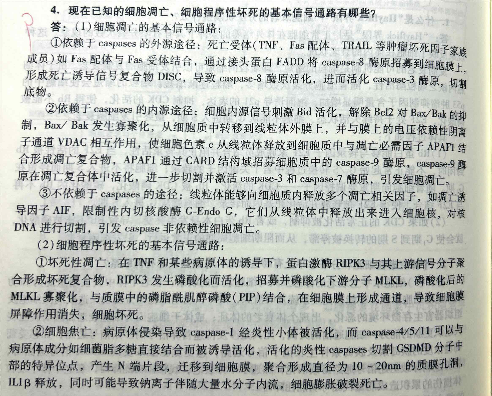
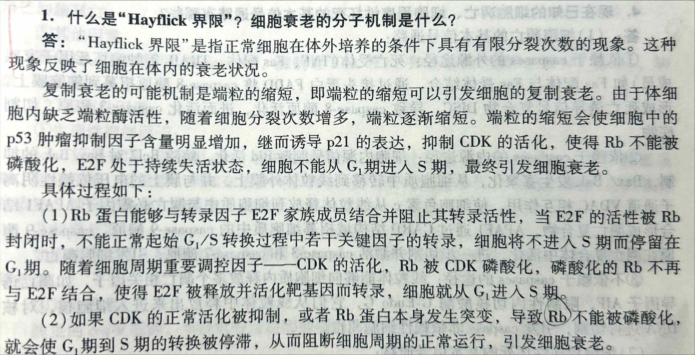

<!-- anki-id: cell-biology-jsonl-000031 -->
### Front
现在已知的细胞凋亡、细胞程序性坏死的基本信号通路有哪些？

### Back
答：
(1) 细胞凋亡的基本信号通路：
①依赖于 caspases 的外源途径：死亡受体(TNF、Fas 配体、TRAIL 等肿瘤坏死因子家族成员)如 Fas 配体与 Fas 受体结合，通过接头蛋白 FADD 将 caspase-8 酶原招募到细胞膜上，形成死亡诱导信号复合物 DISC，导致 caspase-8 酶原活化，进而活化 caspase-3 酶原，切割底物。
②依赖于 caspases 的内源途径：细胞内源信号刺激 Bid 活化，解除 Bcl2 对 Bax/Bak 的抑制，Bax/Bak 发生寡聚化，从细胞质中转移到线粒体外膜上，并与膜上的电压依赖性阴离子通道 VDAC 相互作用，使细胞色素 c 从线粒体释放到细胞质中与凋亡必需因子 APAF1 结合形成凋亡复合物，APAF1 通过 CARD 结构域招募细胞质中的 caspase-9 酶原，caspase-9 酶原在凋亡复合体中活化，进一步切割并激活 caspase-3 和 caspase-7 酶原，引发细胞凋亡。
③不依赖于 caspases 的途径：线粒体能够向细胞质内释放多个凋亡相关因子，如凋亡诱导因子 AIF，限制性内切核酸酶 G-Endo G，它们从线粒体中释放出来进入细胞核，对核 DNA 进行切割，引发 caspase 非依赖性细胞凋亡。

(2) 细胞程序性坏死的基本信号通路：
①坏死性凋亡：在 TNF 和某些病原体的诱导下，蛋白激酶 RIPK3 与其上游信号分子聚合形成坏死复合物，RIPK3 发生磷酸化而活化，招募并磷酸化下游分子 MLKL，磷酸化后的 MLKL 寡聚化，与质膜中的磷脂酰肌醇磷酸(PIP)结合，在细胞膜上形成通道，导致细胞膜屏障作用消失，细胞坏死。
②细胞焦亡：病原体侵染导致 caspase-1 经炎性小体被活化，而 caspase-4/5/11 可以与病原体成分如细菌脂多糖直接结合而被诱导活化，活化的炎性 caspases 切割 GSDMD 分子中部的特异位点，产生 N 端片段，迁移到细胞膜，聚合形成直径为 10 ~ 20nm 的质膜孔洞，IL1β 释放，同时可能导致钠离子伴随大量水分子内流，细胞膨胀破裂死亡。

### OriginalMaterial

---

<!-- anki-id: cell-biology-jsonl-000032 -->
### Front
1. 什么是“Hayflick 界限”？细胞衰老的分子机制是什么？

### Back
“Hayflick 界限”是指正常细胞在体外培养的条件下具有有限分裂次数的现象。这种现象反映了细胞在体内的衰老状况。

复制衰老的可能机制是端粒的缩短，即端粒的缩短可以引发细胞的复制衰老。由于体细胞内缺乏端粒酶活性，随着细胞分裂次数增多，端粒逐渐缩短。端粒的缩短会使细胞中的p53肿瘤抑制因子含量明显增加，继而诱导p21的表达，抑制CDK的活化，使得Rb不能被磷酸化，E2F处于持续失活状态，细胞不能从G_1期进入S期，最终引发细胞衰老。

具体过程如下：
(1) Rb蛋白能够与转录因子E2F家族成员结合并阻止其转录活性，当E2F的活性被Rb封闭时，不能正常起始G_1/S转换过程中若干关键因子的转录，细胞将不进入S期而停留在G_1期。随着细胞周期重要调控因子——CDK的活化，Rb被CDK磷酸化，磷酸化的Rb不再与E2F结合，使得E2F被释放并活化靶基因而转录，细胞就从G_1进入S期。
(2) 如果CDK的正常活化被抑制，或者Rb蛋白本身发生突变，导致®Rb不能被磷酸化，就会使G_1期到S期的转换被停滞，从而阻断细胞周期的正常运行，引发细胞衰老。

### OriginalMaterial

---

<!-- anki-id: cell-biology-jsonl-000034 -->
### Front
**一、caspases 依赖性细胞凋亡途径**

### Back
**① 由死亡受体起始的外源途径**
(1) 细胞外凋亡信号分子（FasL、TNF 等）与细胞表面的受体（死亡受体）结合启动外源凋亡途径，受体的胞质部分均含有<u>**死亡结构域（DD）**</u>，负责招募凋亡信号通路中的接头蛋白。
(2) **Fas** 是死亡受体家族中的代表成员。配体与之结合后引起 Fas 的聚合，聚合的 Fas 通过胞质区的死亡结构域招募接头蛋白 **FADD** 和 **caspase-8前原**，形成<u>**死亡诱导信号复合物（DISC）**</u>。
(3) 起始 **caspase-8** 通过同源活化，进一步异性活化 **caspase-3**，导致细胞凋亡。如：
<u>① 裂解核纤层蛋白，导致细胞核形成凋亡小体；</u>
<u>② 裂解与 CAD（caspase-activated DNase）结合的抑制因 ICAD/DFF-45 蛋白，释放激活 CAD，使它进入胞核降解 DNA，形成 DNA 梯带；</u>
<u>③ 裂解参与细胞连接或附着的骨架和其他蛋白，使凋亡细胞皱缩、脱落，便于细胞吞噬，导致膜脂 PS 重排，便于吞噬细胞识别并吞噬，导致细胞凋亡。</u>

### OriginalMaterial

---

<!-- anki-id: cell-biology-jsonl-000035 -->
### Front
**② 由线粒体起始的内源途径**

### Back
(1) 当细胞受到内部或外部的凋亡信号刺激时，胞内线粒体的外膜通透性发生改变，向细胞质中释放出凋亡相关因子，引发细胞凋亡。
(2) 其中，**Cyt c** 的释放是关键。释放到胞质中的 Cyt c 与 **APAF-1**、**caspase-9前原**形成凋亡复合体，召集并激活 caspase-3，导致细胞凋亡。APAF1 是线虫凋亡分子 Ced4 在哺乳动物细胞中的同源蛋白，N端含有 caspase 募集结构域（CARD）。
(3) 抗凋亡因子 **Bcl-2家族**大多数定位于线粒体外膜上，或受信号刺激后转移到线粒体外膜上，影响细胞色素C的释放。

### OriginalMaterial

---

<!-- anki-id: cell-biology-jsonl-000036 -->
### Front
**③ 外、内源途径的关联**

### Back
(1) 外源途径中的 **caspase-8**、细胞毒性 T 淋巴细胞和自然杀伤细胞分泌的颗粒酶 B，也可以切割并活化 <b>Bcl-2 家族的促凋亡因子 Bid</b>，激活内源凋亡途径；
(2) 凋亡的内源途径被激活后，线粒体上释放的促凋亡因子 Smac 也能够活化 caspase-8。

### OriginalMaterial

---

<!-- anki-id: cell-biology-jsonl-000037 -->
### Front
**二、caspases 非依赖性的细胞凋亡**

### Back
线粒体除了释放 Cyt c 外，还能够向细胞质内释放多个凋亡相关因子，如：凋亡诱导因子（AIF）、限制性内切核酸酶 G 等，诱发 caspase 非依赖的细胞凋亡。

### OriginalMaterial

---

<!-- anki-id: cell-biology-jsonl-000038 -->
### Front
**三、穿孔蛋白-颗粒酶介导的细胞凋亡**

### Back
(1) **分泌场所**：细胞毒性 T 淋巴细胞接收刺激后产生毒性颗粒释放到细胞外，其中主要成分是 <b>穿孔蛋白</b> 和 <b>颗粒酶</b> 两类蛋白。
(2) **作用机制**
① 在靶细胞外，颗粒酶 A、B 切割胞外基质蛋白，使靶细胞与基质及周围细胞脱离；
② 颗粒酶 A、B 在穿孔蛋白的协助下进入靶细胞切割胞内蛋白，进入靶细胞后，颗粒酶通过 caspases 依赖性和非依赖性两种方式促使靶细胞凋亡；
③ 颗粒酶 A 通过切割核纤层蛋白和组蛋白破坏细胞核与染色体结构的稳定性，更有利于 DNA 酶的作用，颗粒酶 A 主要通过 caspases 非依赖性细胞凋亡途径促使靶细胞凋亡。颗粒酶 B 主要通过由线粒体起始的内源途径来诱导细胞凋亡，它通过切割并活化促凋亡因子 Bid，改变线粒体外膜通透性，释放 Cyt c 等促凋亡因子，引发 caspases 级联反应；或通过切割凋亡抑制因子 Mcl-1 诱发细胞凋亡内源途径。

### OriginalMaterial

---
